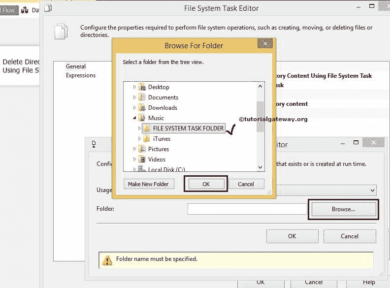

# 在 SSIS 使用文件系统任务删除目录内容

> 原文：<https://www.tutorialgateway.org/delete-directory-content-using-file-system-task-in-ssis/>

SSIS 的[文件系统任务](https://www.tutorialgateway.org/file-system-task-in-ssis/)允许我们对文件和文件夹执行十种类型的操作。在本文中，我们将通过示例向您展示如何使用 SSIS 文件系统任务删除目录内容。要删除目录，请参考 [SSIS](https://www.tutorialgateway.org/ssis/) 页面中的[在 SSIS 使用文件系统任务删除目录](https://www.tutorialgateway.org/delete-directory-using-file-system-task-in-ssis/)文章。

音乐文件夹中有文件系统任务文件夹。下面的截图显示了该文件夹中的数据。我们的任务是删除文件系统任务文件夹()中的所有内容。xml，。xls，。txt 文件，以及 SSIS 博主图片文件夹)。

## 在 SSIS 使用文件系统任务删除目录内容

要在 SSIS 使用文件系统任务删除目录内容，请将文件系统任务拖放到控制流区域。并将其重命名为使用文件系统任务

删除目录内容

双击它将打开文件系统任务编辑器进行配置。

在本例中，我们正在删除目录内容，因此，请将操作属性更改为删除目录内容，如下图所示

让我们通过选择 Source Connection 属性来配置源连接。如果您之前已经创建了[文件连接管理器](https://www.tutorialgateway.org/file-connection-manager-in-ssis/)，请选择创建的那个。或者，如果您将源连接存储在变量中，请将 IsSourcePathVariable 属性更改为 TRUE，并选择变量名称。

这里，我们之前没有创建任何连接管理器，所以我们选择<new connection..="">。</new>

一旦点击<new connection..="">选项，将打开文件连接管理器编辑器进行配置。在这个例子中，我们正在删除目录内容。所以我们从使用类型</new>

中选择现有目录选项

单击浏览按钮选择现有文件夹。

从上面的截图可以观察到，我们选择了

文件系统任务文件夹

单击“确定”完成文件连接管理器的配置。

单击“确定”完成在 SSIS 包中使用文件系统任务配置删除目录内容。让我们运行并看看是否使用文件系统任务成功删除了目录内容。

我们成功删除了文件系统任务文件夹或目录中的内容。

