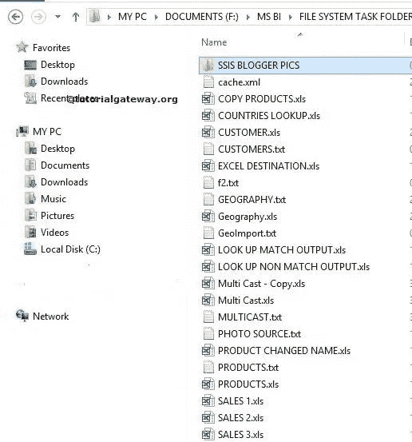
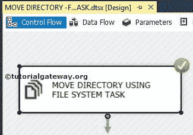

# 在 SSIS 使用文件系统任务移动目录

> 原文：<https://www.tutorialgateway.org/move-directory-using-file-system-task-in-ssis/>

在本文中，我们将通过示例向您展示如何在 SSIS 使用文件系统任务将目录从一个位置移动到另一个位置。要删除完整的目录，请参考 [SSIS](https://www.tutorialgateway.org/ssis/) 页面中的[使用文件系统任务删除目录](https://www.tutorialgateway.org/delete-directory-using-file-system-task-in-ssis/)一文。

我们在 MSBI 文件夹中有文件系统任务文件夹。下面的截图显示了该文件夹中的数据。我们的任务是将文件系统任务文件夹中的 SSIS 博主图片文件夹移动到 F 驱动器中的复制文件夹。

复制文件夹中的文件有:

## 在 SSIS 使用文件系统任务移动目录

将文件系统任务拖放到控制流区域，并将其重命名为在 SSIS

使用文件系统任务移动目录

双击打开[文件系统任务](https://www.tutorialgateway.org/file-system-task-in-ssis/)编辑器进行配置。

在这个例子中，我们正在移动目录。因此，请将操作属性更改为【移动目录】

选择“源连接”属性来配置源。如果已经创建了文件连接管理器，请选择已创建的文件连接管理器。或者，如果将源连接存储在变量中，请将 IsSourcePathVariable 属性更改为 TRUE，并选择变量名。

这里，我们之前没有创建任何连接管理器，所以我们选择<new connection..="">。</new>

一旦点击<new connection..="">，将打开文件连接管理器编辑器进行配置。在本例中，我们正在移动现有目录。所以我们从使用类型</new>

中选择现有文件夹选项

单击浏览按钮选择现有文件夹。

如您所见，我们选择了文件系统任务文件夹

中的 SSIS 博主图片文件夹

现在，我们必须配置目标连接。因此，请选择目标连接属性。如果您之前创建了文件连接管理器，请选择相同的选项。或者，如果将目标连接放在变量中，请将 IsDestinationPathVariable 属性更改为 TRUE，并选择变量名。

这里，我们没有创建任何连接管理器。所以，我们选择<new connection..="">。</new>

从上面的截图中，你可以看到我们通过点击新建文件夹按钮，在复制的文件夹中创建了一个名为 [SSIS](https://www.tutorialgateway.org/ssis/) 的博主图片文件夹。

单击“确定”完成目标的文件连接管理器配置。

单击“确定”完成在 SSIS 使用文件系统任务配置移动目录。让我们运行并看看是否使用文件系统任务成功移动了目录。

嗯，我们成功地将文件系统任务文件夹中的 SSIS 博主图片目录移动到复制文件夹目录。

如果您再次观察源连接(MSBI 文件夹)，SSIS 博主 pics 文件夹不存在，因为我们正在移动目录，而不是复制它。

