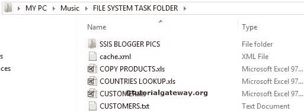
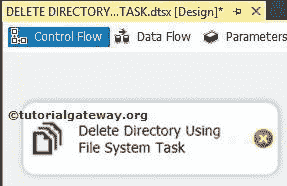
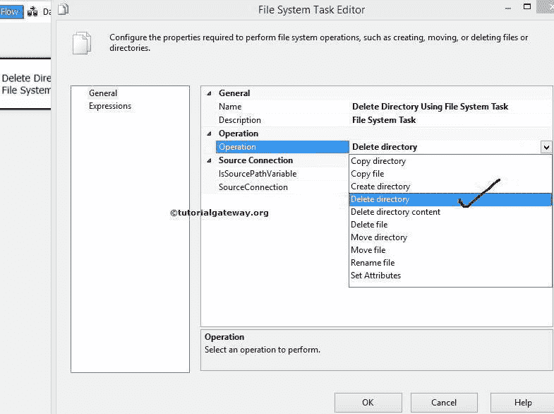
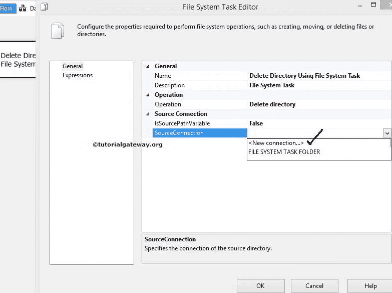
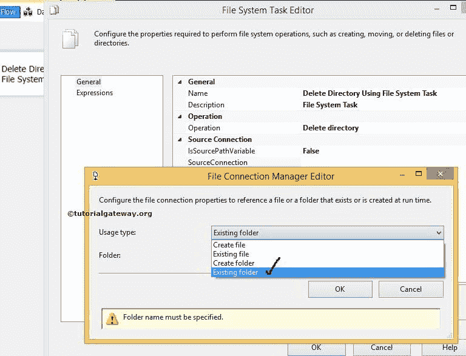
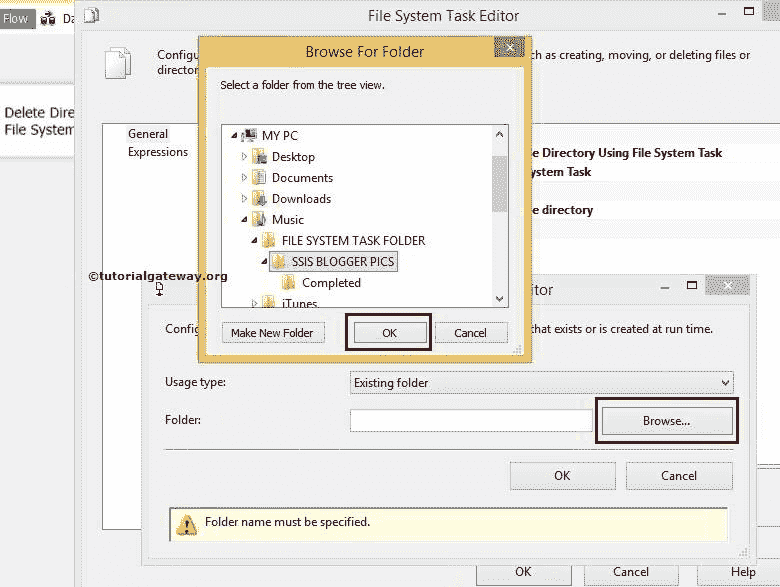
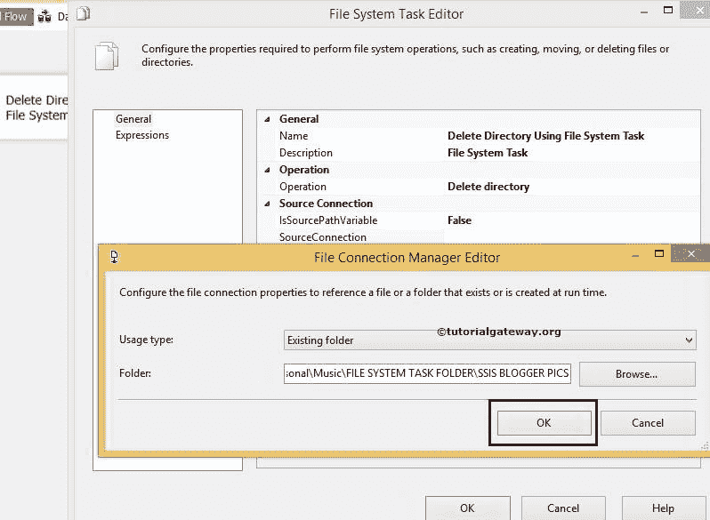
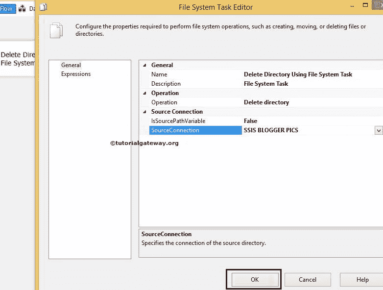
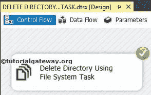
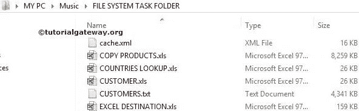

# 在 SSIS 使用文件系统任务删除目录

> 原文：<https://www.tutorialgateway.org/delete-directory-using-file-system-task-in-ssis/>

SSIS 文件系统任务允许我们对文件和文件夹执行十种类型的操作。在本文中，我们通过示例向您展示了如何在 SSIS 使用文件系统任务删除目录。

要删除目录内容，请参考 [SSIS](https://www.tutorialgateway.org/ssis/) 页面中的[使用文件系统删除目录内容](https://www.tutorialgateway.org/delete-directory-content-using-file-system-task-in-ssis/)一文。

我们在音乐文件夹中有文件系统任务文件夹。我们的任务是删除文件系统任务文件夹中的 SSIS 博主图片文件夹。

## 在 SSIS 使用文件系统任务删除目录

要在 SSIS 使用文件系统任务删除目录内容，请将文件系统任务拖放到控制流区域。接下来，使用文件系统任务

将其重命名为删除目录

双击打开[文件系统任务](https://www.tutorialgateway.org/file-system-task-in-ssis/)编辑器进行配置。

在这个例子中，我们正在删除目录。因此，请将操作属性更改为【删除目录】

让我们通过选择 Source Connection 属性来配置源连接。如果您之前创建了文件连接管理器，请选择相同的选项。或者，如果将源连接存储在变量中，请将 IsSourcePathVariable 属性更改为 TRUE，并选择变量名称。

虽然我们之前创建了连接管理器，但是为了向您展示步骤，我们选择了<new connection..="">。</new>

点击<new connection..="">选项后，文件连接管理器编辑器打开进行配置。这里，我们正在删除一个目录，所以我们从使用类型</new>

中选择现有目录选项

单击浏览按钮选择现有文件夹。

从上面的截图中，可以看到我们选择了文件系统任务文件夹

里面的 SSIS 博主 pics 文件夹

单击“确定”完成文件连接管理器的配置。

单击确定完成在 SSIS 使用文件系统任务配置删除目录。让我们运行并看看是否使用文件系统任务成功删除了目录。

我们成功删除了文件系统任务文件夹或目录中的目录。

