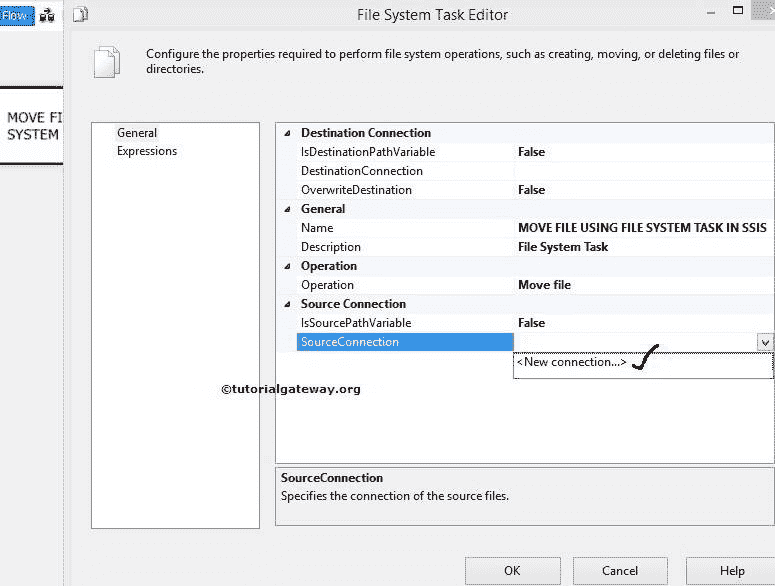
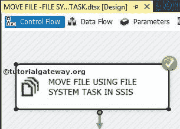

# 在 SSIS 使用文件系统任务移动文件

> 原文：<https://www.tutorialgateway.org/move-file-using-file-system-task-in-ssis/>

在本文中，我们通过示例向您展示了如何在 SSIS 使用文件系统任务将目录从一个位置移动到另一个位置。要删除完整的目录，请参考 [SSIS](https://www.tutorialgateway.org/ssis/) 页面中的[使用文件系统任务删除目录](https://www.tutorialgateway.org/delete-directory-using-file-system-task-in-ssis/)一文。

提示:请使用 [Foreach Container](https://www.tutorialgateway.org/ssis-foreach-loop-file-enumerator/) 将多个文件从一个位置移动到另一个位置。实例可参考[使用文件系统任务](https://www.tutorialgateway.org/move-multiple-files-using-file-system-task-in-ssis/)移动多个文件。

我们在 MSBI 文件夹中有文件系统任务文件夹。下面的截图显示了该文件夹中的数据。我们的 SSIS 任务是将文件系统任务文件夹中的 CUSTOMERS.txt 文件移动到 F 驱动器中的复制文件夹。

复制文件夹中的文件有:

## 在 SSIS 使用文件系统任务移动文件

要在 ssis 中使用文件系统任务移动文件，请将文件系统任务拖放到控制流区域，并将其重命名为 SSIS

中的使用文件系统任务移动文件

双击打开[文件系统任务](https://www.tutorialgateway.org/file-system-task-in-ssis/)编辑器进行配置。

在本例中，我们正在移动单个文件。因此，请将操作属性更改为【移动文件】，如下图所示

让我们通过选择 Source Connection 属性来配置源连接。如果已经创建了文件连接管理器，请选择已创建的文件连接管理器。或者，如果您将源连接保存在变量中，请将 IsSourcePathVariable 属性更改为 TRUE，并选择变量名称。

这里，我们之前没有创建任何连接管理器，所以我们选择<new connection..="">。</new>

一旦点击<new connection..="">选项，文件连接管理器编辑器将打开进行配置。这里，我们正在移动现有文件，因此从“使用类型”中选择“现有文件”选项。</new>

单击浏览按钮从文件系统中选择现有文件。

从上面的截图可以看到我们在

文件系统任务文件夹里面选择了 CUSTOMERS.tx 文件

单击“确定”完成源连接的配置。

现在我们必须配置目标连接，因此，请选择目标连接属性。如果您之前已经创建了文件连接管理器，请选择已创建的文件连接管理器，或者如果您将目标连接存储在变量中，请将 IsDestinationPathVariable 属性更改为 TRUE，并选择变量名称。

这里，我们以前没有创建任何连接管理器。所以，我们选择<new connection..="">。</new>

在本例中，我们将现有文件移动到一个已经存在的文件夹中。因此，从“使用类型”中选择“现有文件夹”选项。

单击浏览按钮从文件系统中选择现有文件夹。

如您所见，我们选择了复制的文件夹作为目标文件夹。单击确定按钮选择它。

接下来，单击确定为目标完成文件连接管理器的配置。

单击确定，使用 SSIS 包中的文件系统任务完成移动文件配置。让我们运行，看看我们是否使用文件系统任务成功移动了 Customers.txt 文件。

我们成功地将文件系统任务文件夹中的 Customers.txt 文件移动到了复制的文件夹中。

