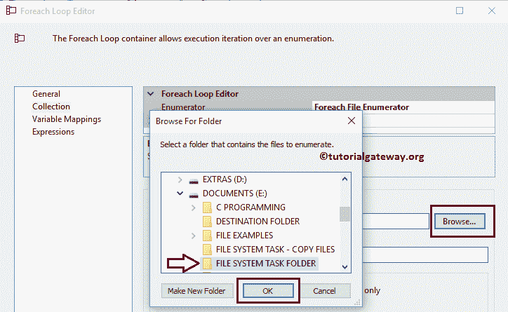

# 在 SSIS 使用文件系统任务移动多个文件

> 原文：<https://www.tutorialgateway.org/move-multiple-files-using-file-system-task-in-ssis/>

在本文中，我们将通过示例向您展示如何在 SSIS 使用文件系统任务移动多个文件。要将单个文件从一个位置移动到另一个位置，请参考 [SSIS](https://www.tutorialgateway.org/ssis/) 页面中的[使用文件系统任务移动文件](https://www.tutorialgateway.org/move-file-using-file-system-task-in-ssis/)一文。

文档驱动器中有文件系统任务文件夹。下面的截图显示了该文件夹中的数据。我们的任务是将 SSIS 文件系统任务文件夹中的 27 个文件移动到 E 驱动器中的目标文件夹。

## 在 SSIS 使用文件系统任务移动多个文件

要在 [SSIS](https://www.tutorialgateway.org/ssis/) 中使用文件系统任务移动多个文件，首先将 Foreach 循环容器拖放到控制流区域，如下图所示

双击它将打开 Foreach 循环编辑器进行配置。在我们进入剩下的属性之前，我们必须了解 Enumerator 属性。从下面的截图中，您可以观察到我们选择 [Foreach 文件枚举器](https://www.tutorialgateway.org/ssis-foreach-loop-file-enumerator/)是因为我们想要循环遍历文件系统中存在的文件。

接下来，单击浏览按钮从我们的文件系统中选择文件夹名称。从下面的截图中，您可以看到我们正在选择电子驱动器中的文件系统任务文件夹。单击确定按钮选择它。

在文件部分，我们必须使用通配符指定文件类型。在本例中，我们希望将本地文件系统中的所有文件(不考虑扩展名)从一个位置移动到另一个位置，因此我们使用通配符*。*.

提示:如果您想只发送文本文件，请使用:*。txt

接下来，我们必须将文件名存储在一个变量中，以便在我们的[文件系统任务](https://www.tutorialgateway.org/file-system-task-in-ssis/)中使用它们。为此，请转到变量映射部分并选择用户变量(如果有)或创建新变量

一旦点击<new variable..="">，添加变量窗口将打开，创建一个新的变量。在这个例子中，我们需要变量来存储文件名及其扩展名，例如，SALES1.xls。单击“确定”完成创建字符串变量。</new>

接下来，选择创建的变量并将其分配给索引 0。完成后，单击确定完成 Foreach 循环容器的配置。

接下来，将[文件系统任务](https://www.tutorialgateway.org/file-system-task-in-ssis/)拖放到控制流区域，按照您的要求

进行重命名

双击它将打开文件系统任务编辑器进行配置。在本例中，我们将多个文件从一个位置移动到另一个位置。因此，请将操作属性更改为“移动文件”。

接下来，我们必须配置 SourceConnection 属性。在上一步中，我们使用 Foreach 循环容器来循环文件，并将扩展名为的文件名存储在一个名为 variable 的变量中。因此，我们将 IsSourcePathVariable 设置为 True，并选择 User: Variable 变量作为 SourceVariable。

现在我们必须配置目标连接。因此，请选择 DestinationConnection 属性。如果之前已经创建了[文件连接管理器](https://www.tutorialgateway.org/file-connection-manager-in-ssis/)，请选择创建的连接，或者如果将目标连接存储在变量中，请将 IsDestinationPathVariable 属性更改为真，并选择变量名。

这里，我们之前没有创建任何连接管理器，所以我们选择<new connection..="">。</new>

在本例中，我们将现有文件移动到一个已经存在的文件夹中。因此，我们从“使用类型”中选择“现有文件夹”选项。接下来，单击浏览按钮从文件系统中选择现有文件夹。正如您从下面的截图中看到的，我们选择了目标文件夹。

单击确定，使用 SSIS 包中的文件系统任务完成移动多个文件的配置。

在执行任务之前，请将文件系统任务的延迟验证属性更改为真。

让我们运行，看看我们是否使用 SSIS [文件系统任务](https://www.tutorialgateway.org/file-system-task-in-ssis/)成功地将 27 个文件从一个位置移动到另一个位置。

我们成功地将文件系统任务文件夹中的 27 个文件移动到目标文件夹。

