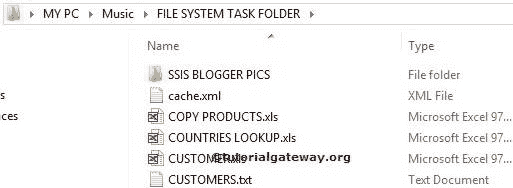
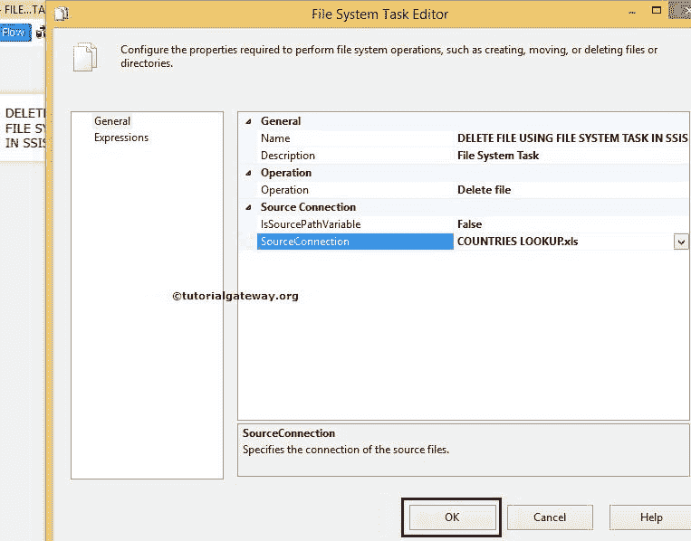
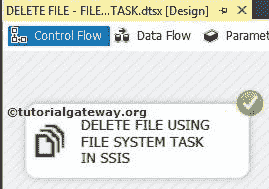

# 在 SSIS 使用文件系统任务删除文件

> 原文：<https://www.tutorialgateway.org/delete-file-using-file-system-task-in-ssis/>

在本文中，我们通过示例向您展示了如何在 SSIS 使用文件系统任务删除文件。要删除目录，请参考 [SSIS](https://www.tutorialgateway.org/ssis/) 页面中的[使用文件系统任务删除目录](https://www.tutorialgateway.org/delete-directory-using-file-system-task-in-ssis/)一文。

提示:要删除多个文件，我们必须对每个容器使用。

音乐文件夹中有文件系统任务文件夹。我们的任务是删除文件系统任务文件夹中的一个文件。

## 在 SSIS 使用文件系统任务删除文件

要在 SSIS 使用文件系统任务删除文件，请将文件系统任务拖放到控制流区域，并将其重命名为使用文件系统任务删除文件

双击打开[文件系统任务](https://www.tutorialgateway.org/file-system-task-in-ssis/)编辑器进行配置。

在本例中，我们删除了单个文件。因此，请将操作属性更改为【删除文件】

让我们通过选择 Source Connection 属性来配置源连接。如果您有文件连接管理器，请选择它。或者，如果将源连接存储在变量中，请将 IsSourcePathVariable 字段更改为 TRUE，并选择变量名。

这里，我们选择<new connection..="">。</new>

一旦点击<new connection..="">选项，文件连接管理器编辑器打开进行配置。在本例中，我们删除了一个文件。因此，从“使用类型”中选择“现有文件”选项</new>

单击浏览按钮选择现有文件(即国家查找. xls)。

从上面的截图可以观察到，我们在文件系统任务文件夹

里面选择了名为国家查找的 Excel 文件

单击“确定”完成文件连接管理器的配置。

单击确定完成文件系统任务编辑器的配置。让我们运行，看看我们是否使用文件系统任务成功删除了 excel 文件。

我们成功删除了文件系统任务文件夹或目录中的国家查找文件。

