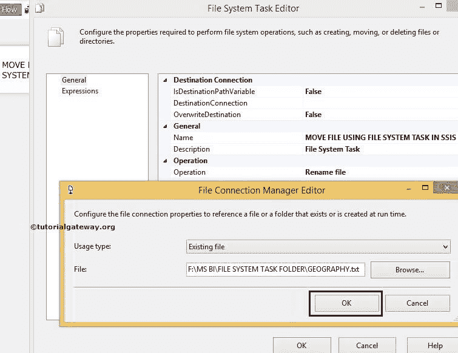

# 在 SSIS 使用文件系统任务重命名文件

> 原文：<https://www.tutorialgateway.org/rename-file-using-file-system-task-in-ssis/>

在本文中，我们通过示例向您展示了如何使用 SSIS 文件系统任务重命名文件。要移动文件，请参考 [SSIS](https://www.tutorialgateway.org/ssis/) 页面中的[使用文件系统任务移动文件](https://www.tutorialgateway.org/move-file-using-file-system-task-in-ssis/)一文。

我们在 MSBI 文件夹中有文件系统任务文件夹。我们的任务是将文件系统任务文件夹中的 GEOGRAPHY.txt 文件移动到 F 驱动器中的复制文件夹中，并对其进行重命名。

复制文件夹中的文件有:

## 在 SSIS 使用文件系统任务重命名文件

要在 SSIS 使用文件系统任务重命名文件，请将文件系统任务拖放到控制流区域，并将其重命名为在 SSIS 使用文件系统任务重命名文件

双击打开[文件系统任务](https://www.tutorialgateway.org/file-system-task-in-ssis/)编辑器进行配置。

在本例中，我们正在重命名现有文件。所以，请将操作属性更改为【重命名文件】

让我们通过选择 Source Connection 属性来配置源连接。如果之前已经创建了[文件连接管理器](https://www.tutorialgateway.org/file-connection-manager-in-ssis/)，请选择创建的文件连接管理器，或者如果将源连接存储在变量中，请将 IsSourcePathVariable 属性更改为真，并选择变量名称。

这里，我们之前没有创建任何连接管理器，所以我们选择<new connection..="">。</new>

一旦点击<new connection..="">，文件连接管理器编辑器将打开进行配置。在本例中，我们正在重命名现有文件。因此，从“使用类型”中选择“现有文件”选项。</new>

单击浏览按钮从文件系统中选择现有文件。

从上面的截图可以观察到，我们选择了文件系统任务文件夹

里面的 GEOGRAPHY.txt 文件

单击“确定”完成源连接的配置。

现在我们必须配置目标连接，因此，请选择目标连接属性。如果您之前已经创建了文件连接管理器，请选择已创建的文件连接管理器，或者如果您将目标连接存储在变量中，请将 IsDestinationPathVariable 属性更改为 TRUE，并选择变量名称。

这里，我们之前没有创建任何连接管理器，所以我们选择<new connection..="">。</new>

在本例中，我们将移动现有文件并对其进行重命名。因此，我们从“使用类型”中选择“创建文件”选项。

单击浏览按钮从文件系统中选择目标文件夹。

从上图中，您可以看到我们在复制的文件夹中创建了名为 NewGeography.txt 的新文本文件。单击“打开”按钮创建它。

单击“确定”完成目标的文件连接管理器配置。

最后，单击确定以完成在 SSIS 包中配置使用文件系统重命名文件任务。让我们运行，看看我们是否使用文件系统任务成功重命名了 Geography.txt 文件。

嗯，我们成功地将文件系统任务文件夹中的地理. txt 文件移动到复制的文件夹中，并将文件重命名为新地理. txt

