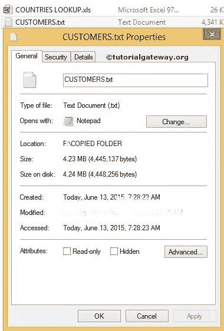
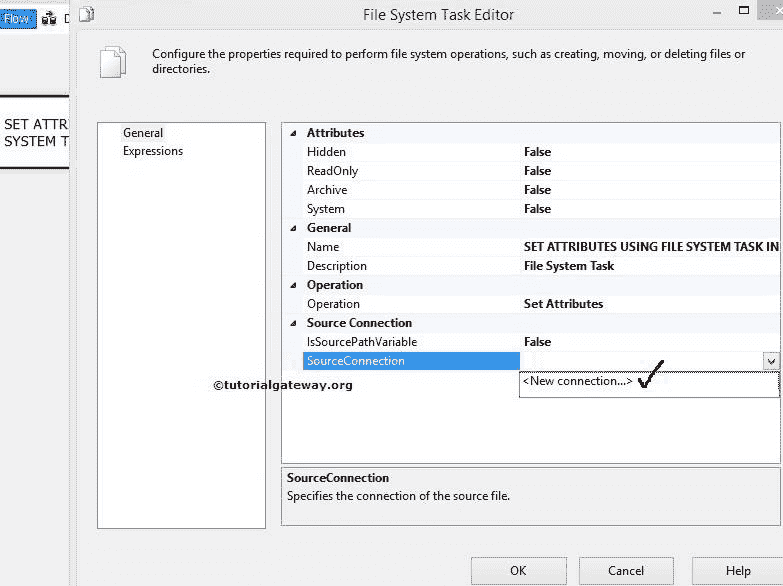

# 在 SSIS 使用文件系统任务设置属性

> 原文：<https://www.tutorialgateway.org/setting-attributes-using-file-system-task-in-ssis/>

在本文中，我们通过示例向您展示了如何使用 SSIS 文件系统任务来设置文件系统中文件和文件夹的属性。要删除目录内容，请参考 [SSIS](https://www.tutorialgateway.org/ssis/) 页面中的[使用文件系统任务删除目录内容](https://www.tutorialgateway.org/delete-directory-content-using-file-system-task-in-ssis/)一文。

我们已经复制了文件驱动器中的文件夹。我们的工作是使用这个 SSIS 文件系统任务

来更改 CUSTOMERS.txt 文件的默认属性

在创建包之前，让我们向您展示 Customers.txt 文件

的默认属性

## 在 SSIS 使用文件系统任务设置属性

对于在 [SSIS](https://www.tutorialgateway.org/ssis/) 使用文件系统任务设置属性，将文件系统任务拖放到控制流区域，并将其重命名为在 SSIS

T4【使用文件系统任务设置属性】

双击打开[文件系统任务](https://www.tutorialgateway.org/file-system-task-in-ssis/)编辑器进行配置。

在本例中，我们正在更改单个文件的属性。因此，请将操作属性更改为设置属性

让我们通过选择 Source Connection 属性来配置源连接。如果之前已经创建了[文件连接管理器](https://www.tutorialgateway.org/file-connection-manager-in-ssis/)，请选择创建的文件连接管理器，或者如果将源连接存储在变量中，请将 IsSourcePathVariable 属性更改为真，并选择变量名称。

虽然我们已经创建了连接管理器，为了向您展示步骤，我们选择<new connection..="">。</new>

一旦点击<new connection..="">选项，将打开文件连接管理器编辑器进行配置。请选择要更改属性的文件。</new>

在这个例子中，我们正在修改客户文本文件。因此，我们从“使用类型”中选择“现有文件”选项，然后单击“浏览”按钮来选择文件。

从上面的截图中，我们选择了复制文件夹中的客户文本文件。

单击“确定”完成文件连接管理器的配置。

让我们将文本文件的隐藏属性更改为真。它隐藏了文本文件

让我们将文本文件的只读属性更改为真。它不允许我们更改文本文件

单击确定完成文件系统任务编辑器的配置。

让我们运行并看看是否使用文件系统任务成功更改了给定文件的属性。

嗯，我们成功的改变了属性

