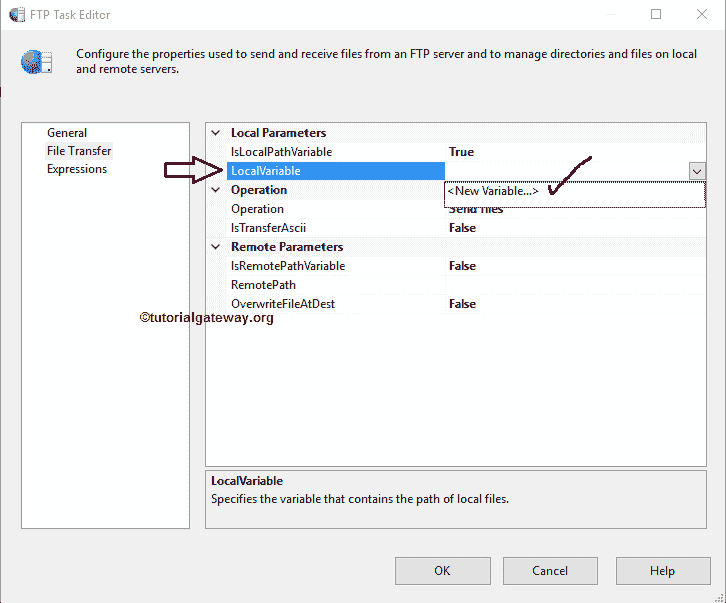

# SSIS 文件传输协议任务

> 原文：<https://www.tutorialgateway.org/ssis-ftp-task/>

SSIS 文件传输协议任务用于对文件和文件夹(或目录)执行不同类型的操作。例如，如果您想从文件传输协议服务器发送或接收文件到本地目录，我们可以使用这个 SSIS 文件传输协议任务。

SSIS 文件传输协议任务使用文件传输协议连接管理器来连接远程(文件传输协议服务器)文件和文件夹。在我们开始配置 SSIS 文件传输协议任务之前，让我们看看文件传输协议服务器中可用的文件和文件夹。下面的截图也会显示同样的内容。

## 配置 SSIS 文件传输协议任务

首先，将 FTP 任务拖放到控制流区域，并将其重命名为 SSIS FTP 任务

双击它将打开 SSIS FTP 任务编辑器进行配置。

*   名称:请提供唯一的名称
*   描述:简述 [SSIS](https://www.tutorialgateway.org/ssis/) 任务功能。提供有效的描述始终是一种良好的做法。

在 SSIS 文件传输协议任务连接部分，我们有一个名为文件传输协议连接的属性:

*   FTP 连接:通过单击下拉箭头，向您显示已经创建的 FTP 连接(如果有)。或者请点击<new connection..="">选项创建一个。让我们看看点击<new connection..="">选项会发生什么</new></new>

一旦点击<new connection..="">选项，将打开 FTP 连接管理器来配置连接设置。请参考 [SSIS FTP 连接管理器](https://www.tutorialgateway.org/ssis-ftp-connection-manager/)文章了解连接设置</new>

停止失败:这个属性有两个选项:真和假。

*   如果您将此属性设置为真，当 FTP 操作出现问题时，它将失败
*   当您将此属性设置为假时，即使 FTP 操作出现问题，SSIS FTP 任务也不会失败

请单击文件传输选项卡来配置文件传输协议操作。下面的屏幕截图显示了该选项卡中的可用属性。在“操作”部分中，我们有一个 IsTransferAscii 选项。

*   IsTransferAscii:这个属性有两个选项:True 和 False。如果我们将此属性设置为 true，FTP 任务将使用 ASCII 模式进行操作。

SSIS 的 FTP 任务支持对文件和文件夹的八种不同操作。请看下方截图

中的可用选项

| 文件传输协议操作 | 描述 |
| 发送文件 | 这将把文件从本地计算机发送到文件传输协议服务器。发送单个文件请参考 [FTP 任务发送文件](https://www.tutorialgateway.org/ssis-ftp-task-send-files/)一文，发送多个文件请参考 [SSIS FTP 任务发送多个文件](https://www.tutorialgateway.org/ssis-ftp-task-send-multiple-files/)一文。 |
| 接收文件 | 它将文件从远程目录导入本地计算机。接收单个文件请参考 [SSIS FTP 任务接收文件](https://www.tutorialgateway.org/ssis-ftp-task-receive-files/)，接收多个文件请参考 [FTP 任务接收多个文件](https://www.tutorialgateway.org/ssis-ftp-task-receive-multiple-files/)文章。 |
| 创建本地目录 | 使用此选项，我们可以在本地计算机上创建目录(或文件夹)。请参考 [SSIS FTP 任务创建本地目录](https://www.tutorialgateway.org/ssis-ftp-task-create-local-directory/)文章创建本地目录。 |
| 创建远程目录 | 使用此选项，我们可以在 FTP 服务器中创建目录(或文件夹)。请参考 [SSIS FTP 任务创建远程目录](https://www.tutorialgateway.org/ssis-ftp-task-create-remote-directory/)创建远程目录。 |
| 删除本地目录 | 它会删除本地计算机上的目录(或文件夹)。请参考 [FTP 任务删除本地目录](https://www.tutorialgateway.org/ssis-ftp-task-delete-local-directory/)删除本地目录。 |
| 删除远程目录 | 使用此选项删除远程文件传输协议服务器中的目录。请参考 [SSIS 删除远程目录](https://www.tutorialgateway.org/ssis-ftp-task-delete-remote-directory/)删除远程目录。 |
| 删除本地文件 | 这将删除本地计算机上的文件。请参考 [SSIS 删除本地文件](https://www.tutorialgateway.org/ssis-ftp-task-delete-local-files/)一文，从本地文件系统中删除文件。 |
| 删除远程文件 | 它删除文件传输协议服务器上的文件。请参考[删除远程文件](https://www.tutorialgateway.org/ssis-ftp-task-delete-remote-files/)一文从服务器删除文件。 |

### SSIS 文件传输协议任务本地参数

IsLocalPathVariable:这个属性有两个选项:True 和 False。如果我们将此属性设置为 true，则本地路径存储在变量中。如果我们将此属性设置为 false，我们必须使用文件连接管理器手动选择本地路径。

当我们将 IsLocalPathVariable 设置为 true 时，将出现一个名为 LocalVariable 的新属性。

本地变量:该属性显示所有可用的用户变量。请选择保存本地路径(文件或文件夹路径)的适当变量。如果你没有创建任何变量，请点击<new variable..="">，如下图截图所示。</new>

一旦点击<new variable..="">，就会打开一个名为添加变量的新窗口，创建新的变量。在这里，您可以创建保存本地源路径的新变量。</new>

当您将 IsLocalPathVariable 设置为 False 时，我们必须使用 LocalPath 属性配置源连接。如果已经创建了[文件连接管理器](https://www.tutorialgateway.org/file-connection-manager-in-ssis/)，可以从下拉列表中选择。

如果您之前没有创建任何连接管理器，您必须通过选择<new connection..="">来创建。</new>

一旦选择了文件和文件夹的<new connection..="">，文件连接管理器编辑器将在新窗口中打开。使用这个编辑器，我们必须配置文件和文件夹的连接。</new>

选择所需文件后，单击确定按钮

### 配置 SSIS 文件传输协议任务远程参数

IsRemotePathVariable:这个属性有两个选项:True 和 False。如果我们将这个属性设置为真，我们必须从变量访问远程路径。如果我们将此属性设置为 false，我们必须使用 FTP 连接管理器(我们在常规选项卡中创建的)手动选择远程路径。

当我们将 SSIS FTP 任务的远程路径变量设置为假时，我们必须使用远程路径属性配置远程连接。请单击此选项旁边的浏览按钮(…)打开远程目录。从下面的截图中，您可以观察到/作为位置，因为它是 FTP 服务器的根目录。目前，我们没有任何文件夹可供选择。所以我们选择根目录作为从本地计算机接收文件的位置。

覆盖定义:该属性有两个选项:真和假。如果我们将此属性设置为真，SSIS 文件传输协议任务将覆盖目标路径中的现有文件。

单击“确定”完成 SSIS 文件传输协议任务编辑器的配置。