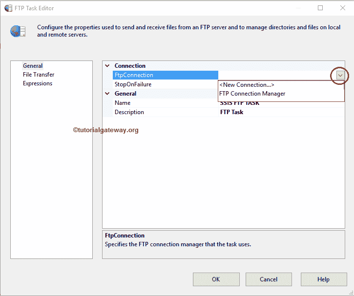
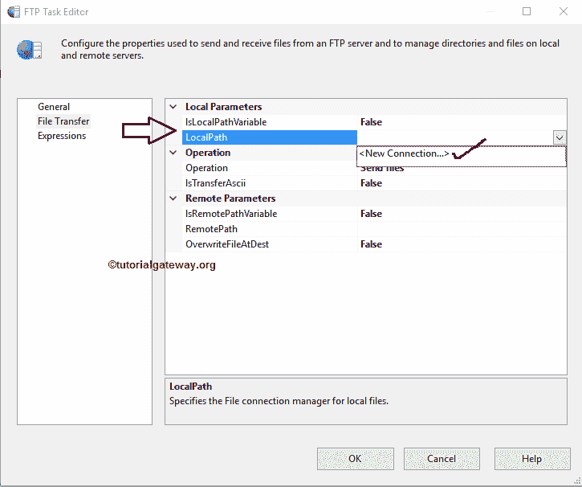

# SSIS 文件传输协议任务发送文件

> 原文：<https://www.tutorialgateway.org/ssis-ftp-task-send-files/>

[SSIS FTP 任务](https://www.tutorialgateway.org/ssis-ftp-task/)用于对文件和文件夹(或目录)执行不同类型的操作。在本文中，我们将通过示例向您展示配置 SSIS FTP 任务发送文件所涉及的步骤。

注: [SSIS](https://www.tutorialgateway.org/ssis/) 文件传输协议任务使用[文件传输协议连接管理器](https://www.tutorialgateway.org/ssis-ftp-connection-manager/)连接远程(文件传输协议服务器)文件和文件夹。

下面的截图显示了本地文件夹中的数据。我们的任务是使用文件系统文件夹中的 SSIS 1.jpg 文件将 Excel 工作表中的双引号复制到文件传输协议服务器的根目录。

下面的截图显示了文件传输协议服务器内部的数据。

## SSIS 文件传输协议任务发送文件

为了将文件从本地计算机发送到 FTP 服务器，首先将 FTP 任务拖放到控制流区域，并将其重命名为 SSIS FTP 任务发送文件

双击它将打开文件传输协议任务编辑器进行配置。请根据您的要求更改任务名称，并提供有效的描述。

在连接部分，我们有一个名为 FTPConnection 的属性。点击下拉箭头将显示您已经创建的 FTP 连接(如果有)，或者请点击<new connection..="">选项创建一个。在这个例子中，我们使用已经创建的连接。请参考 [SSIS FTP 连接管理器](https://www.tutorialgateway.org/ssis-ftp-connection-manager/)文章了解连接设置</new>

请单击文件传输选项卡来配置文件传输协议操作。下面的截图将向您展示该选项卡中的可用属性。

SSIS 的 FTP 任务支持对文件和文件夹的八种不同操作。在这个例子中，我们想要发送文件到文件传输协议服务器，因此，我们从操作属性

中选择发送文件选项

目前，我们手动声明本地路径，但是实时的，我们推荐变量。如果我们将 IsLocalPathVariable 设置为 False，我们必须使用 LocalPath 属性配置源连接。如果您已经创建了[文件连接管理器](https://www.tutorialgateway.org/file-connection-manager-in-ssis/)，您可以简单地从下拉列表中选择它，否则，您必须通过选择<新建连接来创建..>。如下图截图所示。

一旦选择了文件和文件夹的<new connection..="">，文件连接管理器编辑器将在新窗口中打开。使用这个编辑器，我们必须配置文件和文件夹的连接。</new>

从下面的截图中，您可以看到，我们正在使用文件系统文件夹

中的 using 文件来选择在 Excel 工作表中删除双引号

选择所需文件后，单击确定按钮。

目前，我们手动但实时地声明远程路径，我们建议使用变量。请单击此选项旁边的浏览(…)按钮打开远程目录。

目前我们的文件传输协议服务器中没有任何子文件夹，所以我们选择根目录/作为位置。接下来，我们将 OverwriteDetination 属性设置为 true。这意味着 SSIS 文件传输协议任务将覆盖文件传输协议服务器中的现有文件(如果有)。

单击“确定”完成 SSIS FTP 任务发送文件包的配置。让我们运行，看看我们是否成功地将 JPEG 文件从本地文件系统复制到文件传输协议服务器。

嗯，我们成功地使用文件系统文件夹中的 using 文件将 Excel 表中的删除双引号复制到了文件传输协议服务器的根目录中..

