# SSIS FTP任务发送多个文件

> 原文：<https://www.tutorialgateway.org/ssis-ftp-task-send-multiple-files/>

让我用示例向您展示配置 SSIS FTP 任务发送多个文件所涉及的步骤。要发送单个文件，请参考[FTP任务发送文件](https://www.tutorialgateway.org/ssis-ftp-task-send-files/)一文。

注: [SSIS](https://www.tutorialgateway.org/ssis/) FTP任务使用[FTP连接管理器](https://www.tutorialgateway.org/ssis-ftp-connection-manager/)连接远程(FTP服务器)文件和文件夹。

下面的截图将显示本地文件夹中的数据。我们的 SSIS FTP任务是将多个文件(所有现有文件)从文件系统文件夹发送到FTP服务器的根目录。

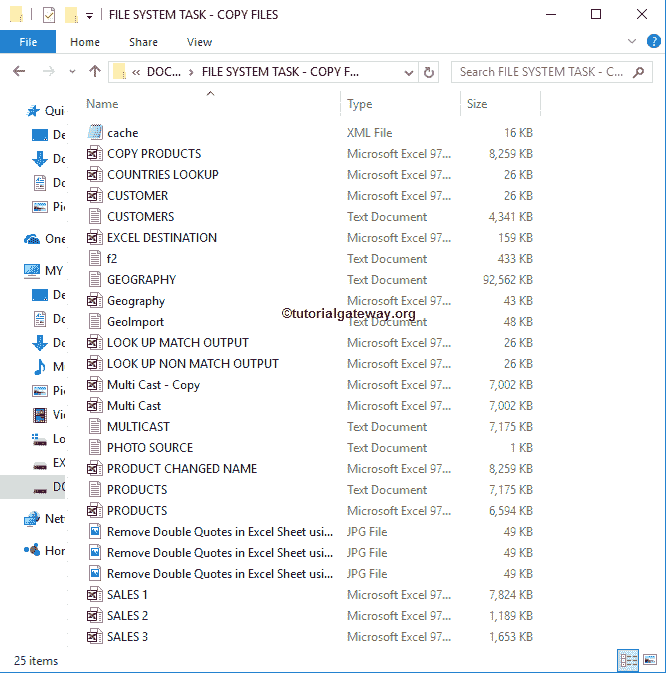

下面的截图显示了FTP服务器内部的数据。

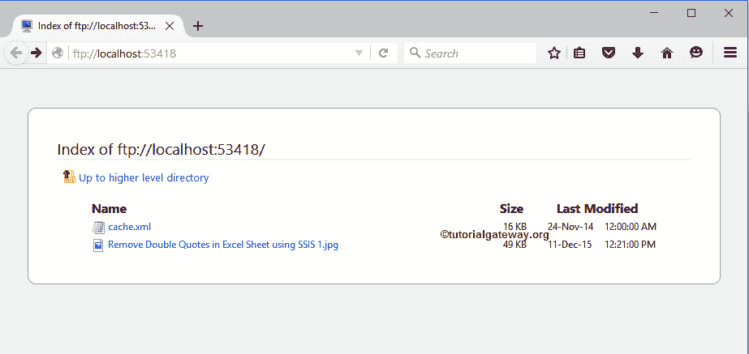

## SSIS FTP任务发送多个文件

要将多个文件从本地计算机发送到 FTP 服务器，首先将 [Foreach Loop 容器](https://www.tutorialgateway.org/ssis-foreach-loop-file-enumerator/)拖放到控制流区域

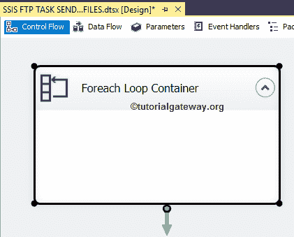

双击它将打开 Foreach 循环编辑器进行配置。从下面的截图中，您可以观察到我们选择 Foreach 文件枚举器是因为我们想要遍历文件系统中的文件。

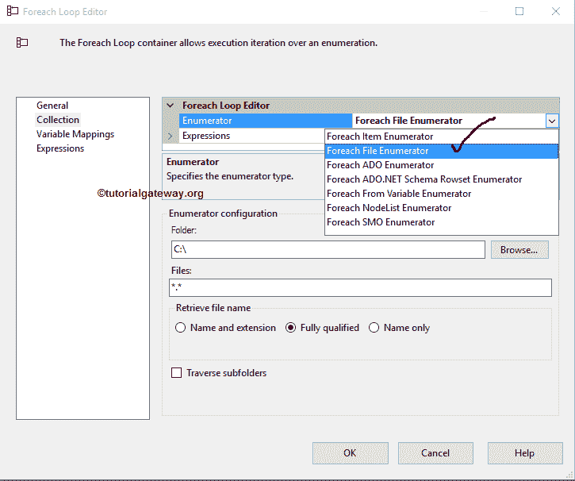

接下来，单击浏览按钮从我们的文件系统中选择文件夹名称。从下面的截图中，可以看到我们选择了电子驱动器中的文件系统任务-复制文件文件夹。单击确定按钮选择它。

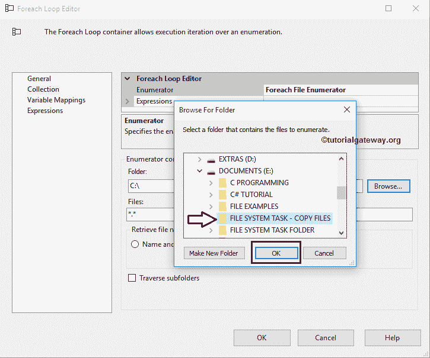

在文件部分，我们必须使用通配符指定文件类型。在本例中，我们希望将本地文件系统中的所有文件(不考虑扩展名)发送到 FTP 服务器，因此我们使用了通配符*。*.

提示:如果您想只发送文本文件，请使用:*。txt

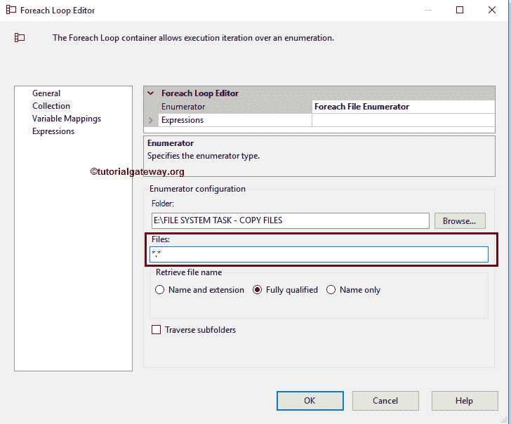

接下来，我们必须将文件名存储在一个变量中，以便在我们的 [FTP 任务](https://www.tutorialgateway.org/ssis-ftp-task/)中使用它们。为此，请转到变量映射部分并选择用户变量(如果有)或创建新变量

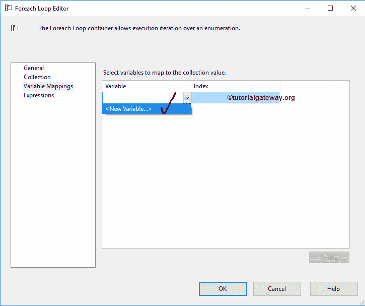

一旦点击<new variable..="">，添加变量窗口将打开，创建一个新的变量。在这个例子中，我们需要变量来存储文件名及其扩展名，例如，cache.xml。单击“确定”完成创建字符串变量。</new>

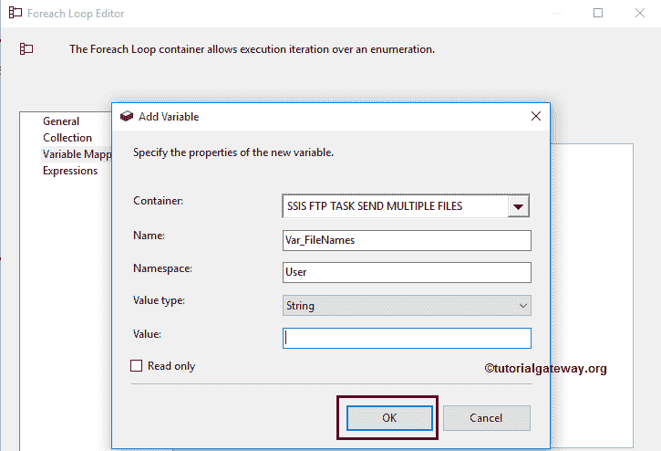

现在选择创建的变量，并将其分配给索引 0。完成后，单击确定完成 Foreach 循环容器的配置。

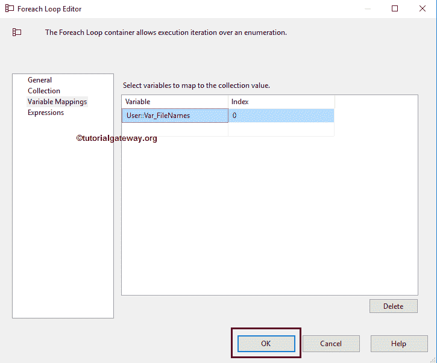

接下来将 [FTP 任务](https://www.tutorialgateway.org/ssis-ftp-task/)拖放到 Foreach 循环容器中，并将其重命名为【SSIS FTP 任务发送多个文件】

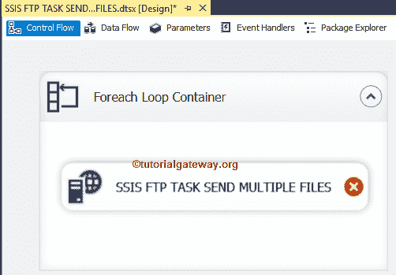

双击它将打开FTP任务编辑器进行配置。请根据您的要求更改任务名称，并提供有效的描述。

在连接部分，我们有一个名为 FTPConnection 的属性。通过点击下拉箭头，将显示已经创建的 FTP 连接(如果有)，或者请点击<new connection..="">选项创建一个。在这个例子中，我们使用已经创建的连接。请参考 [SSIS FTP 连接管理器](https://www.tutorialgateway.org/ssis-ftp-connection-manager/)文章了解连接设置</new>

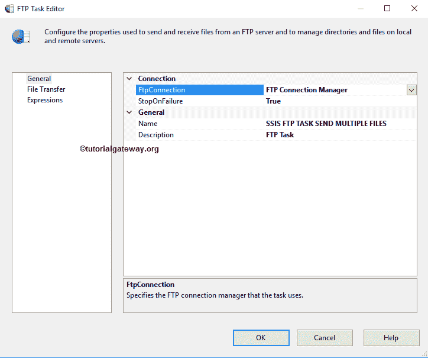

请单击文件传输选项卡来配置FTP操作。下面的截图将向您展示该选项卡中的可用属性。

SSIS 的 FTP 任务支持对文件和文件夹的八种不同操作。在这个例子中，我们想发送多个文件到FTP服务器。因此，我们从操作属性

中选择发送文件选项

在上一步中，我们使用 Foreach 循环容器来循环文件，并将扩展名为的文件名存储在一个名为 Var _ FileNames 的变量中。因此，我们将 IsLocalPathVariable 设置为 True，并选择 User:Var _ filename 变量作为 LocalVariable。

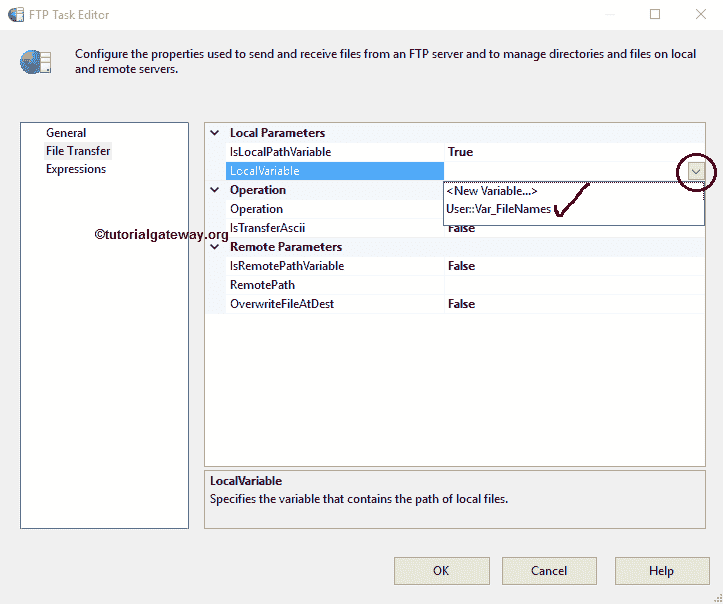

目前，我们手动声明远程路径，但是在实时情况下，我们建议使用变量。请单击此选项旁边的浏览按钮(…)打开远程目录。

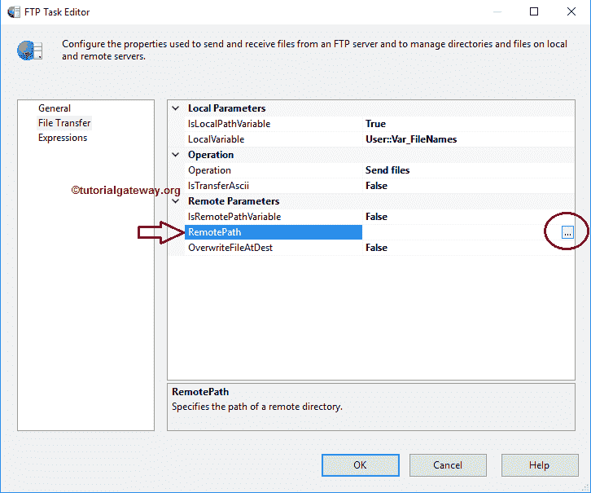

目前，我们的FTP服务器中没有任何子文件夹。因此，我们选择根目录/作为位置，并将 OverwriteDetination 属性设置为 true。这意味着 SSIS FTP任务将覆盖FTP服务器中的任何现有文件(缓存. xml 并使用 SSIS 1.jpg 删除 Excel 工作表中的双引号)。

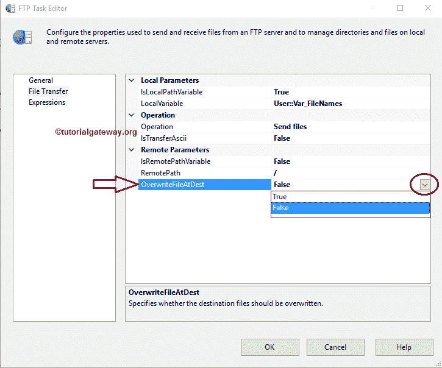

单击“确定”完成配置 SSIS FTP 任务发送多个文件包。让我们运行，看看我们是否成功复制了。xml，。txt，。JPG 和。是否将文件从本地文件系统传输到FTP服务器。

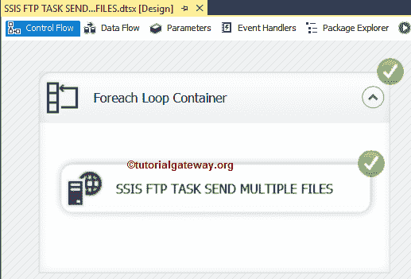

我们成功地将文件系统文件夹中的文件发送到了FTP服务器的根目录。

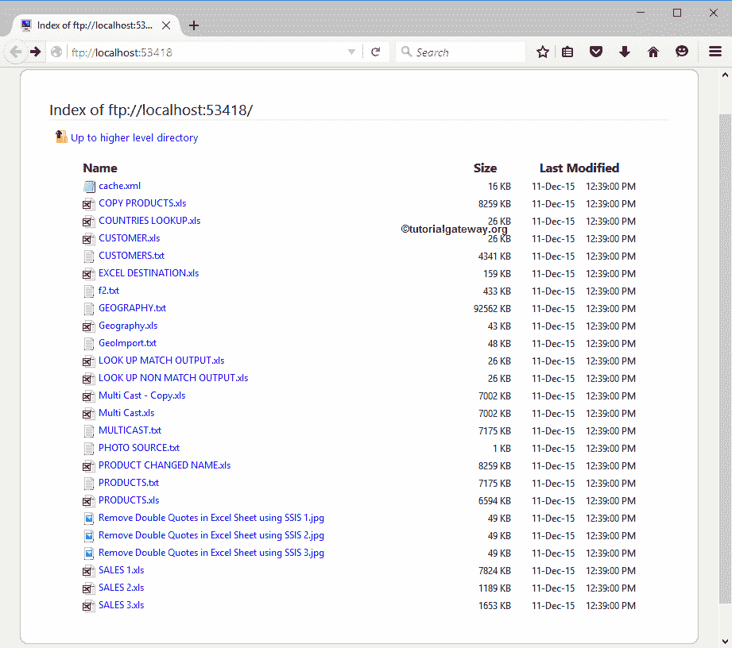