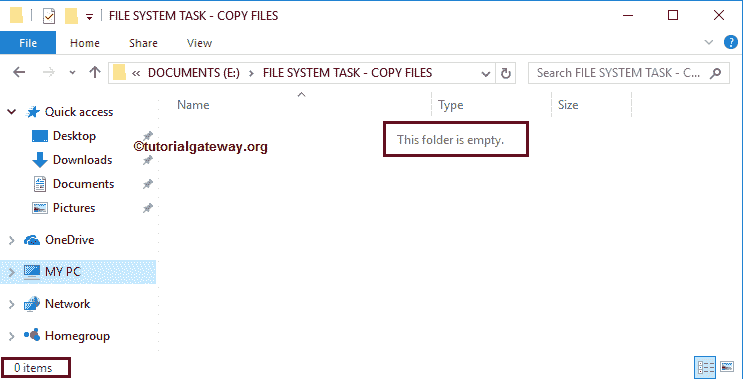
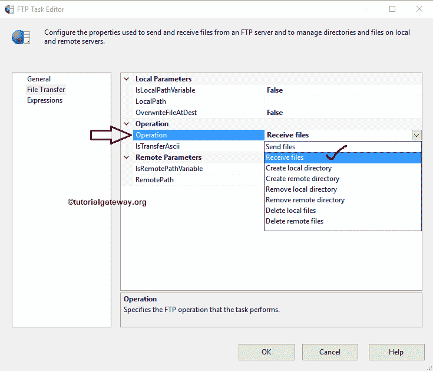
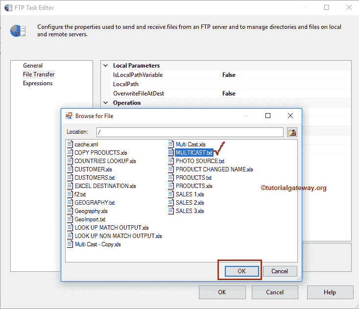
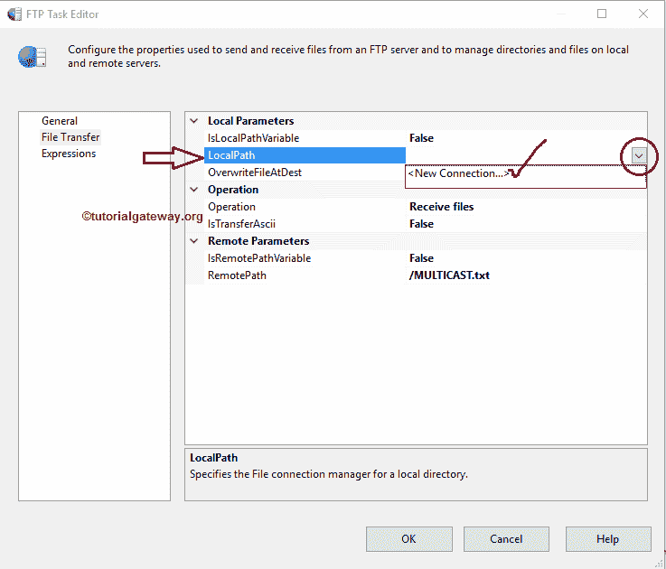

# SSIS FTP任务接收文件

> 原文：<https://www.tutorialgateway.org/ssis-ftp-task-receive-files/>

在本文中，我们将通过示例向您展示配置 SSIS FTP 任务以接收文件所涉及的步骤。

注: [SSIS](https://www.tutorialgateway.org/ssis/) FTP任务使用[FTP连接管理器](https://www.tutorialgateway.org/ssis-ftp-connection-manager/)连接远程(FTP服务器)文件和文件夹。

下面的截图显示了FTP服务器内部的数据。我们的任务是将根目录中的多播. txt 文件复制到 E 驱动器中的文件系统文件夹。

下面的截图显示了本地驱动器中的文件夹。

## SSIS FTP任务接收文件

要从FTP服务器接收文件到本地计算机，首先将[FTP任务](https://www.tutorialgateway.org/ssis-ftp-task/)拖放到控制流区域。并将其重命名为【SSIS FTP 任务接收文件】

双击它将打开FTP任务编辑器进行配置。请根据需要更改任务名称，并提供有效的描述。

在连接部分，单击 FTP 连接下拉箭头，显示现有的 FTP 连接(如果有)。或者请点击<new connection..="">选项。这里，我们使用的是已经从 [SSIS FTP 连接管理器](https://www.tutorialgateway.org/ssis-ftp-connection-manager/)文章</new>

创建的连接

请单击文件传输选项卡来配置FTP操作。下面的屏幕截图显示了该选项卡中的可用属性。

在本例中，我们希望从 FTP 服务器接收文件，因此，我们从操作属性

中选择接收文件选项

目前，我们手动声明远程路径，但实时使用变量。请单击此选项旁边的浏览按钮(…)打开远程目录。

从下面的截图中，你可以看到/作为位置，因为它是 FTP 服务器的根目录，目前，我们没有任何子文件夹。我们的任务是将根目录中的多播. txt 文件复制到 E 驱动器中的文件系统文件夹。因此，我们选择了 MULTICAST.txt 文件。

在这里，我们手动声明了本地路径，但是实时地，我们推荐变量。如果我们将 IsLocalPathVariable 设置为 False，请使用 LocalPath 属性配置源连接。如果您已经创建了[文件连接管理器](https://www.tutorialgateway.org/file-connection-manager-in-ssis/)，请从下拉列表中选择它。否则，通过选择<新建连接来创建..>。

选择文件和文件夹的<new connection..="">后，文件连接管理器编辑器将打开。使用这个编辑器，我们必须配置与现有文件夹的连接。为此，请单击浏览按钮从文件系统中选择现有文件夹。</new>

从下面的截图中，我们选择了文件系统任务-复制文件文件夹作为本地文件夹路径。单击确定按钮选择它。

覆盖目标:如果我们将此属性设置为真，SSIS FTP 任务将覆盖目标路径中的现有文件夹(如果有)。

单击“确定”完成 SSIS FTP任务接收文件包的配置。让我们运行，看看我们是否成功地将多播. txt 文件从FTP服务器复制到本地文件系统。

嗯，我们成功地将多播. txt 文件从FTP服务器复制到文件系统任务-复制文件文件夹。

