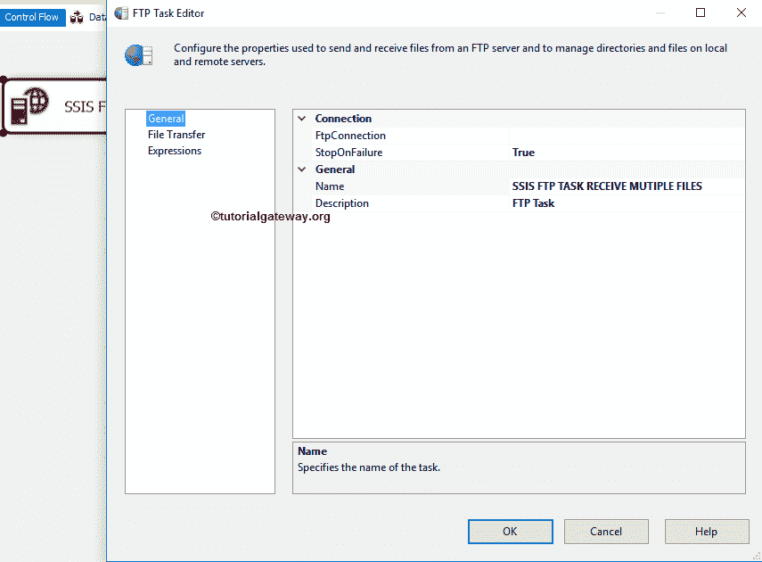

# SSIS 文件传输协议任务接收多个文件

> 原文：<https://www.tutorialgateway.org/ssis-ftp-task-receive-multiple-files/>

在本文中，我们将通过示例向您展示配置 SSIS FTP 任务以接收多个文件所涉及的步骤。请参考 [FTP 任务接收文件](https://www.tutorialgateway.org/ssis-ftp-task-receive-files/)了解从 FTP 服务器接收单个文件到本地文件系统所涉及的配置设置。

注: [SSIS](https://www.tutorialgateway.org/ssis/) 文件传输协议任务使用[文件传输协议连接管理器](https://www.tutorialgateway.org/ssis-ftp-connection-manager/)连接远程(文件传输协议服务器)文件和文件夹。

下面的截图显示了文件传输协议服务器内部的数据。我们的任务是复制所有的文件。txt，。xls，。jpg)存在于 E 驱动器内文件系统文件夹的根目录中。

下面的截图显示了本地目录中的文件夹。

## SSIS 文件传输协议任务接收多个文件

要从 FTP 服务器接收文件到本地计算机，首先将 [FTP 任务](https://www.tutorialgateway.org/ssis-ftp-task/)拖放到控制流区域，并将其重命名为 SSIS FTP 任务接收多个文件

双击它将打开文件传输协议任务编辑器进行配置。请更改任务名称和描述。

在连接部分，单击 FTP 连接旁边的下拉箭头，显示以前创建的 FTP 连接(如果有)。或者点击<new connection..="">选项创建一个。在本例中，我们使用的是已经从 [FTP 连接管理器](https://www.tutorialgateway.org/ssis-ftp-connection-manager/)文章</new>

中创建的连接

请单击文件传输选项卡来配置文件传输协议操作。下面的屏幕截图显示了该选项卡中的属性。

SSIS FTP 任务支持对文件和文件夹的八种不同操作。在这个例子中，我们想从文件传输协议服务器接收多个文件。因此，我们从操作属性

中选择接收文件选项

如果您要手动选择单个文件，请单击此选项旁边的浏览按钮(…)打开远程目录。在本例中，我们希望将所有文件(不考虑扩展名)从 FTP 服务器发送到本地文件系统。所以我们使用通配符。

提示:如果您只想发送文本文件，请使用:/*。txt

这里，我们手动声明本地路径，但实时使用变量。如果我们将 IsLocalPathVariable 设置为 False，请使用 LocalPath 属性配置源连接。如果您之前创建了[文件连接管理器](https://www.tutorialgateway.org/file-connection-manager-in-ssis/)，请从下拉列表中选择它。否则，选择<新建连接创建一个..>。

选择<new connection..="">后，文件连接管理器编辑器将在新窗口中打开。使用这个编辑器，我们必须配置与现有文件夹的连接。为此，请单击浏览按钮，并从文件系统中选择现有文件夹。</new>

从下图中，您可以看到我们选择了文件系统任务-复制文件文件夹作为本地文件夹路径。单击确定按钮选择它。

覆盖目标:如果我们将属性设置为真，SSIS FTP 任务将覆盖目标路径中的现有文件。

单击“确定”完成配置 SSIS FTP 任务接收多个文件包。让我们运行，看看我们是否成功地将文件从文件传输协议服务器复制到本地文件系统。

嗯，我们成功地将所有文件从文件传输协议服务器复制到文件系统任务-复制文件文件夹。

