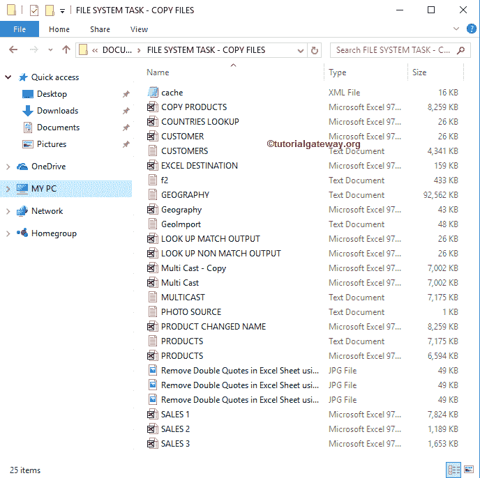
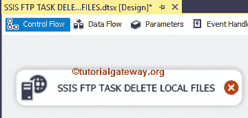
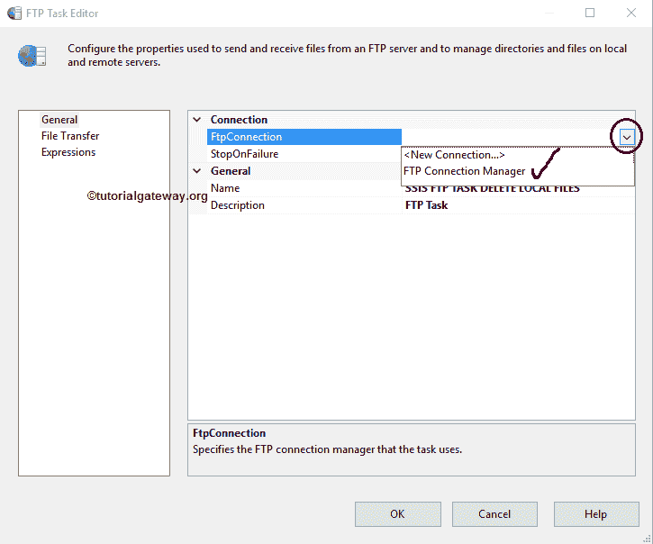
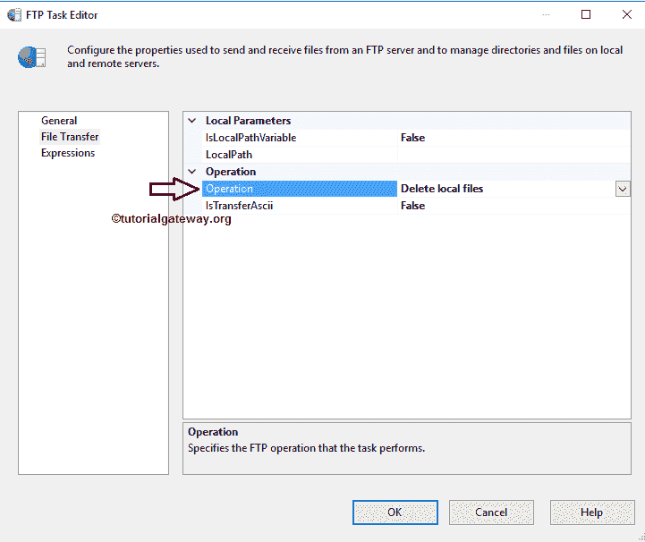
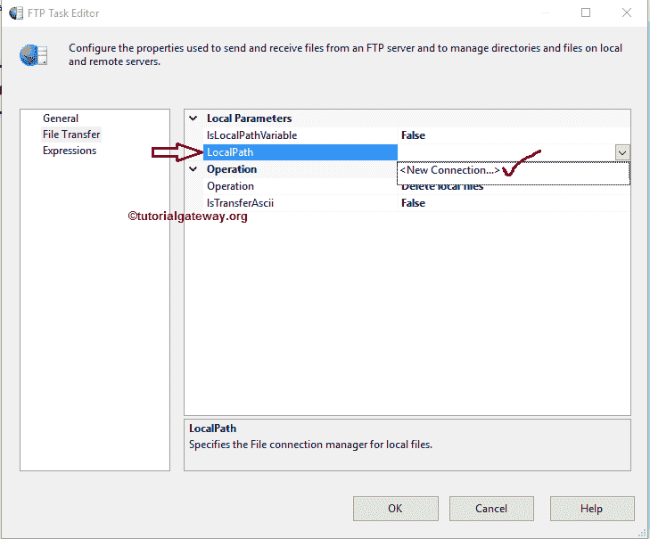
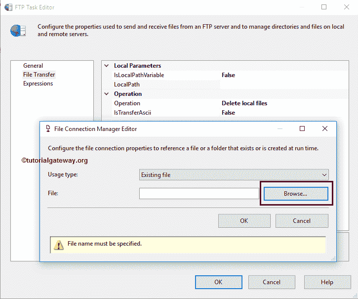
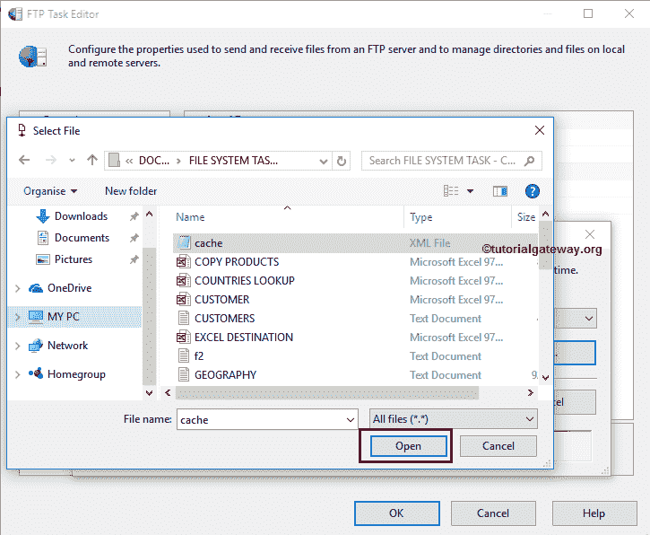
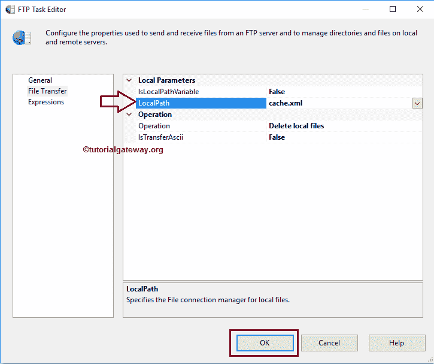
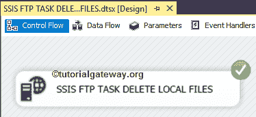

# SSIS 文件传输协议任务删除本地文件

> 原文：<https://www.tutorialgateway.org/ssis-ftp-task-delete-local-files/>

在本文中，我们将通过示例向您展示配置 SSIS FTP 任务删除本地文件所涉及的步骤。

注: [SSIS](https://www.tutorialgateway.org/ssis/) 文件传输协议任务使用[文件传输协议连接管理器](https://www.tutorialgateway.org/ssis-ftp-connection-manager/)连接远程(文件传输协议服务器)文件和文件夹。

下面的截图显示了本地文件系统中的数据。我们的任务是删除文件系统任务文件夹中的现有文件，即

## SSIS 文件传输协议任务删除本地文件

为了删除本地计算机上的文件，首先将 [FTP 任务](https://www.tutorialgateway.org/ssis-ftp-task/)拖放到控制流区域，并将其重命名为【SSIS FTP 任务删除本地文件】

双击它将打开文件传输协议任务编辑器进行配置。请根据您的要求更改任务名称，并提供有效的描述。

在连接部分，我们有一个名为 FTPConnection 的属性。点击下拉箭头将显示您已经创建的 FTP 连接(如果有)，或者请点击<new connection..="">选项创建一个。在这个例子中，我们使用已经创建的连接(FTP 连接管理器)，如下所示。请参考 [SSIS FTP 连接管理器](https://www.tutorialgateway.org/ssis-ftp-connection-manager/)文章了解连接设置</new>

请单击文件传输选项卡来配置文件传输协议操作。下面的截图将向您展示该选项卡中的可用属性。

SSIS FTP 任务支持对文件和文件夹的八种不同操作。在本例中，我们希望删除本地文件系统中的文件，因此，我们从操作属性中选择删除本地文件选项，如下所示

接下来，我们必须配置本地参数。目前，我们手动但实时地声明本地路径，我们建议使用变量。如果我们将 IsLocalPathVariable 设置为 False，我们必须使用 LocalPath 属性配置源连接。如果您已经创建了[文件连接管理器](https://www.tutorialgateway.org/file-connection-manager-in-ssis/)，您可以简单地从下拉列表中选择它，否则，您必须通过选择<新建连接来创建..>。如下图截图所示。

一旦选择了<new connection..="">，文件连接管理器编辑器将在新窗口中打开。使用这个编辑器，我们必须从本地文件系统中选择所需的文件。为此，请单击浏览按钮从我们的文件系统中选择位置。</new>

从下面的截图可以看到，我们选择了 Cache.xml 作为文件名。这意味着，接下来的任务将从 E Drive 中删除 Cache.xml 文件。单击打开按钮选择它。

单击确定完成配置 SSIS FTP 任务删除本地文件包。

让我们运行并看看我们是否成功地从本地文件系统中删除了 Cache.xml 文件。

