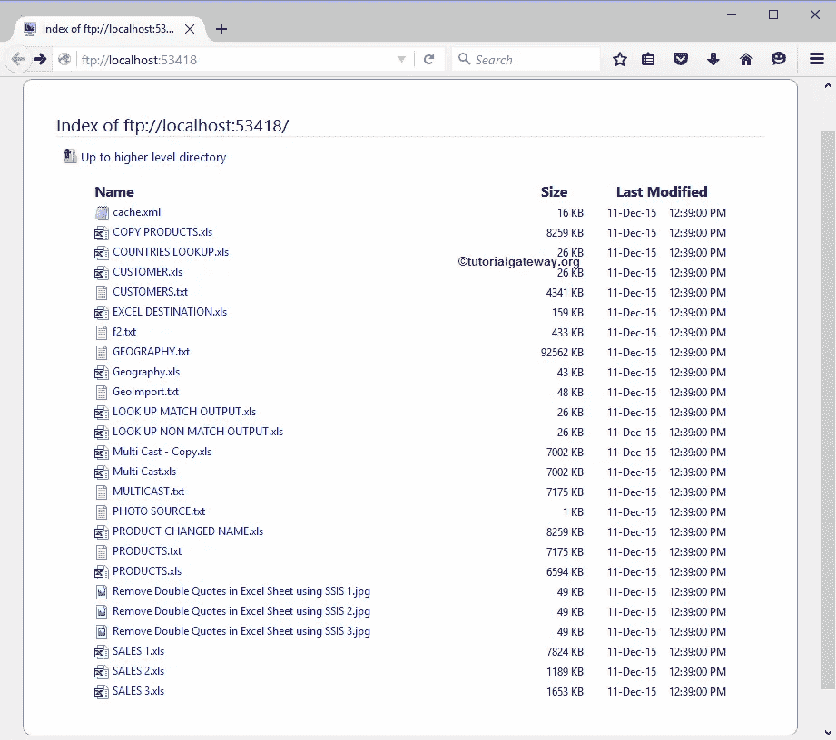
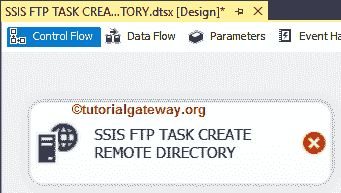
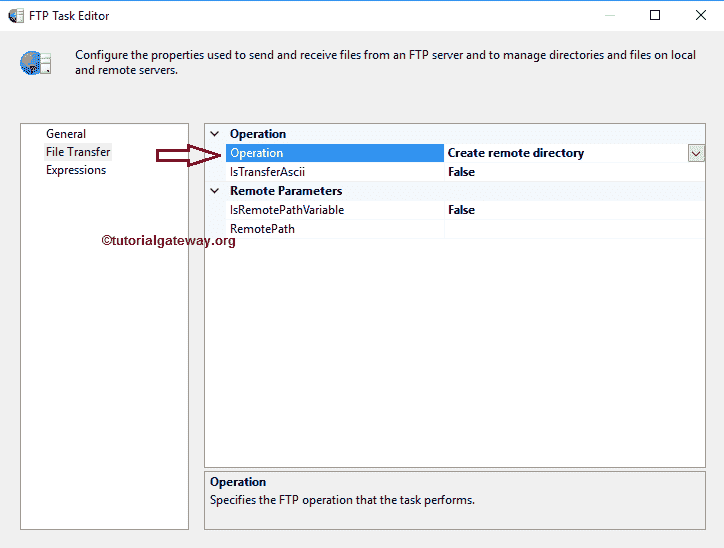
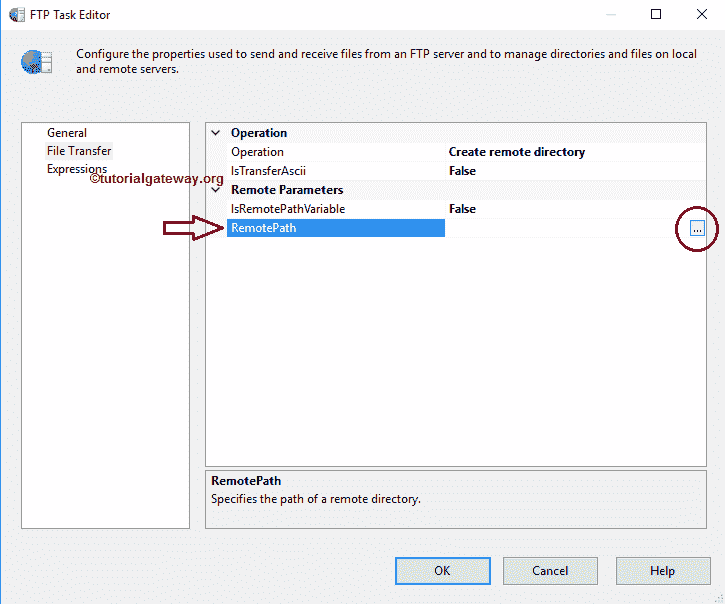
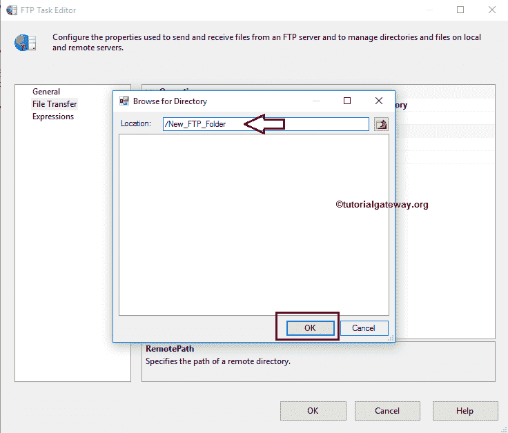
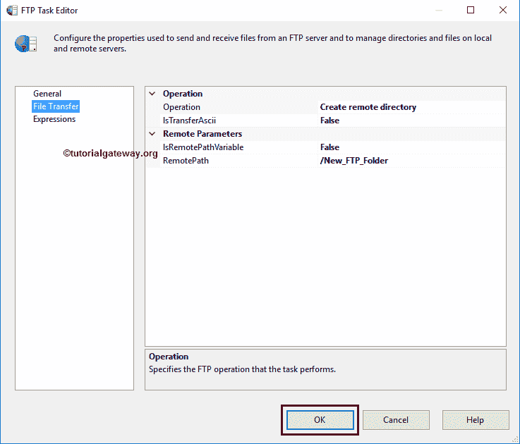
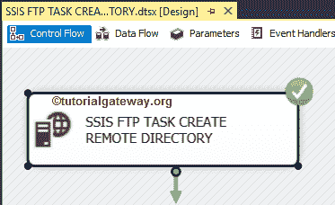

# SSIS 文件传输协议任务创建远程目录

> 原文：<https://www.tutorialgateway.org/ssis-ftp-task-create-remote-directory/>

在本文中，我们将通过一个示例向您展示配置 SSIS FTP 任务以创建远程目录所涉及的步骤。 [SSIS](https://www.tutorialgateway.org/ssis/) 文件传输协议任务使用[文件传输协议连接管理器](https://www.tutorialgateway.org/ssis-ftp-connection-manager/)连接远程(文件传输协议服务器)文件和文件夹。

下面的截图显示了文件传输协议服务器内部的数据。我们的任务是在 SSIS 文件传输协议服务器根目录下创建一个新的文件夹或目录。

## SSIS 文件传输协议任务创建远程目录

要在我们的 FTP 服务器中创建目录或文件夹，首先将 [FTP 任务](https://www.tutorialgateway.org/ssis-ftp-task/)拖放到控制流区域，并将其重命名为 SSIS FTP 任务创建远程目录

双击它将打开文件传输协议任务编辑器进行配置。请更改任务名称并提供有效的描述。

在连接部分，我们有一个名为 FTPConnection 的属性。单击下拉箭头，显示已经创建的文件传输协议连接(如果有)。或者点击<new connection..="">选项创建一个。在这个例子中，我们使用已经创建的连接。请参考 [SSIS FTP 连接管理器](https://www.tutorialgateway.org/ssis-ftp-connection-manager/)文章</new>

T4

请单击文件传输选项卡来配置文件传输协议操作。下面的截图将向您展示该选项卡中的可用属性。

SSIS FTP 任务支持对文件和文件夹的八种不同操作。在这个例子中，我们想在文件传输协议服务器中创建一个新的文件夹。因此，我们从操作属性

中选择创建远程目录选项

目前，我们手动声明远程路径，但是在实时情况下，我们建议使用变量。请单击此选项旁边的浏览按钮(…)打开远程目录。

从下面的截图中，您可以观察到/作为位置，因为它是 FTP 服务器的根目录，目前，我们没有任何子文件夹。在这里，我们正在创建一个名为新文件传输协议文件夹的文件夹。单击确定按钮选择它。

单击“确定”完成 SSIS FTP 任务的配置，以创建远程目录包。

让我们运行，看看我们是否在我们的文件传输协议服务器中成功创建了新文件夹。

嗯，我们在本地 FTP 服务器

内成功创建了一个新文件夹