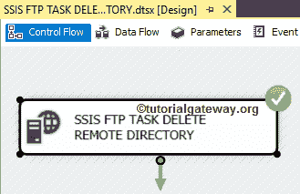
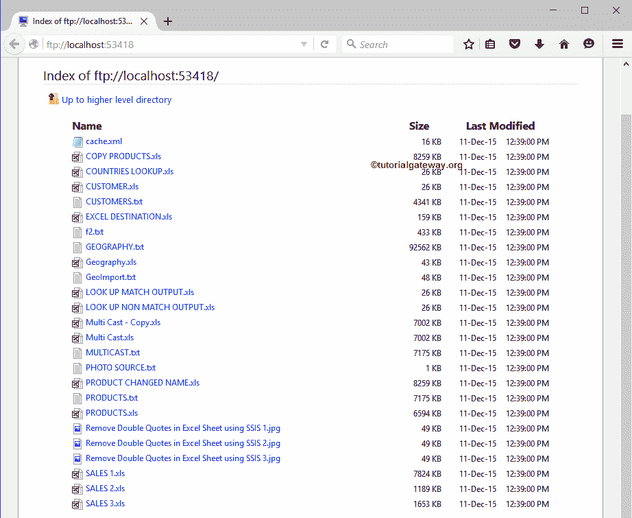

# SSIS 文件传输协议任务删除远程目录

> 原文：<https://www.tutorialgateway.org/ssis-ftp-task-delete-remote-directory/>

[SSIS 文件传输协议任务](https://www.tutorialgateway.org/ssis-ftp-task/)用于对文件和文件夹(或目录)执行不同类型的操作。在本文中，我们将通过示例向您展示配置 SSIS FTP 任务删除远程目录所涉及的步骤。

注: [SSIS](https://www.tutorialgateway.org/ssis/) 文件传输协议任务使用[文件传输协议连接管理器](https://www.tutorialgateway.org/ssis-ftp-connection-manager/)连接远程(文件传输协议服务器)文件和文件夹。

下面的截图显示了文件传输协议服务器内部的数据。我们的任务是删除文件传输协议服务器根目录下的现有文件夹或目录，也就是新的文件传输协议文件夹。

## SSIS 文件传输协议任务删除远程目录

为了从我们的 FTP 服务器上删除目录或文件夹，首先将 FTP 任务拖放到控制流区域，并将其重命名为 SSIS FTP 任务删除远程目录，如下图所示

双击它将打开文件传输协议任务编辑器进行配置。请根据您的要求更改任务名称，并提供有效的描述。

在连接部分，我们有一个名为 FTPConnection 的属性。点击下拉箭头将显示您已经创建的 FTP 连接(如果有)，或者请点击<new connection..="">选项创建一个。在这个例子中，我们使用已经创建的连接(FTP 连接管理器)，如下所示。请参考 [SSIS FTP 连接管理器](https://www.tutorialgateway.org/ssis-ftp-connection-manager/)文章了解连接设置</new>

请单击文件传输选项卡来配置文件传输协议操作。下面的截图将向您展示该选项卡中的可用属性。

SSIS 文件传输协议任务支持八种不同的文件和文件夹操作。在本例中，我们希望删除 FTP 服务器中的现有文件夹，因此，我们从操作属性

中选择了删除远程目录选项

目前，我们手动但实时地声明远程路径，我们建议使用变量。请单击此选项旁边的浏览(…)按钮打开远程目录。

从下面的截图你可以观察到/作为位置，因为它是 FTP 服务器的根目录，目前我们只有一个子文件夹。在这里，我们选择了新的文件传输协议文件夹，如下所示。单击确定按钮选择它。

单击确定完成配置 SSIS FTP 任务删除远程目录包。

让我们运行，看看我们是否成功地从我们的文件传输协议服务器中删除了现有的文件夹(新的文件传输协议文件夹)。

从下面的截图可以观察到，我们成功删除了 FTP 服务器

内已有的文件夹 New_FTP_Folder