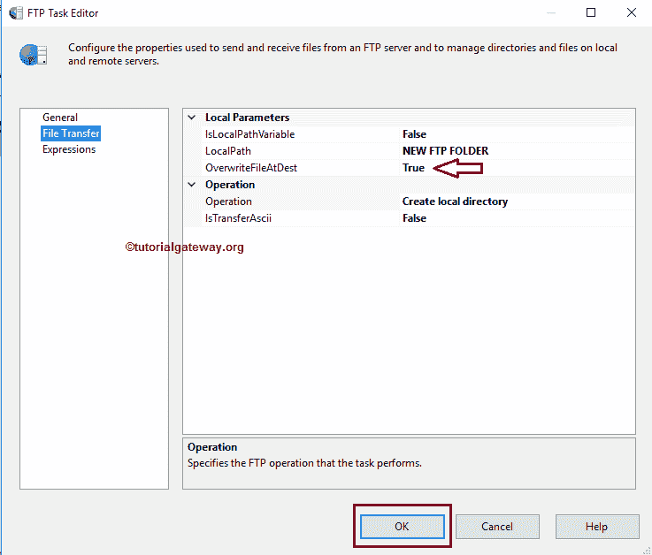
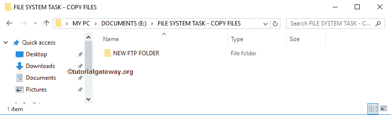

# SSIS 文件传输协议任务创建本地目录

> 原文：<https://www.tutorialgateway.org/ssis-ftp-task-create-local-directory/>

[SSIS FTP 任务](https://www.tutorialgateway.org/ssis-ftp-task/)用于对文件和文件夹(或目录)执行各种操作。在本文中，我们将通过一个示例向您展示配置 SSIS FTP 任务以创建本地目录所涉及的步骤。

注: [SSIS](https://www.tutorialgateway.org/ssis/) 文件传输协议任务使用[文件传输协议连接管理器](https://www.tutorialgateway.org/ssis-ftp-connection-manager/)连接远程(文件传输协议服务器)文件和文件夹。

下面的截图显示了本地文件系统中的数据。我们的任务是使用 SSIS FTP 任务在 E 驱动器内的文件系统文件夹内创建一个新的文件夹或目录。

## SSIS 文件传输协议任务创建本地目录

要在本地计算机上创建目录或文件夹，首先将 FTP 任务拖放到控制流区域，并将其重命名为 SSIS FTP 任务创建本地目录

双击它将打开文件传输协议任务编辑器进行配置。请根据您的要求更改任务名称，并提供有效的描述。

在连接部分，我们有一个名为 FTPConnection 的属性。单击下拉箭头，显示已经创建的文件传输协议连接(如果有)。或者请点击<new connection..="">选项创建一个。在这个例子中，我们使用已经创建的连接。请参考 [SSIS FTP 连接管理器](https://www.tutorialgateway.org/ssis-ftp-connection-manager/)文章了解连接设置</new>

请单击文件传输选项卡来配置文件传输协议操作。下面的屏幕截图显示了该选项卡中的可用属性。

SSIS FTP 任务支持对文件和文件夹的八种不同操作。在这个例子中，我们想要创建一个本地文件夹，因此，我们从操作属性

中选择创建本地目录选项

目前，我们手动声明本地路径，但是在实时情况下，我们建议使用变量。如果我们将 IsLocalPathVariable 设置为 False，我们必须使用 LocalPath 属性配置源连接。如果已经创建了[文件连接管理器](https://www.tutorialgateway.org/file-connection-manager-in-ssis/)，可以从下拉列表中选择。否则，您必须通过选择<新建连接来创建..>。

一旦选择了文件和文件夹的<new connection..="">，文件连接管理器编辑器将在新窗口中打开。使用这个编辑器，我们必须在本地文件系统中创建新文件夹。为此，请单击浏览按钮从文件系统中选择位置。</new>

从下面的截图中，您可以看到我们选择了新的 FTP FOLDER 作为本地文件夹名称。单击确定按钮选择它。

覆盖定义:该属性有两个选项:真和假。如果我们将此属性设置为 true，SSIS FTP 任务将覆盖目标路径中的现有文件夹(如果有)。

单击确定完成配置 SSIS FTP 任务创建本地目录包。让我们运行，看看我们是否在本地文件系统中成功创建了新文件夹。

嗯，我们使用 SSIS FTP 任务

成功创建了一个新的文件夹或目录