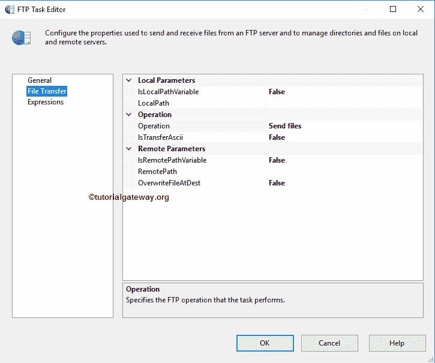

# SSIS FTP任务删除本地目录

> 原文：<https://www.tutorialgateway.org/ssis-ftp-task-delete-local-directory/>

[SSIS FTP任务](https://www.tutorialgateway.org/ssis-ftp-task/)用于对文件和文件夹(或目录)执行不同类型的操作。在本文中，我们将通过示例向您展示配置 SSIS FTP 任务删除本地目录所涉及的步骤。

注: [SSIS](https://www.tutorialgateway.org/ssis/) FTP任务使用[FTP连接管理器](https://www.tutorialgateway.org/ssis-ftp-connection-manager/)连接远程(FTP服务器)文件和文件夹。

下面的截图显示了本地文件系统中的数据。我们的任务是删除文件系统文件夹中的现有文件夹或目录，也就是新的FTP文件夹。

## SSIS FTP任务删除本地目录

为了从我们的本地计算机中删除目录或文件夹，首先将 FTP 任务拖放到控制流区域，并将其重命名为 SSIS FTP 任务删除本地目录

双击它将打开FTP任务编辑器进行配置。在连接部分，我们有一个名为 FTPConnection 的属性。点击下拉箭头将显示您已经创建的 FTP 连接(如果有)，或者请点击<new connection..="">选项创建一个。在这个例子中，我们使用已经创建的连接。请参考 [SSIS FTP 连接管理器](https://www.tutorialgateway.org/ssis-ftp-connection-manager/)文章了解连接设置</new>

请根据您的要求更改任务名称，并提供有效的描述。提供有效的描述总是一种好的做法。

请单击文件传输选项卡来配置FTP操作。下面的截图将向您展示该选项卡中的可用属性。

SSIS FTP任务支持八种不同的文件和文件夹操作。在本例中，我们希望删除本地文件夹，因此，我们从操作属性中选择删除本地目录选项，如下所示。

目前，我们手动但实时地声明本地路径，我们建议使用变量。如果我们将 IsLocalPathVariable 设置为 False，我们必须使用 LocalPath 属性配置源连接。如果您已经创建了[文件连接管理器](https://www.tutorialgateway.org/file-connection-manager-in-ssis/)，您可以简单地从下拉列表中选择它，否则，您必须通过选择<新建连接来创建..>。如下图截图所示。

一旦选择了文件和文件夹的<new connection..="">，文件连接管理器编辑器将在新窗口中打开。使用这个编辑器，我们必须从本地文件系统中选择所需的文件夹。为此，请单击浏览按钮从文件系统中选择位置。</new>

从下面的截图中，您可以看到，我们选择了新的 FTP 文件夹作为本地文件夹名称。这意味着，接下来的任务将从 E 驱动器删除新的 FTP 文件夹。单击确定按钮选择它。

如果您想在此操作中使用 ASCII 模式，请将 IsTransferAscii 属性设置为真，否则为假

单击确定完成配置 SSIS FTP 任务删除本地目录包。让我们运行，看看我们是否成功地从本地文件系统中删除了现有的文件夹或目录。

嗯，我们成功地从本地文件系统中删除了文件夹或目录。

