# SSIS FTP 任务删除远程文件

> 原文：<https://www.tutorialgateway.org/ssis-ftp-task-delete-remote-files/>

[SSIS FTP 任务](https://www.tutorialgateway.org/ssis-ftp-task/)用于对文件和文件夹(或目录)执行不同类型的操作。在本文中，我们将通过示例向您展示配置 SSIS FTP 任务删除远程文件所涉及的步骤。

下面的截图将向您展示 FTP 服务器内部的数据。我们的任务是删除一个或所有文件。txt，。xls，。存在于 FTP 服务器的根目录中。

注: [SSIS](https://www.tutorialgateway.org/ssis/) FTP 任务使用[FTP 连接管理器](https://www.tutorialgateway.org/ssis-ftp-connection-manager/)连接远程(FTP 服务器)文件和文件夹。

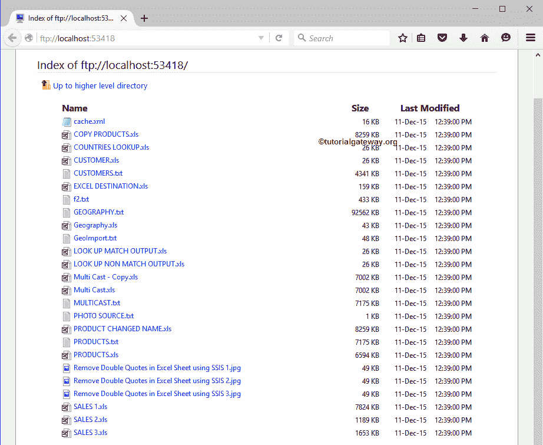

## SSIS FTP 任务删除远程文件

要从 FTP 服务器删除文件，首先将 FTP 任务拖放到控制流区域，并将其重命名为 SSIS FTP 任务删除远程文件

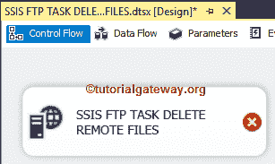

双击它将打开 FTP 任务编辑器进行配置。请根据您的要求更改任务名称，并提供有效的描述。

在连接部分，我们有一个名为 FTPConnection 的属性。点击下拉箭头将显示您已经创建的 FTP 连接(如果有)，或者请点击<new connection..="">选项创建一个。在这个例子中，我们使用已经创建的连接(FTP 连接管理器)，如下所示。请参考 [SSIS FTP 连接管理器](https://www.tutorialgateway.org/ssis-ftp-connection-manager/)文章了解连接设置</new>

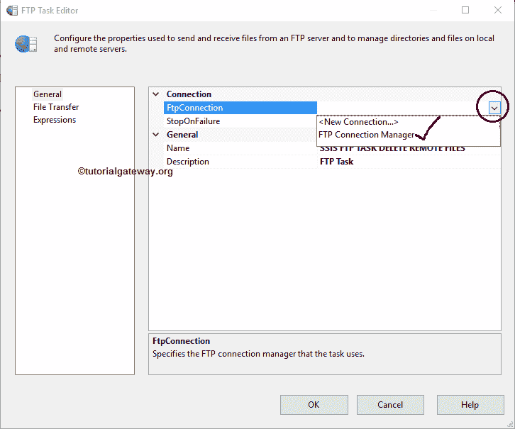

请单击文件传输选项卡来配置 FTP 操作。下面的截图将向您展示该选项卡中的可用属性。

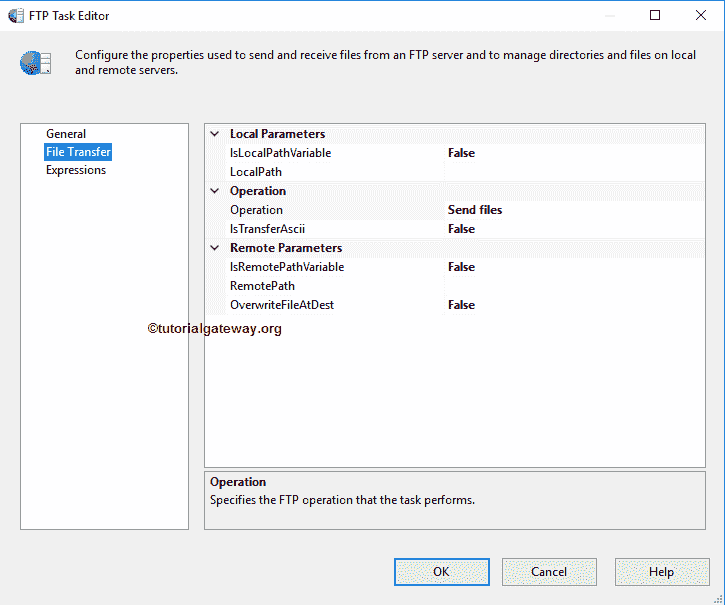

SSIS FTP 任务支持八种不同的文件和文件夹操作。在本例中，我们希望删除 FTP 服务器中的现有文件，因此，我们从操作属性

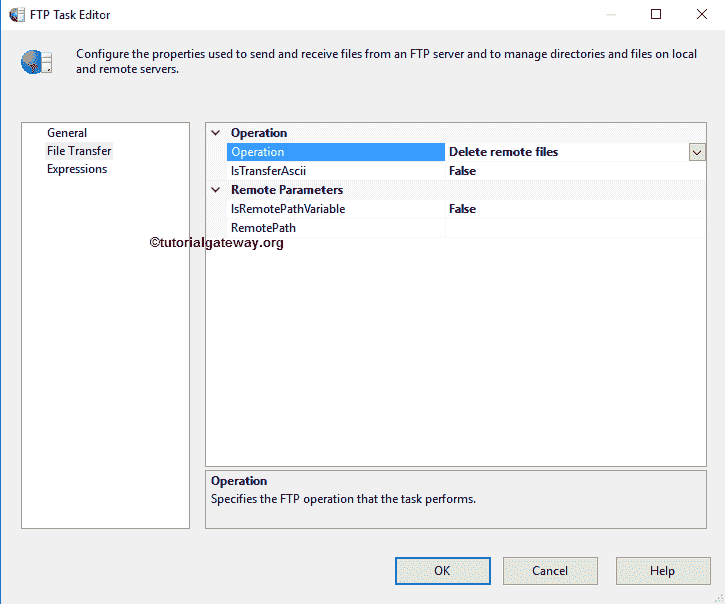

中选择了删除远程目录选项

目前，我们手动但实时地声明远程路径，我们建议使用变量。请单击此选项旁边的浏览(…)按钮打开远程目录。

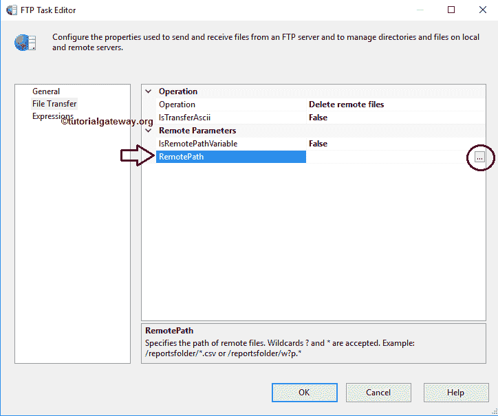

从下面的截图你可以观察到/作为位置，因为它是 FTP 服务器的根目录，目前我们没有任何子文件夹。如果要删除单个文件，我们可以从目录中选择需要的文件。

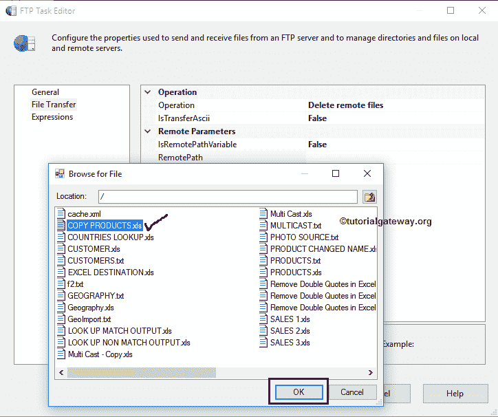

单击确定按钮选择它。

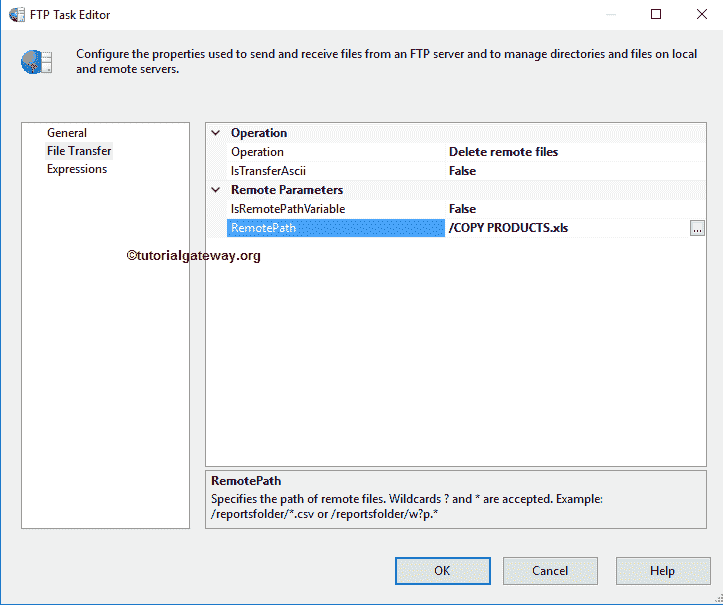

如果您想删除多个文件，我们可以使用通配符。在这里，我们想删除 FTP 服务器中的所有文件，所以我们使用*。*.

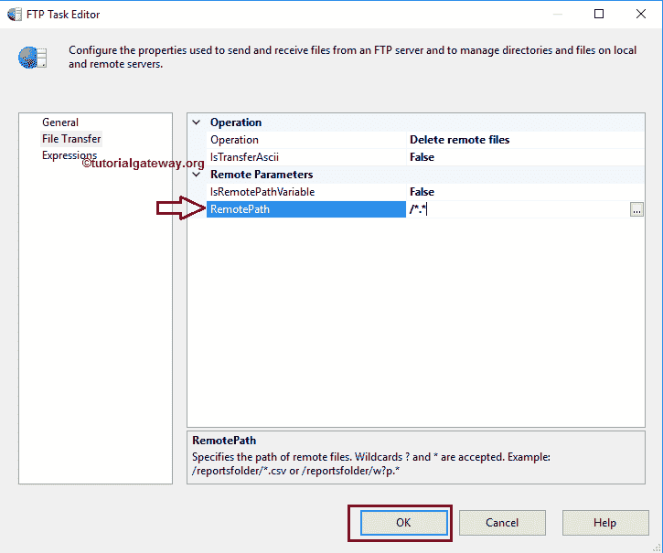

单击确定完成配置 SSIS FTP 任务删除远程文件包。让我们运行，看看我们是否成功地从我们的 FTP 服务器删除了现有的文件。

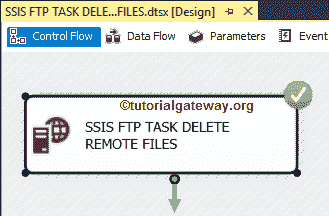

从下面的截图中你可以观察到，我们成功删除了我们 FTP 服务器

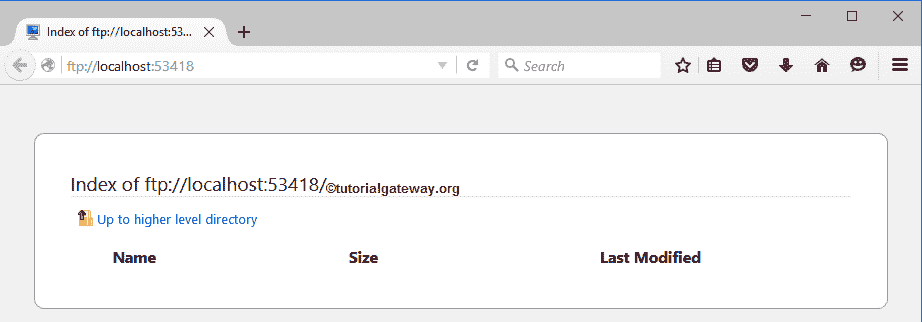

内的所有现有文件