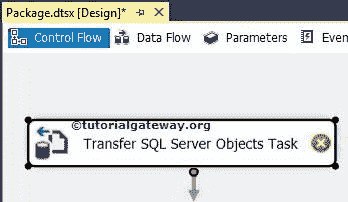
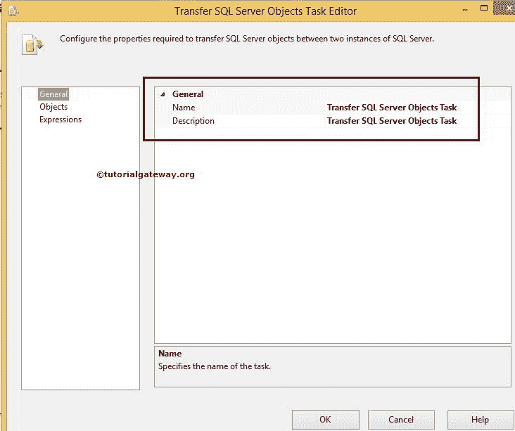

# SSIS 中的传输 SQL Server 对象任务

> 原文：<https://www.tutorialgateway.org/transfer-sql-server-objects-task-in-ssis/>

SSIS 的“传输 SQL Server 对象”任务用于传输一个或多个 SQL Server 对象(如表、视图、存储过程、用户定义函数、索引、用户、登录等)。)从一个数据库转移到另一个数据库。“SQL Server 集成服务”中的“传输 SQL Server 对象”任务允许我们对源和目标连接使用相同的 SQL Server 实例，或者使用不同的实例。

在 SSIS，传输 SQL Server 对象任务的一些关键特性是:

*   SSIS 的“传输 SQL Server 对象”任务允许您选择一种类型的 SQL 对象或所有 SQL Server 对象。表、视图、存储过程、用户定义函数等。，是一些 SQL Server 对象。
*   SSIS 的“传输 SQL Server 对象”任务允许您选择所有表，或者它将传输所有表。请参考[在 SSIS 传输带有数据的 SQL Server 表](https://www.tutorialgateway.org/transfer-sql-server-tables-with-data-in-ssis/)文章，了解如何将 SQL Server 表从源传输到目标。
*   在 SSIS 传输 SQL Server 对象任务允许您传输 SQL Server 表结构，这意味着没有数据的表。请参考[在 SSIS 传输 SQL Server 表结构](https://www.tutorialgateway.org/transfer-sql-server-table-structures-in-ssis/)文章，了解如何将 SQL Server 表结构从源传输到目标。
*   SSIS 的“传输 SQL Server 对象”任务允许您选择所有存储过程。或者它将传输源数据库中的所有存储过程。请参考[在 SSIS 传输 SQL Server 存储过程](https://www.tutorialgateway.org/transfer-sql-server-stored-procedures-in-ssis/)文章，了解如何在 [SSIS](https://www.tutorialgateway.org/ssis/) 将用户定义的存储过程从源传输到目标。
*   SSIS 的“传输 SQL Server 对象”任务允许您选择所有用户定义的函数。或者它传输源数据库中的所有用户定义函数。请参考[在 SSIS 传输 SQL Server 自定义函数](https://www.tutorialgateway.org/transfer-sql-server-user-defined-functions-in-ssis/)文章，了解如何将自定义函数从源传输到目标。
*   SSIS 的“传输 SQL Server 对象”任务允许您选择所有视图。或者它传输所有视图。请参考 SSIS 文章中的[传输 SQL Server 视图，了解如何将视图从源传输到目标。](https://www.tutorialgateway.org/transfer-sql-server-views-in-ssis/)

## 在 SSIS 配置传输 SQL Server 对象任务

将“传输 SQL Server 对象”任务从工具箱拖到控制流区域。双击该任务将打开如下所示的传输 SQL Server 对象任务编辑器进行配置。

### 常规选项卡

此选项卡纯粹用于更改 SSIS 传输 SQL Server 对象任务名称并提供描述。实时情况下，请将任务名称更改为适当的名称，并编写描述来解释任务功能。它帮助其他开发人员更好地理解任务。

例如，如果您正在传输表，那么请编写类似以下内容:

*   名称:传输 SQL 服务器表
*   描述:将名为“员工和销售”的 SQL Server 表连同数据从[Adventure Works 2014]传输到[SSIS 教程]数据库。

### 对象选项卡

在此选项卡中，我们将在 SSIS 执行所有传输 SQL Server 对象任务操作。让我们一节一节地探讨它们。

#### 关系

*   源连接:为源数据库配置连接管理器设置。如果已经创建，从列表中选择或点击<new connection="">创建新连接。</new>
*   源数据库:它是要从中复制表、视图和函数等对象的数据库的名称。
*   目标连接:为目标数据库配置连接管理器设置。如果已经创建，请从列表中选择。或者点击<new connection="">创建新连接。</new>
*   目标数据库:选择所选对象复制到的目标连接上的数据库的名称。

注意:SSIS 的传输 SQL Server 对象任务仅支持 [SMO 连接管理器](https://www.tutorialgateway.org/smo-connection-manager-in-ssis/)，因此，对于源和目标，请创建 SMO 连接管理器。

#### 目标

*   DropObjectsFirst:在复制它们之前，请指定是否要在目标数据库中删除选定的对象。
*   IncludeExtendedProperties:指定在复制数据时是否要包含 SQL 对象的扩展属性。
*   复制数据:复制表时，是否也要传输所选表的数据？如果是，则选择“真”。如果选择 FALSE，将会传输带有列名的空表。
*   现有数据:在将数据复制到目标表时，它为您提供了是追加还是替换数据的选项。如果选择追加选项，新数据将添加到旧数据中。否则，新数据将被旧数据替换。
*   复制模式:将 SQL 对象的模式从源复制到目标。
*   使用排序规则:每个数据库都有自己的排序规则设置。通过将此选项设置为真，SSIS 传输 SQL Server 对象任务将使用目标数据库中源数据库的排序规则设置。
*   包含从属对象:如果有任何从属对象，通过设置此选项，它也会复制那些从属对象。

#### 目标复制对象

*   复制对象:是否要将所有 SQL 对象从源数据库复制到目标数据库。如果您将此设置为真，则所有的 SQL 对象都将一次性传输。如果设置为假，下一个属性对象复制将被启用。
*   对象复制:通过扩展此属性，您可以从源数据库中选择单个的 SQL 对象。这些对象类型可能因 SQL Server 版本而异。下面的截图会给你看那些

在这里，我们将为您解释在 SSIS 传输 SQL Server 对象任务中可用的 [SQL Server](https://www.tutorialgateway.org/sql/) 对象

*   复制所有表:如果要将所有表从源数据库传输到目标数据库，请将此选项设置为真。如果要移动一个或几个表，请设置 FALSE 并从表列表中选择所需的表
*   表列表:除了这个选项，还有一个(…)按钮。单击该按钮将显示源数据库中存在的所有表。您的工作是从列表中选择所需的表。这些选定的表已传输到目标数据库。
*   复制所有视图:如果要将所有视图从源数据库传输到目标数据库，请将此选项设置为真。如果您要传输一个或几个视图，请设置 FALSE 并从视图列表中选择所需的视图
*   视图列表:除了这个选项，还有一个(…)按钮。单击该按钮会显示源数据库中存在的所有视图。您的工作是从列表中选择所需的视图。这些选定的视图将传输到目标数据库。
*   CopyAllStoredProcedures:如果要将所有用户定义的存储过程从源数据库传输到目标数据库，请将此选项设置为 TRUE。要传输一个或几个存储过程，请设置 FALSE，并从存储过程列表中选择所需的用户定义存储过程
*   StoredProceduresList:除了这个选项，还有一个(…)按钮。单击该按钮将显示源数据库中存在的所有用户定义的存储过程，您的工作是从列表中选择所需的存储过程。这些选定的用户定义存储过程被传输到目标数据库。
*   复制用户定义的函数:如果要将所有用户定义的函数从源数据库转移到目标数据库，请将此选项设置为真。要转移一个或几个用户定义函数，请设置 FALSE，并从用户定义函数列表中选择所需的用户定义函数
*   用户定义的功能列表:除了这个选项，还有一个(…)按钮。单击该按钮将显示源数据库中存在的所有用户定义函数，您的工作是从列表中选择所需的用户定义函数。这些用户定义的函数被移动到目标数据库。
*   复制默认值:如果要将所有默认值从源数据库传输到目标数据库，请将此选项设置为真。要移动一个或几个默认值，请设置 FALSE，并从默认值列表中选择所需的值
*   默认列表:除此之外，还有一个(…)按钮。单击该按钮将显示源数据库中存在的所有默认值，您的工作是从列表中选择所需的默认值。这些选定的默认值被移动到目标数据库。
*   复制用户定义的数据类型:如果要将所有用户定义的数据类型从源数据库传输到目标数据库，请将此选项设置为真。如果要移动一个或几个数据类型，请设置 FALSE，并从用户定义的数据类型列表中选择所需的用户定义的数据类型
*   用户定义的数据类型列表:除了这个选项，还有一个(…)按钮。单击该按钮将显示源数据库中存在的所有用户定义数据类型，您的工作是从列表中选择所需的用户定义数据类型。这些选定的数据类型被传输到目标数据库。
*   复制分区函数:如果要将所有分区函数从源数据库转移到目标数据库，请将此选项设置为真。要移动一个或几个分区函数，请设置 FALSE，并从分区函数列表中选择所需的分区函数
*   分区功能列表:除了这个选项，还有一个(…)按钮。单击该按钮将显示源数据库中存在的所有分区函数。您的工作是从列表中选择所需的分区。这些选定的将被转移。
*   复制分区方案:如果要将所有分区方案从源数据库传输到目标数据库，请将此选项设置为真。要移动一个或几个分区方案，请设置 FALSE，并从分区方案列表中选择所需的分区方案
*   PartitionSchemesList:除此之外，还有一个(…)按钮。单击该按钮会显示源数据库中存在的所有分区方案，您的工作是从列表中选择所需的分区。这些选定的已传输到目标数据库。
*   复制所有模式:如果要将所有数据库模式从源数据库传输到目标数据库，请将此选项设置为真。要传输一个或几个模式，请设置 FALSE，然后从模式列表中选择所需的模式
*   SchemasList:除了这个选项，还有一个(…)按钮。单击该按钮将显示源数据库中存在的所有模式。您的工作是从列表中选择所需的模式。这些选定的已传输到目标数据库。
*   复制 SQL 程序集:如果要将所有 SQL 程序集从源数据库传输到目标数据库，请将此选项设置为真。要传输一个或几个 SQL 程序集，请设置 FALSE，并从 SQL 程序集列表中选择所需的 SQL 程序集
*   SqlAssembliesList:除了这个选项，还有一个(…)按钮。单击该按钮将显示源数据库中存在的所有 SQL 程序集，您的工作是从列表中选择所需的程序集。这些选定的已传输到目标数据库。
*   复制用户定义的聚合:如果要将所有用户定义的聚合从源数据库传输到目标数据库，请将此选项设置为真。如果要移动一个或几个聚合，请设置 FALSE，并从用户定义的聚合列表中选择所需的聚合
*   用户定义聚合列表:除了这个选项，还有一个(…)按钮。单击该按钮会显示源数据库中存在的所有用户定义的聚合。您的工作是从列表中选择所需的聚合。这些选定的文件被移动到目标数据库。
*   复制用户定义的类型:如果要将所有用户定义的类型从源数据库传输到目标数据库，请将此选项设置为真。要移动一个或几个类型，请设置 FALSE，并从用户定义的类型列表中选择所需的类型
*   用户定义的类型列表:除了这个选项，还有一个(…)按钮。单击该按钮将显示源数据库中存在的所有用户定义类型。您的工作是从列表中选择所需的类型。这些选择的将转移到目标数据库。
*   复制 XML 架构集合:如果要将所有 XML 架构集合从源数据库传输到目标数据库，请将此选项设置为真。要移动一个或几个 XML 模式，请设置 FALSE，并从 XmlSchemaCollectionsList 列表中选择所需的模式
*   XmlSchemaCollectionsList:除了这个选项，还有一个(…)按钮。单击该按钮将显示源数据库中存在的所有 XML 模式集合。您的工作是从列表中选择所需的 XML 模式。这些选定的文件被移动到目标数据库。

#### 安全

*   复制数据库用户:通过在“真”和“假”之间切换，指定是否要将数据库用户从源数据库转移到目标数据库。
*   复制数据库角色:指定是否要将角色从源数据库转移到目标数据库。
*   复制 SQL Server 登录名:指定是否要将 SQL Server 登录名从源数据库传输到目标数据库。
*   复制对象级别权限:指定是否要将对象级别权限从源数据库转移到目标数据库。

#### 表选项

*   复制索引:通过在“真”和“假”之间切换，指定是否要将表索引从源数据库复制到目标数据库。
*   复制触发器:指定是否要将表中的触发器从源数据库复制到目标数据库
*   复制全文索引:指定是否要将全文索引从源数据库复制到目标数据库
*   复制所有对象:指定是否要将表的引用完整性从源数据库复制到目标数据库
*   复制主键:指定是否要将表中的主键从源数据库复制到目标数据库
*   复制外键:是否要将表中的外键从源数据库复制到目标数据库是否包含外键
*   生成脚本代码:指定是否要以 Unicode 格式生成脚本

注意:在 SSIS 执行传输 SQL Server 对象任务的包的人必须具有删除和创建对象的权限。