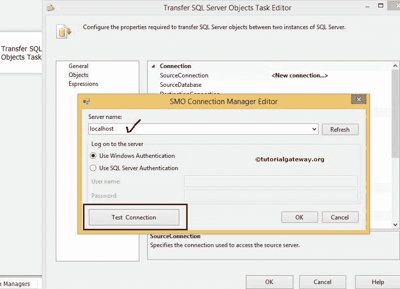
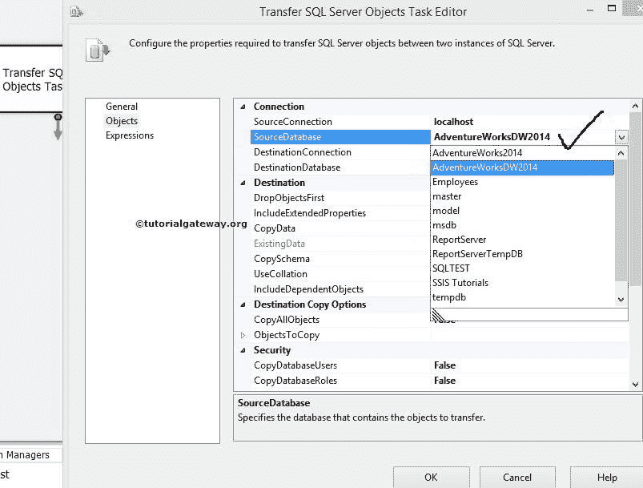
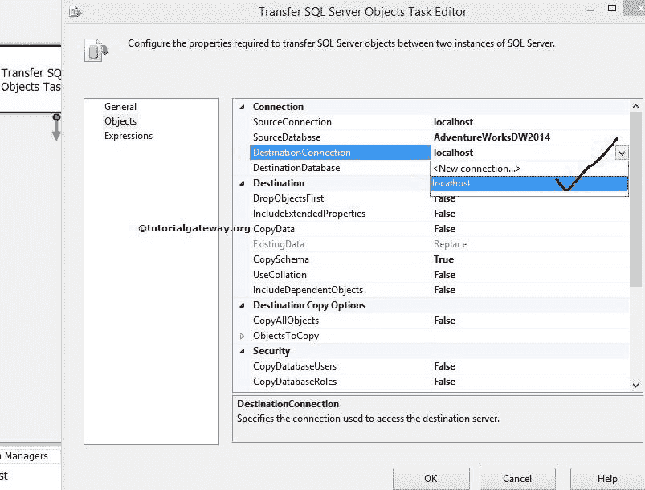
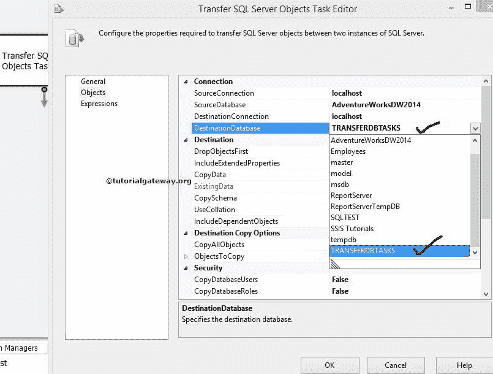
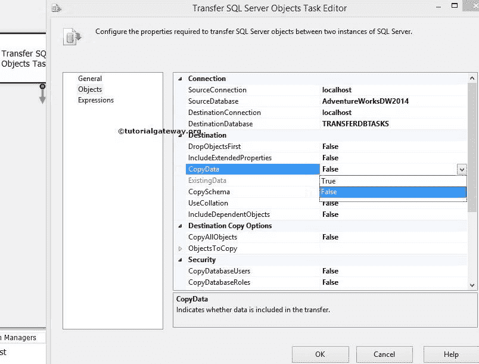
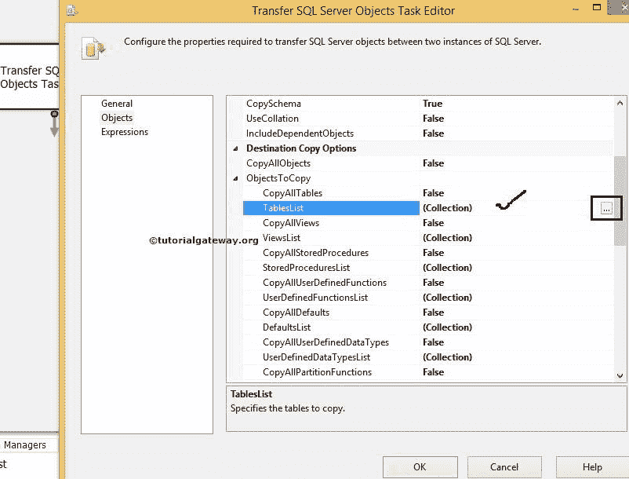

# 在 SSIS 中传输带有数据的 SQL Server 表

> 原文：<https://www.tutorialgateway.org/transfer-sql-server-tables-with-data-in-ssis/>

在本文中，我们将向您展示如何使用[传输 SQL Server 对象任务](https://www.tutorialgateway.org/transfer-sql-server-objects-task-in-ssis/)将带有数据的 SQL Server 表从一个数据库传输到另一个数据库。如果您想传输 SQL Server 表结构(无数据)，请参考 SSIS 文章中的[传输 SQL Server 表结构。](https://www.tutorialgateway.org/transfer-sql-server-table-structures-in-ssis/)

## 在 SSIS 使用传输 SQL Server 对象任务传输带有数据的 SQL Server 表

如果您观察下面的截图，我们有一个空数据库(TRANSFERDBTASKS)。在本例中，我们将使用 [SSIS](https://www.tutorialgateway.org/ssis/) 中的 Transfer SQL Server 对象任务将几个表以及数据从【Adventure Works DW 2014】数据库传输到【TRANSFER DB TASKS】数据库。

步骤 1:打开 BIDS，从工具箱中拖放传输 SQL Server 对象任务来控制流程。

双击传输 SQL Server 对象将打开传输 SQL Server 对象任务编辑器进行配置。

常规选项卡:在此选项卡中，您可以根据项目要求写下您的姓名和描述。

这里我们没有更改名称，但是我们将描述更改为“用数据传输 SQL Server 表”。

单击对象选项卡

步骤 2:选择 SourceConnection 属性，然后单击它创建一个新连接。如果已经创建，则选择它。

单击<new connection="">后，将打开 SMO 连接管理器编辑器窗口来配置连接。</new>

步骤 3:在这个例子中，我们选择了本地主机实例，并且使用了 Windows 身份验证。如果您为组织工作，请选择“SQL Server 身份验证”，并提供凭据。

单击测试连接按钮检查连接是否抛出错误。

第 4 步:单击源数据库选项，选择您想要使用的数据库。对于这个 SSIS 传输带数据的 SQL Server 表，我们选择[冒险作品 DW 2014]。

步骤 5:选择目标连接属性，然后单击创建新连接。如果已经创建，则选择它。

我们已经在 SourceConnection 中提到了 localhost 实例，这里我们也将使用相同的实例。如果您想创建一个新的，点击将打开 SMO 连接管理器编辑器窗口来配置连接。

第六步:点击目标数据库选项，选择你想使用的数据库。现在，我们选择[传输数据库任务]。

第七步:点击复制数据属性，将默认选项从假更改为真。在本例中，我们愿意将 SQL Server 数据库表和数据一起从源传输到目标。

通过将复制数据属性选项从假更改为真，传输 SQL Server 对象任务将复制表以及表中的数据。

步骤 8:如果需要从源数据库中复制所有对象(视图、函数、存储过程、表)，那么将 CopyAllObjects 选项设置为 True。在本例中，我们将发送几个表。所以我们让它默认为 False。

如果我们将复制对象选项设置为假，下一个属性对象复制将被启用。

步骤 9:单击对象复制属性进行配置。对象复制属性将探索传输 SQL Server 对象任务的许多选项。让我们专注于属于或与这个例子相关的选项。在这个例子中，我们的要求是转移表。所以我们只需要理解前两个选项，比如 CopyAllTables 和 TableList。

如果需要从源数据库复制所有表，请将“复制所有表”选项设置为“真”。在本例中，我们将发送几个表，所以我们将默认为 False。

注意:如果将“复制所有表”选项设置为“真”，则从表列表选项中选择表是没有意义的。

步骤 10:点击表列表选项，然后点击集合。单击“集合”旁边的(…)按钮后，它会打开“选择表”窗口，从源连接中选择可用的表。

对于本例，我们仅选择 3 个表([Dim 客户]、[Dim 员工]、[Dim 产品]和[Dim 地理位置])。但是你可以试着用更多的桌子。

步骤 11:单击确定关闭选择表窗口，然后单击确定完成配置传输 SQL Server 对象任务。

让我们运行包，看看我们是否成功地将带有数据的 SQL Server 表从源传输到目标。

让我们打开 [SQL Server 管理工作室](https://www.tutorialgateway.org/sql/)查看表。

从上面的截图中，您可以观察到我们成功地传输了 SQL Server 表及其数据。