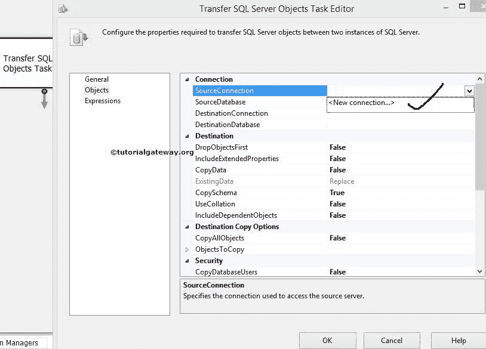
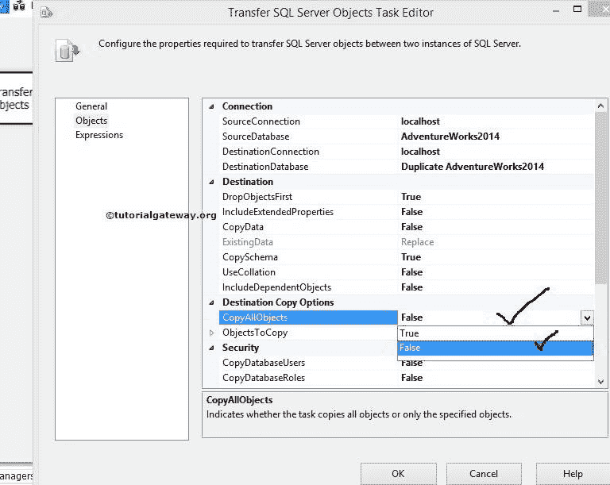
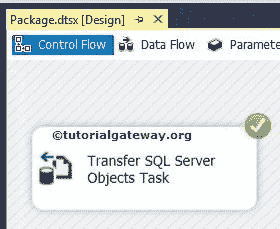

# 在 SSIS 传输 SQL Server 存储过程

> 原文：<https://www.tutorialgateway.org/transfer-sql-server-stored-procedures-in-ssis/>

在本文中，我们将向您展示如何在 SSIS 传输 SQL Server 存储过程。为此，我们将创建一个 SSIS 包，使用传输 SQL Server 对象任务将 SQL Server 存储过程从一个数据库传输到另一个数据库。

请参考 SSIS 中的[传输 SQL Server 对象任务，了解每个](https://www.tutorialgateway.org/transfer-sql-server-objects-task-in-ssis/) [SSIS](https://www.tutorialgateway.org/ssis/) 属性的功能。

## 在 SSIS 使用传输 SQL Server 对象任务传输 SQL Server 存储过程

如果您观察下面的截图，有一个名为[重复冒险 2014]的数据库。我们已经在 SSIS 文章中的[传输带有数据的 SQL Server 表中传输了表。](https://www.tutorialgateway.org/transfer-sql-server-tables-with-data-in-ssis/)

在本例中，我们将使用 SSIS 传输 SQL Server 对象任务，将 SQL Server 存储过程从[AdventureWorks2014]传输到[复制 AdventureWorks2014]。如果您想转移用户定义函数，那么请参考 SSIS 文章中的[转移 SQL Server 用户定义函数。](https://www.tutorialgateway.org/transfer-sql-server-user-defined-functions-in-ssis/)

第一步:打开 BIDS，从工具箱中拖放[传输 SQL Server 对象任务](https://www.tutorialgateway.org/transfer-sql-server-objects-task-in-ssis/)来控制流程。

双击传输 SQL Server 对象将打开传输 SQL Server 对象任务编辑器进行配置。

常规选项卡

在该选项卡中，输入名称和描述

步骤 2:选择 SourceConnection 属性，然后单击它创建一个新连接。如果已经创建，则选择它。

单击<new connection="">后，将打开 SMO 连接管理器编辑器窗口来配置连接。</new>

步骤 3:在这个例子中，我们选择本地主机实例并使用 Windows 身份验证。如果您在某个组织工作，请选择 [SQL Server](https://www.tutorialgateway.org/sql/) 身份验证，并输入凭据。

单击测试连接按钮检查连接是否抛出错误。

第 4 步:单击源数据库选项并选择数据库。目前，我们选择了[Adventureworks2014]。

步骤 5:选择目标连接属性，然后单击创建新连接。如果已经创建，则选择它。

我们已经在 SourceConnection 中提到了 localhost 实例，这里也使用了相同的实例。如果您想创建一个新的，点击将打开 SMO 连接管理器编辑器窗口来配置连接。

第六步:点击目标数据库选项，选择你想使用的数据库。现在，我们选择[复制冒险 2014]。

步骤 7:如果需要从源数据库中复制所有对象(视图、函数、存储过程、表)，那么将 CopyAllObjects 选项设置为 True。在本例中，我们将只发送存储过程。所以我们让它默认为 False。

如果我们将复制对象选项设置为假，下一个属性对象复制将被启用。

步骤 8:单击对象复制属性进行配置。对象复制属性将探索传输 SQL Server 对象任务的许多选项。让我们专注于属于或与这个例子相关的选项。在这个例子中，我们的需求是转移存储过程。因此，我们必须了解诸如 CopyAllStoredProcedures 和 StoredProceduresList 之类的选项。

如果需要从源数据库复制所有存储过程，请将“复制所有存储过程”选项设置为“真”。虽然我们发送了所有的存储过程。为了向您展示，我们将其保留为默认值 False，稍后我们将在存储过程列表

中选择它们

步骤 9:单击存储过程列表选项，然后单击集合。单击集合旁边的(…)按钮后，它将打开选择存储过程窗口，从源连接中选择可用的存储过程。

对于本例，我们选择了所有选项，但是您可以尝试不同的选项。

步骤 10:单击确定关闭选择存储过程窗口，然后单击确定完成配置传输 SQL Server 对象任务。

让我们运行包，看看我们是否成功地将 SQL Server 存储过程从源传输到目标。

让我们打开 SQL Server 管理工作室，检查 SSIS 传输 SQL Server 存储过程。

从上面的截图可以观察到，我们成功传输了 SQL Server [存储过程](https://www.tutorialgateway.org/stored-procedures-in-sql/)。