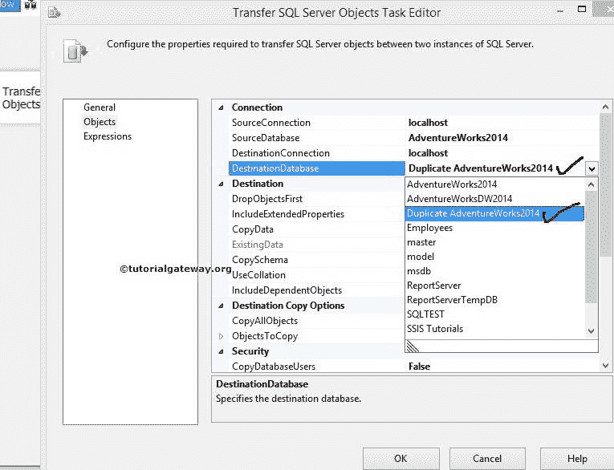

# 在 SSIS 传输 SQL Server 用户定义函数

> 原文：<https://www.tutorialgateway.org/transfer-sql-server-user-defined-functions-in-ssis/>

在本文中，我们将向您展示如何使用传输 SQL Server 对象任务将 SQL Server 用户定义函数从一个数据库传输到另一个数据库。

## 在 SSIS 使用传输 SQL Server 对象任务传输 SQL Server 用户定义函数

在这个 SSIS 示例中，我们将使用传输 SQL Server 对象任务将用户定义函数(表值函数和标量值函数)从[AdventureWorks2014]传输到[复制 AdventureWorks2014]。

如果您观察下面的截图，有一个名为[重复冒险 2014]的数据库。我们已经使用[传输 SQL Server 对象任务](https://www.tutorialgateway.org/transfer-sql-server-objects-task-in-ssis/)从【AdventureWorks2014】传输了表。请参考[在 SSIS 传输带数据的 SQL Server 表](https://www.tutorialgateway.org/transfer-sql-server-tables-with-data-in-ssis/)一文，了解如何传输 [SQL server](https://www.tutorialgateway.org/sql/) 表。如果您想移动存储过程，请参考[在 SSIS 传输 SQL Server 存储过程](https://www.tutorialgateway.org/transfer-sql-server-stored-procedures-in-ssis/)一文。

在我们开始创建 SSIS 传输 SQL Server 用户定义函数包之前，让我们看看[adventureworks 2014]

中的[函数](https://www.tutorialgateway.org/user-defined-functions-in-sql/)

从上面的截图中，可以观察到[AdventureWorks2014]数据库中保存了一个表值函数和 10 个标量值函数。我们的工作是使用传输 SQL Server 对象任务将一个表值函数和 9 个标量值函数(除了 ufnLeadingZeros 函数)从[AdventureWorks2014]传输到[复制 AdventureWorks2014]。现在让我们看看目标数据库

从上面的截图中，您可以观察到[复制 AdventureWorks2014]数据库保存了一个标量值函数。

步骤 1:打开 BIDS，从工具箱中拖放 [SSIS](https://www.tutorialgateway.org/ssis/) 传输 SQL Server 对象任务来控制流程。

双击传输 SQL Server 对象将打开传输 SQL Server 对象任务编辑器进行配置。

常规选项卡:在此选项卡中，您可以根据项目要求编写自己的名称和描述。

在这里我们没有改变任何东西。单击对象选项卡

步骤 2:选择 SourceConnection 属性，然后单击它创建一个新连接。如果已经创建，请选择它。

点击<new connection="">后，将会打开 [SMO 连接管理器](https://www.tutorialgateway.org/smo-connection-manager-in-ssis/)编辑器窗口来配置连接。</new>

步骤 3:在这个例子中，我们选择了本地主机实例，并且使用了 Windows 身份验证。如果您在某个组织工作，请选择 [SQL Server](https://www.tutorialgateway.org/sql/) 身份验证，并提供凭据。

单击测试连接按钮检查连接是否抛出错误。

第 4 步:单击源数据库选项，选择您想要使用的数据库。目前，我们正在选择[Adventureworks2014]。

步骤 5:选择目标连接属性，然后单击创建新连接。如果已经创建，请选择相同的。我们已经在 SourceConnection 中提到了 localhost 实例，这里也使用了相同的实例。如果您想创建一个新的，点击将打开 SMO 连接管理器编辑器窗口来配置连接。

第六步:点击目标数据库选项，选择你想使用的数据库。目前，我们选择[复制冒险 2014]。

步骤 7:如果需要从源数据库中复制所有对象(视图、函数、存储过程、表)，将 CopyAllObjects 选项设置为 True。在本例中，我们将只发送用户定义函数。所以我们让它默认为 False。

如果我们将复制对象选项设置为假，下一个属性对象复制将被启用。

步骤 8:单击对象复制属性进行配置。在这个 SSIS 的例子中，我们的需求是转移用户定义的函数。因此，我们必须了解诸如复制所有用户定义函数和用户定义函数列表等选项。如果需要从源数据库复制所有用户定义的函数，请将“复制所有用户定义的函数”选项设置为“真”。

步骤 9:单击用户定义的功能列表选项，然后单击集合。单击“集合”旁边的(…)按钮后，它将打开“选择用户定义函数”窗口，从源连接中选择可用的用户定义函数。

对于这个例子，我们选择了除 ufnLeadingZeros 函数之外的所有函数。但是你可以尝试不同的选择。

步骤 10:单击确定关闭选择用户定义函数窗口，然后单击确定完成配置传输 SQL Server 对象任务。

让我们运行这个包，看看我们是否成功地将 SQL Server 用户定义函数从源传输到目标。

让我们打开 SQL Server 管理工作室，检查用户定义的函数。

从上面的截图中，您可以看到我们在 SSIS 成功地转移了 SQL Server 用户定义函数。它们包括一个表值函数和 9 个标量值函数。