# 在 SSIS 传输 SQL Server 视图

> 原文：<https://www.tutorialgateway.org/transfer-sql-server-views-in-ssis/>

在本文中，我们将向您展示如何使用[传输 SQL Server 对象任务](https://www.tutorialgateway.org/transfer-sql-server-objects-task-in-ssis/)将 SSIS 的 SQL Server 视图从一个数据库传输到另一个数据库。如果您想移动存储过程，请参考[在 SSIS 传输 SQL Server 存储过程](https://www.tutorialgateway.org/transfer-sql-server-stored-procedures-in-ssis/)一文。

## 在 SSIS 使用传输 SQL Server 对象任务传输 SQL Server 视图

如果您观察下面的截图，有一个名为[重复冒险 2014]的数据库。我们已经使用传输 SQL Server 对象任务从[AdventureWorks2014]传输了表。请参考[在 SSIS 传输带数据的 SQL server 表](https://www.tutorialgateway.org/transfer-sql-server-tables-with-data-in-ssis/)一文，了解如何传输 SQL Server 表。

在本例中，我们将使用 SSIS 传输 SQL Server 对象任务将 Sql Server 用户定义的[视图](https://www.tutorialgateway.org/views-in-sql-server/)从[AdventureWorks2014]传输到[复制 AdventureWorks2014]。在开始创建包之前，让我们看看[adventureworks 2014]

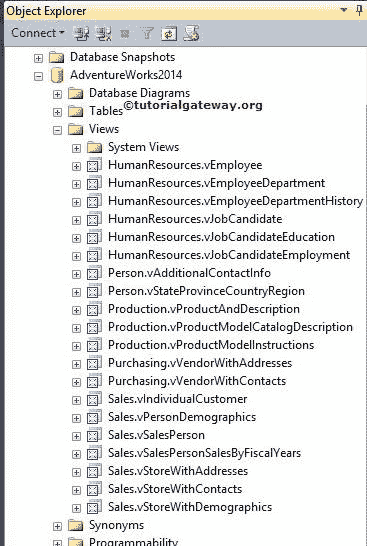

中的可用视图列表

从上面的截图中，您可以看到数据库保存了许多用户定义的视图。我们的工作是使用 SSIS 传输 SQL Server 对象任务将 SQL Server 视图从[AdventureWorks2014]传输到[复制 AdventureWorks2014]。

现在让我们看看目标数据库

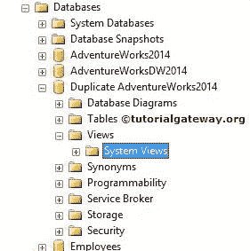

从上面的截图中，您可以看到[重复冒险 2014]数据库除了系统视图之外没有任何视图。

第一步:打开投标文件，从 [SSIS](https://www.tutorialgateway.org/ssis/) 工具箱中拖放传输 [SQL Server](https://www.tutorialgateway.org/sql/) 对象任务来控制流程。

双击传输 SQL Server 对象将打开传输 SQL Server 对象任务编辑器进行配置。

常规选项卡:在此选项卡中，您可以根据项目要求编写名称和描述。

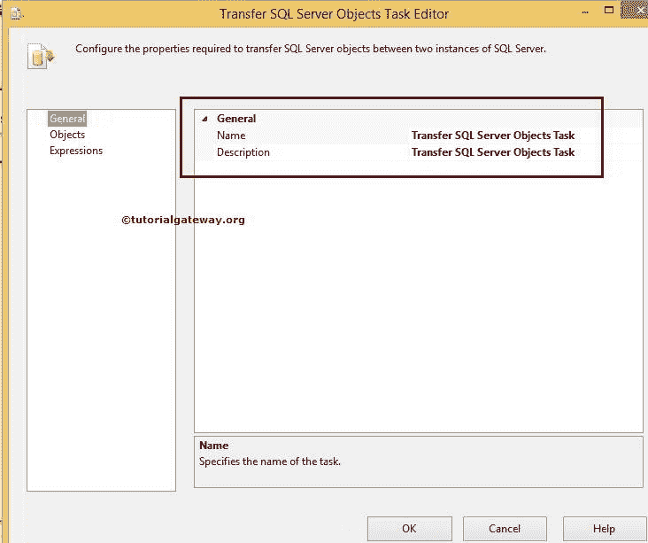

在这里我们没有改变任何东西。单击对象选项卡

步骤 2:选择 SourceConnection 属性，然后单击它创建一个新连接。如果已经创建，请选择它。

单击<new connection="">后，将打开 SMO 连接管理器编辑器窗口来配置连接。</new>

步骤 3:在这个例子中，我们选择了本地主机实例，并且使用了 Windows 身份验证。如果您为组织工作，请选择“SQL Server 身份验证”，并提供凭据。

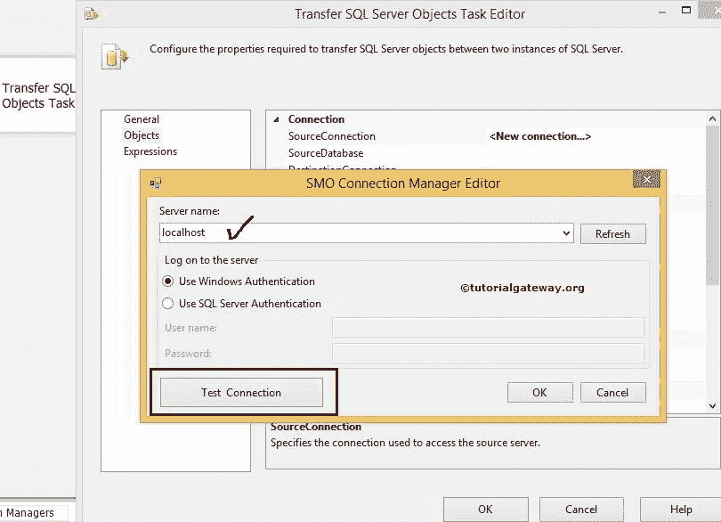

单击测试连接按钮检查连接是否抛出错误。

第 4 步:单击源数据库选项，选择您想要使用的数据库。目前，我们选择[Adventureworks2014]。

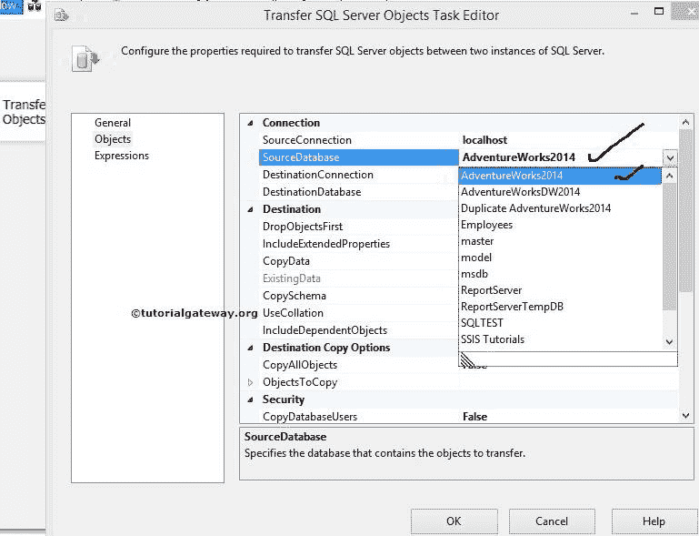

步骤 5:选择目标连接属性，然后单击创建新连接。如果您已经设计了，请选择它。

我们已经在 SourceConnection 中提到了 localhost 实例，这里也使用了同一个实例。如果您想创建一个新的，点击将打开 SMO 连接管理器编辑器来配置连接。

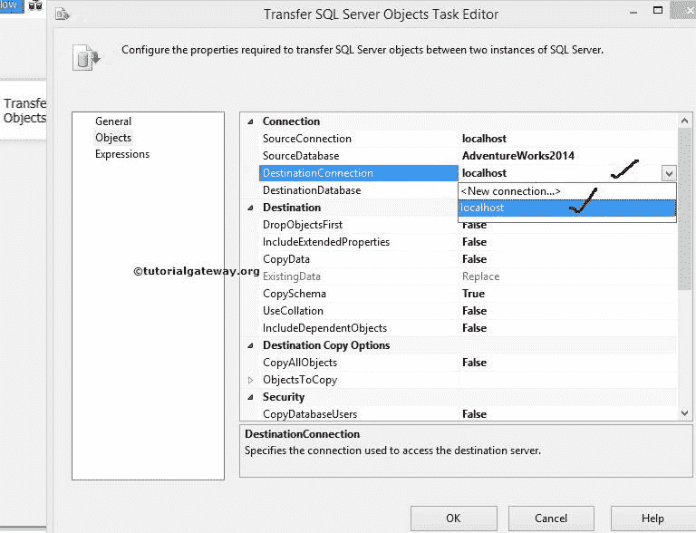

第六步:点击目标数据库选项，选择你想使用的数据库。现在，我们选择[复制冒险 2014]。

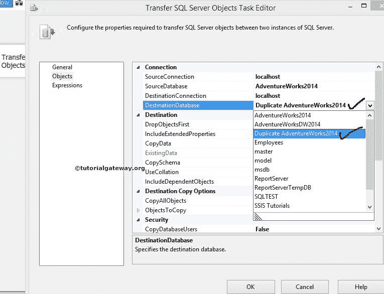

步骤 7:如果需要从源数据库中复制所有对象(视图、函数、存储过程、表)，将 CopyAllObjects 选项设置为 True。在本例中，我们将只发送视图，因此我们将其默认为 False。

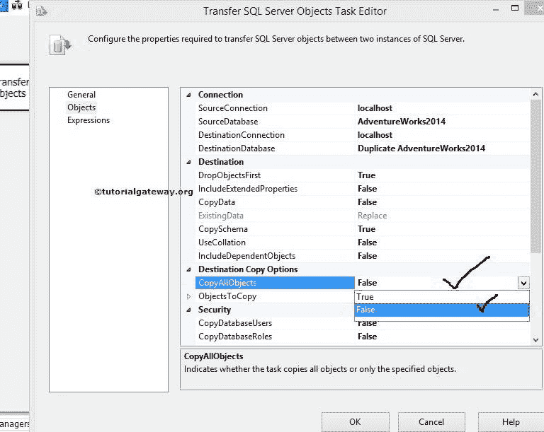

如果我们将复制对象选项设置为假，下一个属性对象复制将被启用。

步骤 8:单击对象复制属性进行配置。在这个例子中，我们的需求是转移视图。因此，我们必须了解诸如复制所有视图和视图列表等选项。

如果需要从源数据库复制所有用户定义的视图，请将“复制所有视图”选项设置为“真”。

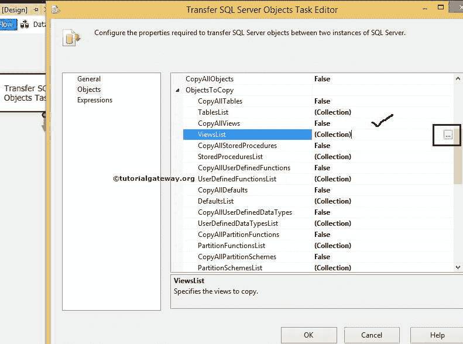

步骤 9:选择视图列表选项，然后单击集合。单击“集合”旁边的(…)按钮后，它将打开“选择视图”窗口，从源连接中选择可用的用户定义视图。

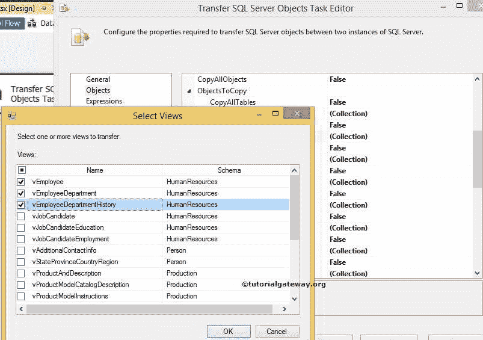

对于本例，我们选择前三个视图。但是你可以尝试不同的选择。

步骤 10:单击确定关闭选择视图窗口，然后单击确定完成配置传输 SQL Server 对象任务。

让我们运行包，看看我们是否成功地将 SQL Server 视图从源传输到目标。

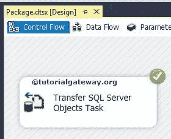

让我们打开 SQL Server 管理工作室，检查用户定义的视图。

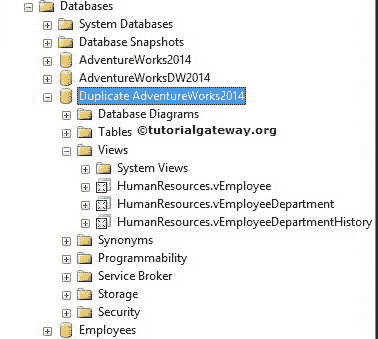

从上面的截图中，您可以观察到我们成功地传输了 SQL Server 用户定义的视图，例如 vEmployee、vEmployeeDepartment 和 vEmployeeDepartmentHistory 视图。