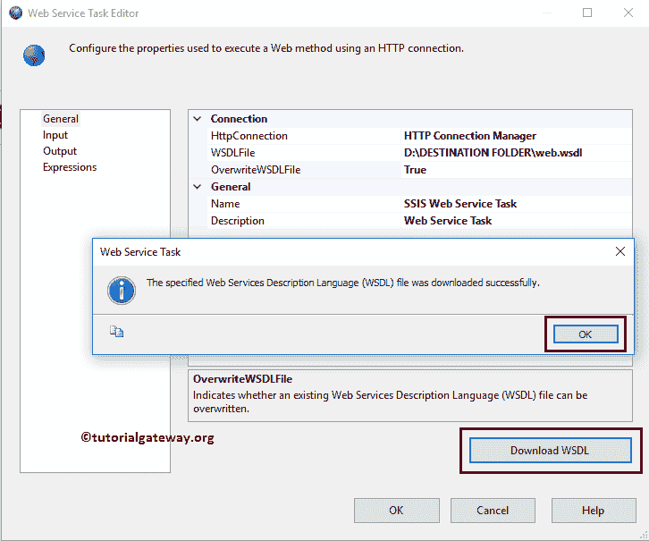

# SSIS 网络服务任务

> 原文：<https://www.tutorialgateway.org/ssis-web-service-task/>

SSIS 网络服务任务用于执行网络服务方法。例如，如果您想将天气报告存储为一个额外的 SQL 列，那么使用雅虎或 MSN 天气提供的网络服务，并将输出存储在一个变量中，以便您可以将该变量传递给数据流任务。

在本文中，我们通过示例向您展示了如何使用 SSIS 网络服务任务来使用网络服务方法。在我们开始在 SSIS 配置 web 服务任务之前，让我们看看服务中可用方法的列表。

注意:SSIS 网络服务任务使用 HTTP 连接管理器与网络服务连接，并发送或接收文件。

下面的截图显示了 SSIS 网络服务任务中可用的方法。我们的任务是使用这个 web 服务中可用的 GetCityForecastByZip 方法。请访问 https://wsf.cdyne.com/WeatherWS/Weather.asmx 网站使用相同的服务。

## SSIS 网络服务任务示例

将网络服务任务拖放到控制流区域，并将其重命名为 SSIS 网络服务任务

双击它将打开 SSIS 网络服务任务编辑器进行配置。

*   名称:请为此网络服务任务提供唯一的名称
*   描述:简要描述 SSIS 网络服务任务功能。提供有效的描述始终是一种良好的做法。

HTTP 连接:HTTP 连接使这个 [SSIS](https://www.tutorialgateway.org/ssis/) 包能够访问网络服务。它使用 HTTP 发送和接收文件。通过点击下拉箭头，将向您显示已经创建的 HTTP 连接(如果有)，或者请点击<新建连接..>选项创建一个。让我们看看当点击<新连接时会发生什么..>选项

一旦点击<new connection..="">选项，将打开 HTTP 连接管理器编辑器进行配置。</new>

*   服务器网址:请指定网络服务的网址。如果您计划使用下载 WSDL 按钮下载 WSDL 文件，请键入 WSDL 文件的网址；否则，选择服务网址。
*   使用凭据:如果您希望 HTTP 连接管理器使用用户的安全凭据，请选中此选项。
*   用户名:请指定访问服务的用户名。
*   密码:请指定访问服务的密码。
*   域:请在此指定域。
*   使用客户端证书:请指定是否要使用客户端证书作为身份验证。
*   超时(秒):请以秒为单位指定 web 服务连接超时。如果连接时间超过此时间，则连接将失败。
*   区块大小(KB):请指定写入数据的区块大小。
*   测试连接:这个按钮将帮助我们检查我们是否成功地建立了与网络服务的连接。根据结果，我们可以更改连接设置。

在这个 SSIS 网络服务任务的例子中，我们选择了一个免费的网络服务。因此，我们不必配置凭据和代理设置。从下面的截图中，您可以看到我们提供了服务网址:https://wsf.cdyne.com/WeatherWS/Weather.asmx?WSDL，因为我们想下载 WSDL 文件。

单击确定关闭 HTTP 连接管理器。

WSDL 文件:如果你已经下载了 WSDL 文件，那么我们必须选择。本地文件系统中的 wsdl 文件。否则，在本地硬盘上创建一个扩展名为 WSDL 的空文件，然后单击。WSDLFile 选项旁边的按钮。

一旦你点击了…选项，将会打开一个新窗口。利用这一点，我们可以在您的本地文件系统中创建一个新的 WSDL 文件，或者从文件系统中选择现有文件。从下面的截图可以观察到，我们选择的是现有的名为

的文件

这个 SSIS 网络服务任务属性有两个选项:真和假。如果我们将此属性设置为 true，Web 服务任务将覆盖本地文件系统中现有的 WSDL 文件。

接下来，点击下载 WSDL 按钮下载 WSDL 文件，如果它存在，它将覆盖现有的文件。

接下来，单击输入选项卡以指定 SSIS 网络服务任务服务和方法。

*   服务:请从可用的网络服务列表中选择所需的服务。
*   方法:在这里，它显示了上面选择的网络服务中可用方法的列表。所以，请选择所需的方法

SSIS 网络服务任务:点击下拉箭头将显示可用的任务。所以，请选择所需的一个。在这里，我们只有一项服务，我们选择相同的服务。

方法:通过点击下拉箭头将显示可用方法的列表。从下面的截图中，您可以观察到我们正在选择 GetCityForcastByZip 方法。此方法接受邮政编码作为参数，并显示天气预报。

由于此方法接受邮政编码作为参数，因此我们提供了加利福尼亚州的邮政编码。这里我们还有一个选择变量的选项。

接下来，单击 SSIS 网络服务任务输出选项卡来配置输出数据。

如果我们将输出类型设置为文件连接，我们必须将输出连接配置为文件连接管理器。这意味着输出的 XML 数据存储在本地文件系统中。

如果我们将输出类型设置为变量，那么我们必须将输出连接配置为变量。这意味着输出的 XML 数据存储在一个变量中。这个选项很方便，因为我们可以在其他任务或转换中使用这个 XML 数据。

一旦点击<new connection..="">选项，一个名为文件连接管理器编辑器的新窗口打开。使用这个，我们必须配置输出连接。</new>

单击“浏览”按钮在本地文件系统中创建一个新的 XML 文件，或者从文件系统中选择“现有文件”。请参考[文件连接管理器](https://www.tutorialgateway.org/file-connection-manager-in-ssis/)一文了解配置。

从上面的截图中，您可以观察到我们正在创建一个名为 WeatherForecast.xml 文件的新文件。

单击“确定”完成配置并关闭 SSIS 网络服务任务编辑器。让我们运行这个包来检查我们是否消费了 web 服务。

让我们打开 WeatherForecast.xml 文件，看看。从下面的截图可以看出，我们达到了效果。

