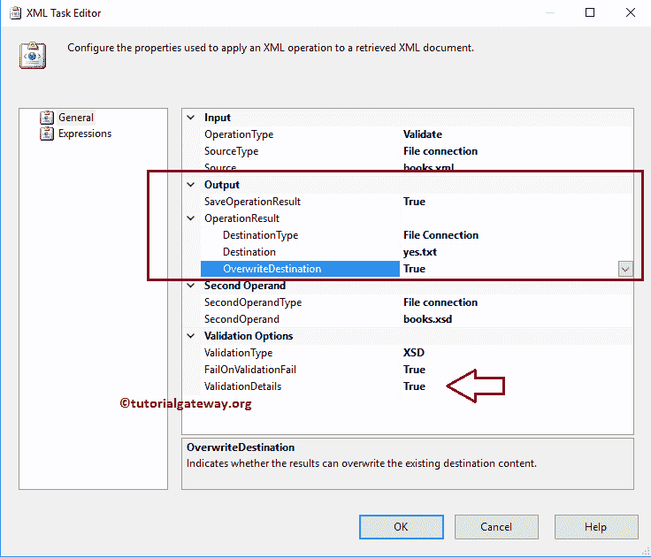

# 使用 SSIS XML 任务验证 XML 文件

> 原文：<https://www.tutorialgateway.org/validate-xml-file-using-ssis-xml-task/>

如何用 SSIS XML 任务验证 XML 文件？。在进入示例之前，让我们看看本地文件系统目标文件夹中的数据。下面的截图显示了 books.xml 文件中的数据。我们的工作是使用 SSIS XML 任务验证这个 XML 文件。

下面的截图显示了我们将在本例中使用的 XSD 文件

## 使用 SSIS XML 任务验证 XML 文件

要验证 XML 文件，首先将 XML 任务拖放到控制流区域，并使用 SSIS XML 任务

将其重命名为验证 XML 文件

双击它将打开配置它的 XML 任务编辑器。

在这个 [SSIS](https://www.tutorialgateway.org/ssis/) 的例子中，我们正在验证 XML 文件，所以请将 operationType 属性更改为 Validate

让我们通过选择 SourceType 属性来配置源连接。

*   如果您使用的是本地文件系统中的 XML 文件，请选择源连接作为文件连接。
*   如果您将源连接存储在变量中，请选择源连接作为变量并选择变量名。
*   如果要直接输入 XML 数据，请选择 SourceType 属性作为直接输入。

在这个例子中，我们使用上面指定的 books.xml 文件作为源，因此，我们选择 SourceType 属性作为文件连接。如果之前已经创建了[文件连接管理器](https://www.tutorialgateway.org/file-connection-manager-in-ssis/)，请选择已经创建的。这里，我们之前没有创建任何连接管理器，所以我们选择<新连接..>。

一旦点击<new connection..="">选项，文件连接管理器编辑器将打开进行配置。在这个例子中，我们正在验证现有的 XML 文件。因此，我们从“使用类型”中选择“现有文件”选项。</new>

单击浏览按钮从我们的文件系统中选择现有文件。

从下图中，可以看到我们选择了目标文件夹

中的 books.xml 文件

验证类型:该属性用于验证给定的 XML 文件。它有两个选项:

*   XSD:如果选择此选项，XML 任务将使用 XML 模式定义文件作为验证文件。在这个例子中，我们使用这个选项
*   DTD:如果选择此选项，SSIS XML 任务将使用文档类型定义文件作为验证文件。

现在我们必须配置第二操作数类型(请选择验证文件 xsd 或 dtd)，因此，请选择第二操作数类型属性。

*   如果您正在使用本地文件系统中的 XSD 文件，请选择第二个操作类型作为文件连接。
*   如果您将 XSD 文件存储在变量中，请选择第二个操作类型作为变量，并选择变量名。
*   如果要直接输入 XSD 数据，请选择第二个操作类型属性作为直接输入。

在这个例子中，我们使用上面指定的 books.xsd 文件作为验证文件。因此，我们选择第二个操作类型属性作为文件连接。

如果之前已经创建了[文件连接管理器](https://www.tutorialgateway.org/file-connection-manager-in-ssis/)，请选择已经创建的。这里，我们之前没有创建任何连接管理器，所以我们选择<新连接..>。

从下面的截图可以看到，我们选择了目的文件夹

里面的 books.xsd 文件

失败验证失败:此属性有两个选项:真和假。如果我们将此属性设置为真，如果有任何验证问题，XML 任务将无法完成任务。

单击确定，使用 [SSIS](https://www.tutorialgateway.org/ssis/) XML 任务包完成验证 XML 文件的配置。让我们运行并查看 books.xml 文件是否有效。

从上面的截图中，您可以看到我们的 SSIS Xml 任务验证 Xml 文件包成功运行。

现在，让我们更改 books.xml 文件。从下面可以看到，我们添加的<republished_date>节点为图书 id bk001</republished_date>

现在，让我们重新运行 SSIS Xml 任务验证 Xml 文件包。从下面的截图中，可以观察到我们的包失败了。

让我们打开“进度”选项卡来查看问题。

提示:实时地，我们将输出结果存储在一个变量中，然后我们可以通过电子邮件将信息发送给 Package developer。

例如，让我们将输出存储在本地文件系统中的文本文件中。为此，我们首先将保存操作结果属性设置为真，并配置目标。从下面的截图中，您可以观察到我们正在选择 yes.txt 文件。

*   覆盖定义:该属性有两个选项:真和假。如果我们将此属性设置为 true，XML 任务将覆盖目标路径中的现有文件。
*   验证详细信息:该属性有两个选项:真和假。如果我们将此属性设置为 true，输出文件包含有关错误的详细信息，包括其行号和位置；否则，它将不包括其细节。

让我们使用 SSIS XML 任务包打开并运行验证 XML 文件，并通过打开 yes.txt 文件

来查看结果