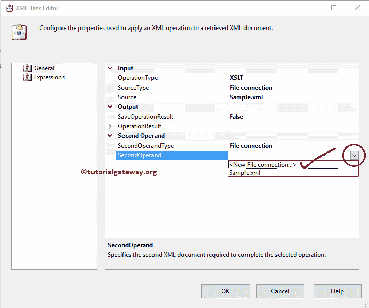
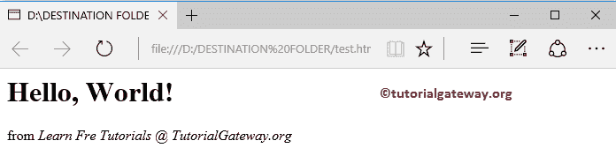

# 使用 SSIS XML 任务和 XSLT 转换 XML 文件

> 原文：<https://www.tutorialgateway.org/ssis-xml-task-to-transform-xml-file-using-xslt/>

如何用 SSIS XML 任务通过例子用 XSLT 转换 XML 文件？。下面的截图向您展示了 Sample.xml 文件中的数据，我们的任务是转换这个 xml 文件。

下面的截图将向您展示我们将在本例中使用的 XSLT 样式表

## 使用 XSLT 转换 XML 文件的 SSIS XML 任务

要转换 XML 文件，首先将 XML 任务拖放到控制流区域，并将其重命名为 SSIS XML 任务使用 XSLT

转换 XML 文件

双击它将打开配置它的 XML 任务编辑器。

在这个 [SSIS](https://www.tutorialgateway.org/ssis/) 的例子中，我们正在转换 XML 文件，所以请将 operationType 属性更改为 XSLT

让我们通过选择 SourceType 属性来配置 SSIS XML 任务的源连接，以使用 XSLT 转换 XML 文件。

*   如果您使用的是本地文件系统中的 XML 文件，请选择文件连接。
*   如果将源连接存储在变量中，请选择源作为变量并选择变量名。
*   并且，如果您想要输入 XML 数据，请直接选择直接输入。

在这个例子中，我们使用上面指定的 Sample.xml 文件作为源，所以我们选择 SourceType 属性作为文件连接。

如果您已经创建了[文件连接管理器](https://www.tutorialgateway.org/file-connection-manager-in-ssis/)，请选择相同的。这里，我们没有创建任何，所以我们选择<新连接..>。

一旦点击<new connection..="">选项，文件连接管理器编辑器将打开进行配置。这里，我们正在验证现有的 XML 文件，因此从“使用类型”中选择“现有文件”选项。</new>

单击浏览按钮从我们的文件系统中选择现有文件。

从下面可以看到，我们在目标文件夹中选择了 Sample.xml 文件。

现在我们必须配置第二操作数类型(请选择 XSLT 样式表)。因此，请为 SSIS XML 任务选择第二个操作类型属性来使用 XSLT 转换 XML 文件。

*   如果 XSLT 文件在本地文件系统中，请选择文件连接。
*   如果您将 XSLT 文件存储在变量中，请选择变量并选择变量名。
*   如果你想直接输入 XSLT 数据，选择直接输入。

在这个例子中，我们使用上面指定的 Sample.xsl 文件作为样式表。因此，我们选择第二个操作类型属性作为文件连接。

如果您已经创建了[文件连接管理器](https://www.tutorialgateway.org/file-connection-manager-in-ssis/)，请选择相同的。这里，我们没有创建任何，所以我们选择<新连接..>。

从下面可以看到，我们选择了目标文件夹

内的 Sample.xsl 文件

保存操作结果:该属性有“真”和“假”选项。如果我们将此属性设置为真，将保存 XML 任务结果。否则，它不会保存输出。在这个例子中，我们想要存储转换后的 XML 文件。因此，将属性从默认的假更改为真

现在我们必须配置输出，所以请选择操作结果属性。

*   如果要将输出存储在本地文件系统中，请选择文件连接。
*   要将输出存储在变量中，请选择变量选项，然后选择变量名。

在本例中，我们希望将 XML 任务结果存储在本地硬盘中。因此，我们选择目标类型属性作为文件连接。

如果您之前已经创建了[文件连接管理器](https://www.tutorialgateway.org/file-connection-manager-in-ssis/)，请选择创建的那个。这里，我们之前没有创建任何连接管理器，所以我们选择<新连接..>。

从下面的截图中，我们选择了目标文件夹中的 test.htm 文件。这意味着我们将把转换后的 XML 文件存储到扩展名为 htm 的 HTML 文件中。

覆盖定义:该属性有“真”和“假”选项。如果我们将此属性设置为 true，XML 任务将覆盖目标路径中的现有文件。

从下图中，您可以看到我们将 OverwriteDetination 属性设置为真

让我们使用 XSLT 包运行 [SSIS](https://www.tutorialgateway.org/ssis/) XML 任务来转换 XML 文件，看看我们是否正确地转换了我们的 Sample.xml 文件。

从上面的截图中，可以观察到我们的包运行成功。让我们打开 test.htm 文件，看看结果。

