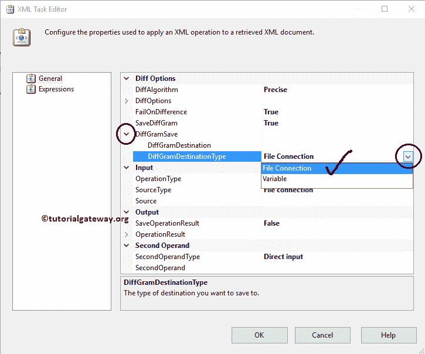

# 使用SSIS XML任务区分XML文件

> 原文：<https://www.tutorialgateway.org/ssis-xml-task-to-differentiate-between-xml-files/>

如何用 SSIS XML 任务用例子区分 XML 文件？。下面的截图显示了系统目标文件夹中 books.xml 文件中的数据。

下面的截图将向您展示我们将在本例中使用的另一个 XML 文件。我们在 SSIS 的任务是找出 books.xml 和 books2.xml 文件

的区别

## SSIS XML任务区分XML文件

要区分 XML 文件，首先将 XML 任务拖放到控制流区域，并将其重命名为 SSIS XML 任务，以区分 XML 文件

双击它将打开配置它的 XML 任务编辑器。

在这个 [SSIS](https://www.tutorialgateway.org/ssis/) 的例子中，我们发现了 XML 文件之间的差异，所以请将 operationType 属性更改为 Diff

DiffAlgorithm: [SSIS](https://www.tutorialgateway.org/ssis/) XML 任务为此属性提供了三种不同的选项。根据比较必须快速还是精确，可以将比较操作组织为使用不同的比较算法。它还有一个名为“自动”的选项，如果你不知道该选择哪个，请选择“自动”选项。

提示:自动选项将根据比较文档的大小选择精确比较或快速比较。

差异选项:差异操作包括一组自定义 XML 比较的选项。下表描述了可用选项的列表，每个属性都有两个选项:真和假。如果我们将属性设置为真，则 DiffOption 会忽略比较属性。

如果我们将此选项设置为 true，则具有相同本地名称但不同命名空间的两个元素被认为是相同的。

| diffoptions | 描述 |
| --- | --- |
| 忽略建议 | 请指定是否要比较注释节点。 |
| IgnoreNamespaces | 请指定是否要比较元素的名称空间 URI(统一资源标识符)及其属性名。 |
| 忽略修复 | 请指定是否要比较元素和属性名称的前缀。如果我们将此选项设置为 true，则具有相同本地名称但不同前缀的两个元素被视为相同。 |
| IgnoreXMLDeclaration | 请指定是否要比较 XML 声明。 |
| 儿童的无知 | 请指定是否要比较子元素的顺序。如果我们将此选项设置为 true，则仅位置不同的子元素在同级列表中被认为是相同的。 |
| IgnoreWhiteSpaces | 请指定是否比较空格。 |
| 忽略重新处理指令 | 请指定是否要比较处理说明。 |
| igboredtd | 请指定是否要忽略 DTD。 |

失败差异:该属性有两个选项:真和假。如果我们将此属性设置为真。如果存在任何 XML 差异，SSIS XML 任务将无法完成任务。现在，我们将属性更改为真

在这个例子中，让我们将 XML 差异输出存储在一个 XML 文件中。为了保存差异，我们必须将 SaveDiffGram 属性设置为 TRUE，并配置 DiffGram 目标。

让我们通过选择 DiffGramSave 属性来配置您想要存储差异的目标路径。

*   如果您想将 XML 差异存储在本地文件系统中的 XML 文件中，请选择不同的目标类型作为文件连接。
*   如果您想将 XML 差异存储在变量中，请选择不同的目标类型作为变量，并选择变量名。

在本例中，我们将把 XML 差异存储在 XML_Diff.xml 文件中。因此，我们选择了“文件连接”属性。

如果之前已经创建了[文件连接管理器](https://www.tutorialgateway.org/file-connection-manager-in-ssis/)，请选择之前创建的。这里，我们之前没有创建任何连接管理器，所以我们选择<新连接..>。

一旦点击<new connection..="">选项，将打开文件连接管理器编辑器进行配置。在这个例子中，我们创建了一个新的 XML 文件来存储差异。因此，我们从“使用类型”中选择了“创建文件”选项，并在目标文件夹中创建了 XML_Diff.xml 文件。</new>

让我们通过选择 SourceType 属性来配置源连接。

*   如果您使用的是本地文件系统中的 XML 文件，请选择源连接作为文件连接。
*   如果您将源连接存储在变量中，请选择源连接作为变量并选择变量名。
*   如果您想直接输入 XML 数据，请选择 SourceType 属性作为直接输入。

在这个例子中，我们使用上面指定的 books.xml 文件作为源。因此，我们选择 SourceType 属性作为文件连接。

如果之前已经创建了[文件连接管理器](https://www.tutorialgateway.org/file-connection-manager-in-ssis/)，请选择已经创建的。这里，我们之前没有创建任何连接管理器，所以我们选择<新连接..>。

一旦点击<new connection..="">选项，将打开文件连接管理器编辑器进行配置。在这个例子中，我们选择了上面指定的 XML 文件。因此，我们从“使用类型”中选择“现有文件”选项。</new>

单击浏览按钮从我们的文件系统中选择现有文件。从下面的截图可以看到，我们选择了目的文件夹

里面的 books.xml 文件

现在我们必须配置第二个 XML 文件，所以请选择第二个操作类型属性。

*   如果您使用的是本地文件系统中的 XML 文件，请选择第二个操作类型作为文件连接。
*   如果您将 XML 文件存储在变量中，请选择第二个操作类型作为变量，并选择变量名。
*   如果您想直接输入 XML 数据，请选择第二个操作类型属性作为直接输入。

在这个例子中，我们使用上面指定的 book 2 . xml 文件作为第二个 XML 文件。因此，我们选择第二个操作类型属性作为文件连接。

如果之前已经创建了[文件连接管理器](https://www.tutorialgateway.org/file-connection-manager-in-ssis/)，请选择之前创建的。这里，我们还没有创建任何连接管理器。因此，我们选择<新连接..>第二个操作数属性旁边的选项。

从下面的截图中，你可以观察到我们选择了目标文件夹

中的 books2.xml 文件

单击“确定”完成 SSIS XML 任务的配置，以区分 XML 文件包。

让我们运行并查看 books.xml 文件和 books2.xml 文件之间是否有任何差异。从下面的截图中，您可以观察到我们的 SSIS XML 任务区分 XML 文件包失败了。这意味着两个 XML 文件

之间存在差异

让我们打开 XML_Diff.xml 文件，看看这两个 XML 文件之间的区别。

