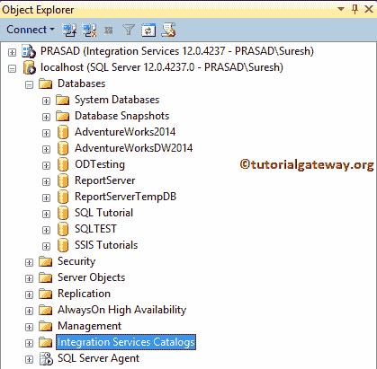
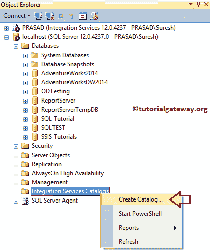
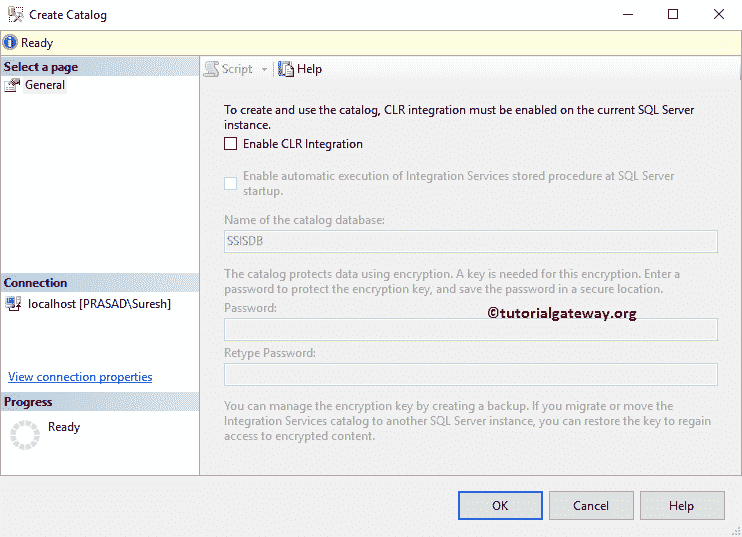
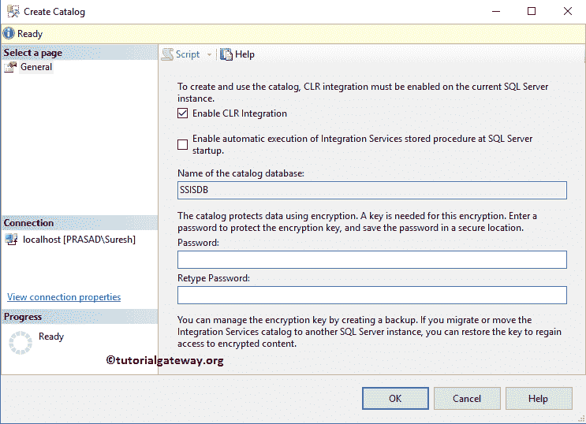
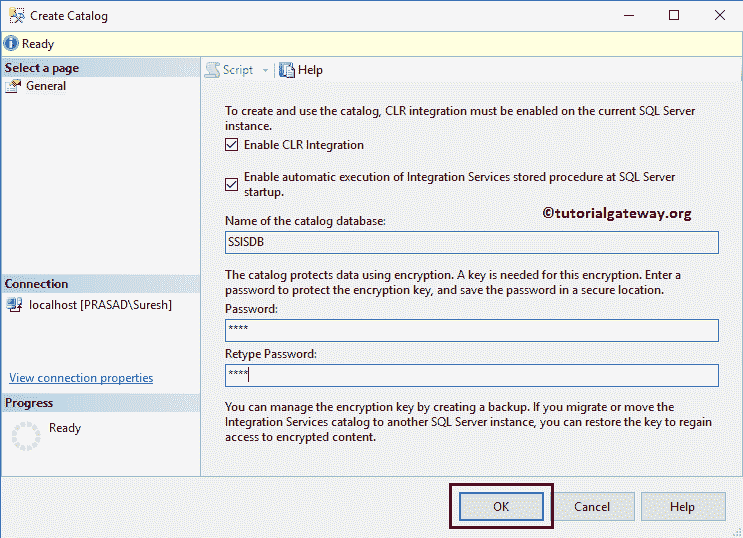
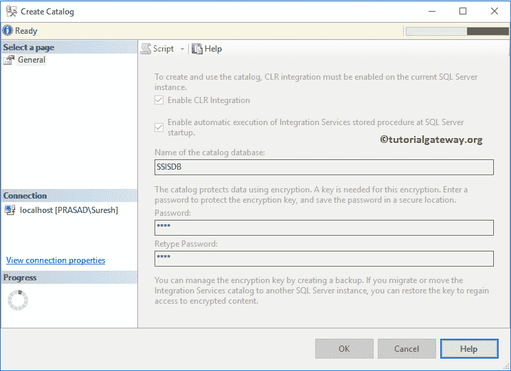
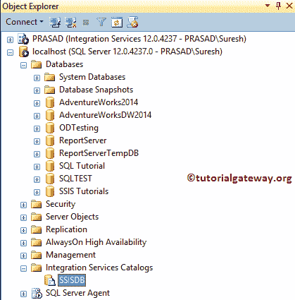
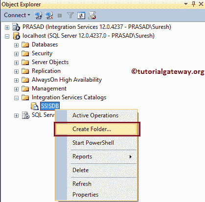
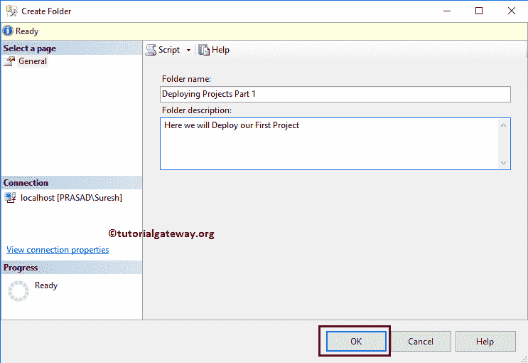
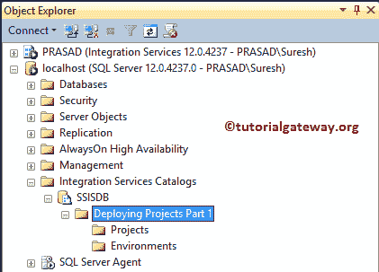

# 创建 SSIS 目录

> 原文：<https://www.tutorialgateway.org/create-ssis-catalog/>

SSIS 目录或 SSISDB 目录(或集成服务目录)对于查询服务项目非常重要。我必须说，部署 SSIS 包是一项基本要求。

本节通过一个示例解释了创建集成服务或 SSIS 目录的分步方法。要创建 SSIS 目录，首先，打开 SQL Server 管理工作室。在对象资源管理器窗口下，请自己导航到集成服务目录文件夹，如下所示。

## 创建 SSIS 目录的步骤

如果您或您的团队成员以前已经创建过，则它们将出现在此文件夹下。如果没有，右键单击文件夹将打开上下文菜单。请选择创建目录..选项。

一旦选择该选项，将会打开一个新窗口

要创建或使用 SSIS 目录，您必须选择启用 CLR 集成选项。

请勾选 [SQL Server](https://www.tutorialgateway.org/sql/) 启动选项“启用集成服务存储过程自动执行”，并提供密码。

单击“确定”按钮后，它将开始创建集成服务目录。

从下面[管理工作室](https://www.tutorialgateway.org/sql-server-management-studio/)截图，可以看到我们在[SSIS](https://www.tutorialgateway.org/ssis/)T4T6 成功搞定了】

让我创建一个新文件夹。为此，右键单击新创建的 SSIS 目录，并从上下文菜单中选择“创建文件夹...”选项。

选择“创建文件夹”后..选项，将打开一个新窗口来创建一个新文件夹。请提供文件夹名称和有效描述。当您从 BIDS 部署项目时，您必须选择此文件夹。

现在，您可以看到新创建的文件夹。如果仔细观察，集成服务会自动添加项目和环境文件夹来存储 [SSIS](https://www.tutorialgateway.org/ssis/) 包和变量。

