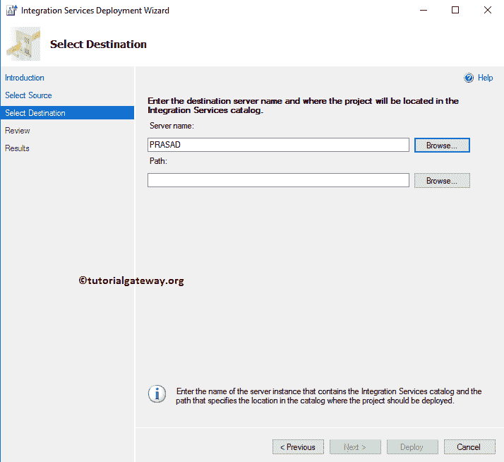
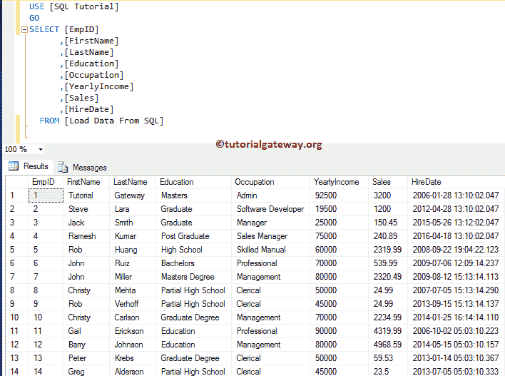

# 使用投标的 SSIS 包部署

> 原文：<https://www.tutorialgateway.org/deploy-ssis-package-using-bids/>

在本文中，我们将向您展示使用 BIDS 或 SQL 数据工具进行 SSIS 包部署的分步方法。在本演示中，我们将使用以下集成服务项目。如您所见，它只有一个包。

在我们开始部署项目之前，让我向您展示一下 SSIS 包的配置。从下面的截图可以看出，它有一个数据流任务

在数据流区域，有一个 OLE DB 源，和 OLE DB 目标

让我双击 OLE 数据库源，这样您就可以看到我们用作源的表。从下面的截图可以看到，我们使用了 [SQL 教程](https://www.tutorialgateway.org/sql/)数据库中的员工重复表。建议大家参考 [OLE DB Source](https://www.tutorialgateway.org/ole-db-source-in-ssis/) 文章了解一下 [SSIS](https://www.tutorialgateway.org/ssis/) 的配置设置。

让我双击 OLE 数据库目标，这样您就可以看到我们使用的目标表。从下面的截图中可以看到，我们使用了 SQL 教程数据库中的从 SQL 表加载数据。建议大家参考 [OLE DB 目标](https://www.tutorialgateway.org/ssis-ole-db-destination/)一文了解目标配置设置。

## 使用投标的 SSIS 包部署

为了使用 BIDS 或数据工具执行 [SSIS](https://www.tutorialgateway.org/ssis/) 包部署，请导航到解决方案资源管理器窗口。在这里，右键单击项目，并从上下文菜单中选择“部署”选项。

选择部署选项后，将打开一个名为集成服务部署向导的新窗口，如下所示。这是一个介绍页面，通过单击不再显示此页面，您可以避开此页面。

选择目标:此页面用于指定目标

*   服务器名称:请指定 [SQL Server](https://www.tutorialgateway.org/sql/) 实例。访问数据库时使用的命名实例。
*   路径:您必须指定集成服务目录路径。如果您尚未创建目录，请参考[创建 SSIS 目录](https://www.tutorialgateway.org/create-ssis-catalog/)一文了解步骤。

这里，我们选择命名实例 PRASAD。

选择

服务器名称后，可以看到路径自动启用

我们选择 SSISDB 目录下的部署项目第 1 部分文件夹作为项目路径。您也可以使用新文件夹..按钮在 SSISDB 目录下创建新文件夹。

点击【下一步】按钮

请交叉检查所有信息，如果发现任何错误，请使用“上一步”按钮返回。

结果页面会显示结果

让我打开 [SQL server 管理工作室](https://www.tutorialgateway.org/sql/)，请导航到对象资源管理器下的集成服务目录- > SSISDB - >部署项目第 1 部分- >项目将显示新部署的项目。

您可以通过右键单击包并选择执行来执行包..上下文菜单中的选项

它将显示以下窗口。如果您有任何参数，它会在这里显示，您也可以检查连接管理器设置。

单击“确定”按钮，因为我想查看性能报告。

可以看到

的业绩报告

单击查看消息超链接，查看每个事件的消息。例如，预执行、后执行等。

当我们从 SQL server 成功执行包时，让我打开目标表来查看结果。

