# 使用 SQL Server 部署 SSIS 包

> 原文：<https://www.tutorialgateway.org/deploy-ssis-package-using-sql-server/>

在本文中，我们将向您展示使用 SQL Server 或集成服务目录部署 SSIS 包的分步方法。

让我打开 SQL Server 管理工作室，请导航到对象资源管理器下的集成服务目录-> SSISDB ->部署项目->项目将显示新部署的项目。

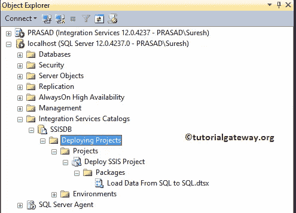

## 如何使用 SQL Server 部署 SSIS 包

要使用 SQL Server 部署 SSIS 包，请右键单击项目文件夹，然后选择部署项目..选项。

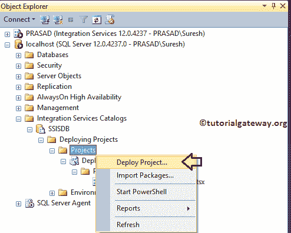

选择部署项目后..选项，将打开一个名为集成服务部署向导的新窗口。这是一个介绍页面，通过单击不再显示此页面，您可以避开此页面。

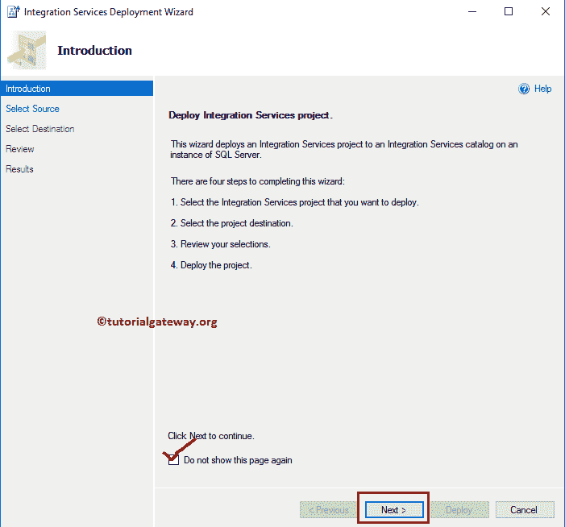

选择源:此页面用于指定源路径

*   项目部署文件:请指定项目文件所在的系统路径。

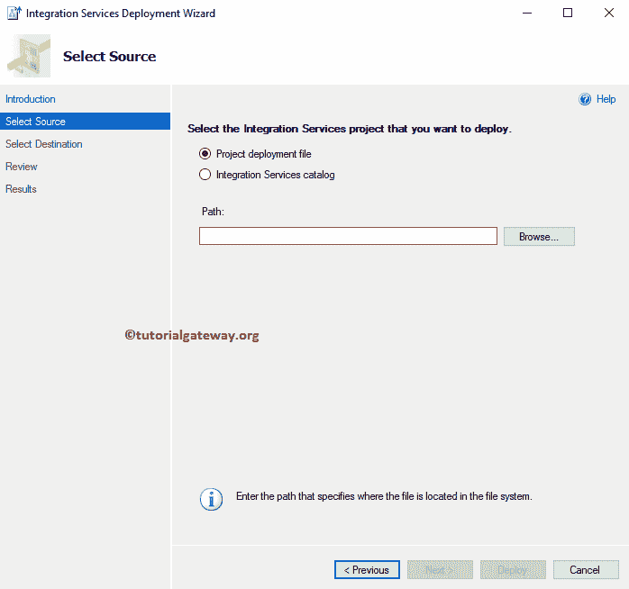

从下面的截图中，您可以看到，我们正在选择类型的事件处理项目文件。ispac

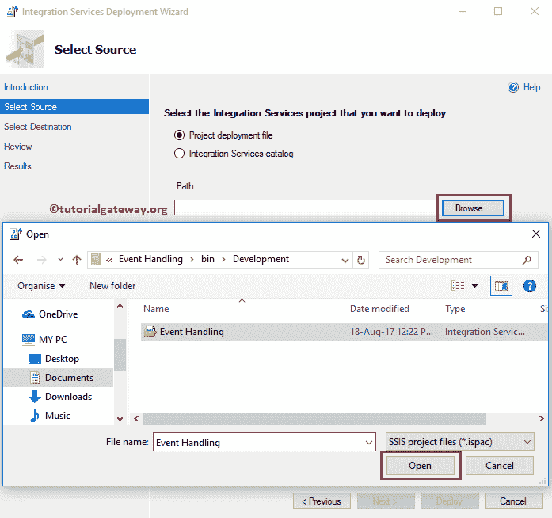

请交叉检查所有选项

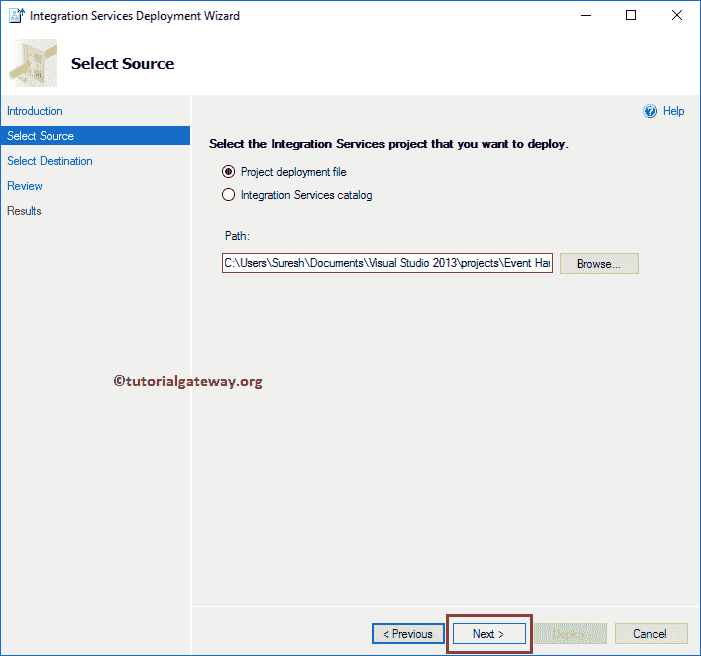

选择目标:此页面用于指定使用 SQL Server 部署 [SSIS](https://www.tutorialgateway.org/ssis/) 包的目标

*   服务器名称:请指定 [SQL Server](https://www.tutorialgateway.org/sql/) 实例。在这里，它将自动选择默认实例 localhost，因为我们使用此实例启动了此向导。但是您可以将其更改为用于访问数据库的命名实例。
*   路径:您必须指定集成服务目录路径。如果您还没有创建目录，请参考[创建目录](https://www.tutorialgateway.org/create-ssis-catalog/)一文了解步骤。

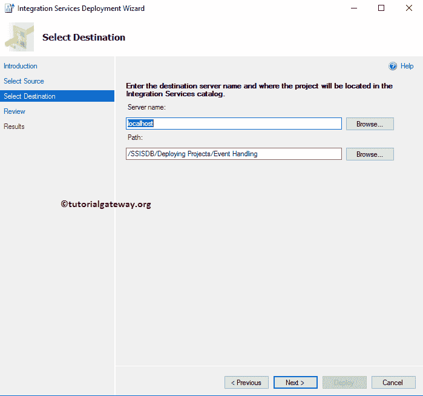

这里，我们选择命名实例 PRASAD。

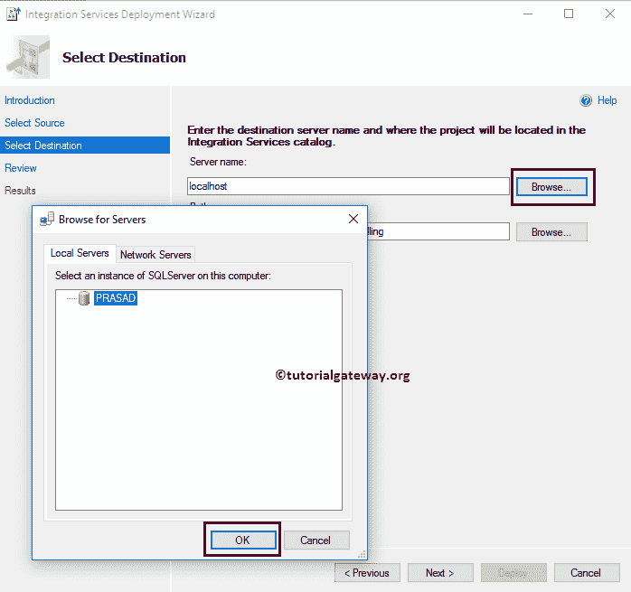

请交叉检查所有信息，如果发现任何错误，请使用“上一步”按钮返回。

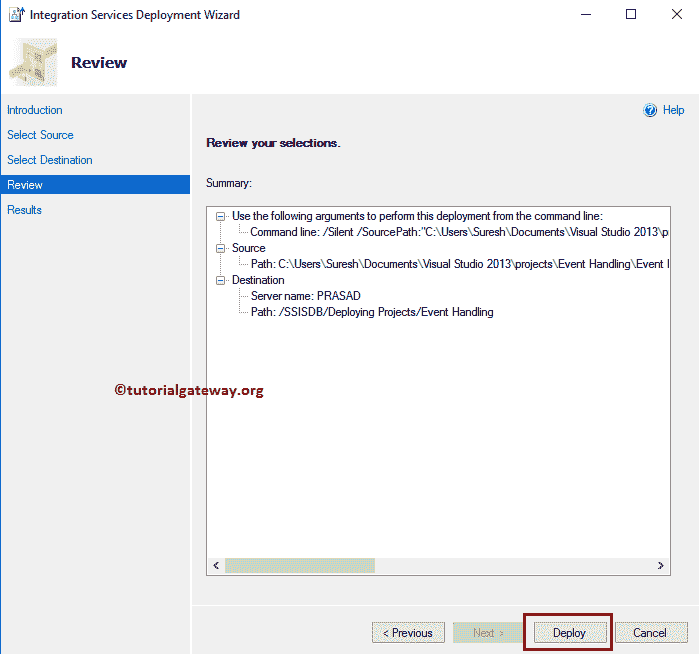

结果页面将显示结果。如您所见，我们已经成功地将 SSIS 包部署到了 SQL Server。

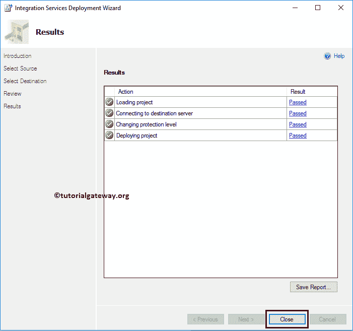

让我打开[管理工作室](https://www.tutorialgateway.org/sql/)，请导航到对象浏览器下的集成服务目录- > SSISDB - >部署项目- >项目将显示新部署的项目。

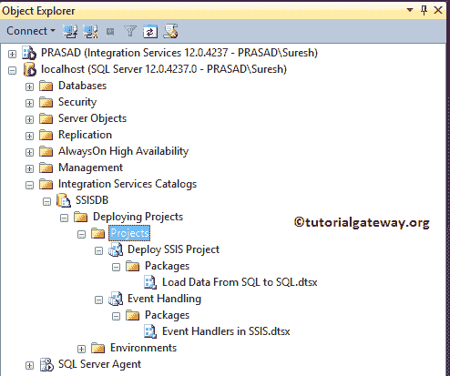

您可以通过右键单击 SSIS 包中的事件处理器来执行包，然后选择执行..上下文菜单中的选项

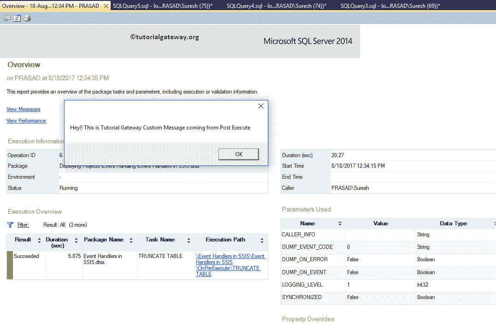

提示:我们已经在前一篇文章中解释了执行过程。因此，请参考[使用 BIDS](https://www.tutorialgateway.org/deploy-ssis-package-using-bids/) 部署包文章来了解这些步骤。