# 使用 SQL 部署向导部署 SSIS 项目

> 原文：<https://www.tutorialgateway.org/deploy-ssis-project-using-sql-deployment-wizard/>

在本文中，我们通过示例向您展示了使用 SQL 部署向导部署 SSIS 项目的理想方法。对于这个使用 SQL 部署向导的 SSIS 项目部署演示，我们将使用以下集成服务项目。如您所见，它有我们之前创建的唯一一个包。

我们已经在[使用 BIDS](https://www.tutorialgateway.org/deploy-ssis-package-using-bids/) 部署 SSIS 包中解释了这个包，我建议你参考一下。在开始部署 SSIS 项目之前，您必须构建该项目。为此，请自行导航到解决方案资源管理器窗口。在这里，右键单击项目并从上下文菜单中选择“构建”选项。

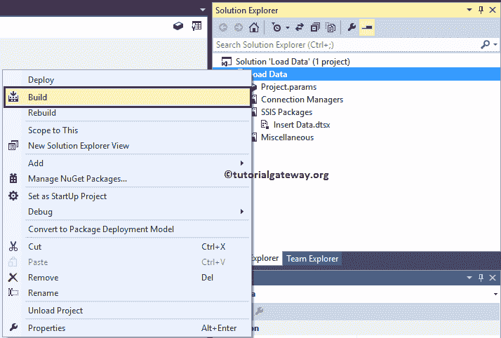

现在您可以在文档-> Visual Studio(版本)->项目->项目名称-> Bin ->开发文件夹中看到项目构建。

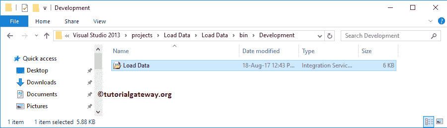

## 使用 SQL 部署向导部署 SSIS 项目

要使用 SQL 部署向导部署 [SSIS](https://www.tutorialgateway.org/ssis/) 项目，请找到 SQL Server 部署向导(版本可能不同)。对我来说是 C:\ ProgramData \ Microsoft \ Windows \开始菜单\程序\ Microsoft SQL Server 2014 \集成服务

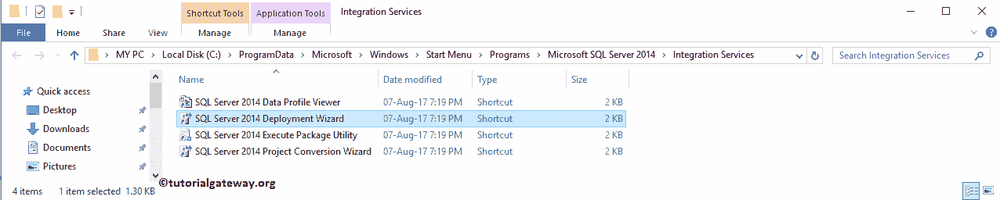

双击 SQL Server 部署向导后，将打开一个名为集成服务部署向导的新窗口。这是一个介绍页面，请单击“不再显示此页面”以避开此页面。

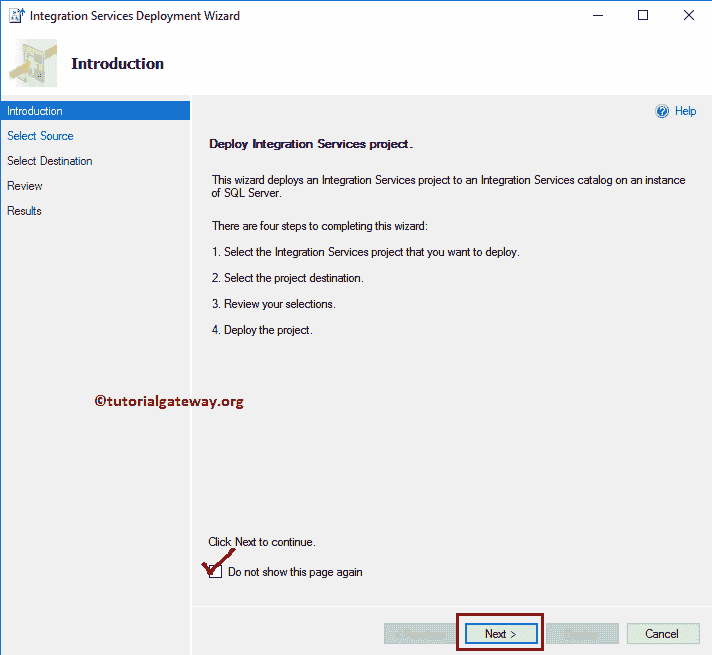

选择源:此页面用于指定源路径

*   项目部署文件:请指定项目文件(我们新构建的文件)所在的系统路径。

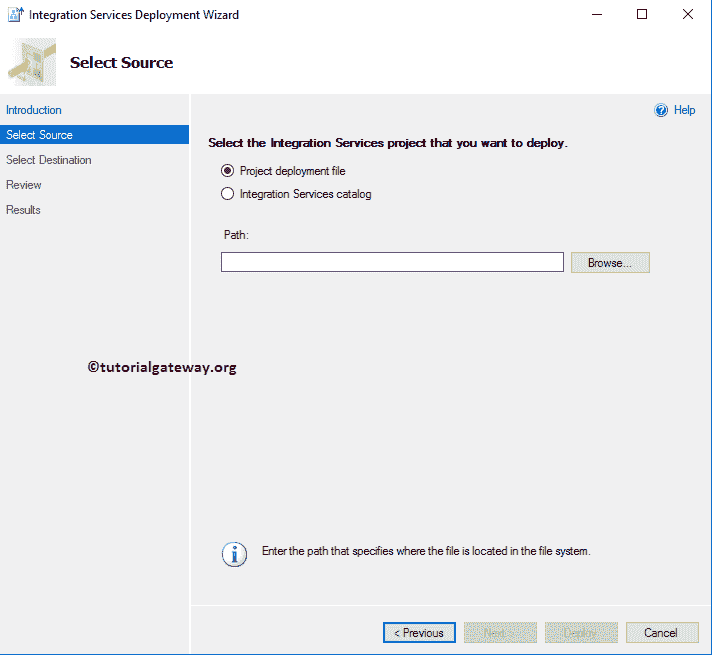

从下面的截图中你可以看到，我们正在选择我们之前构建的

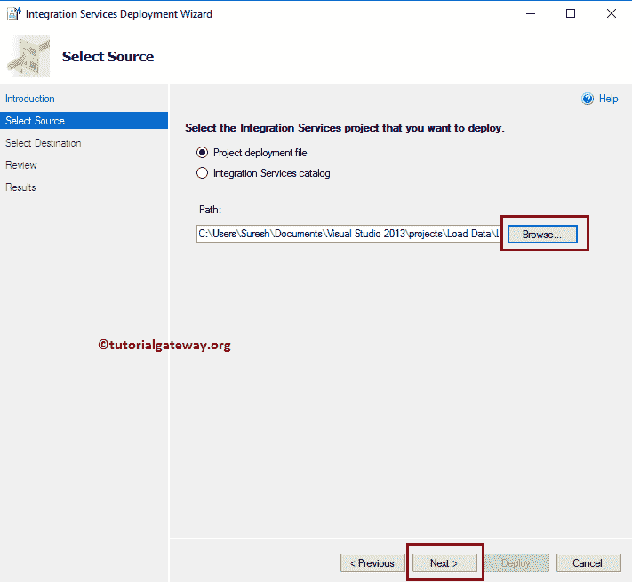

加载数据项目

选择目标:此页面用于指定目标。在这里，我们选择了命名实例 PRASAD。接下来，您可以选择 SSISDB 目录下的现有文件夹作为项目路径。

现在，我们将通过单击“新建文件夹”来创建一个新文件夹..按钮。

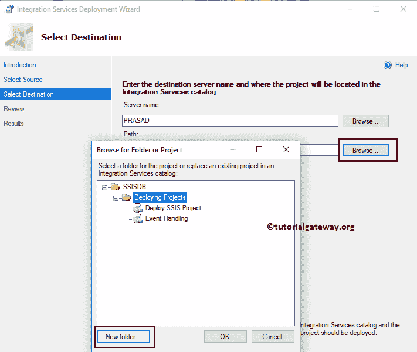

如您所见，我们将加载数据分配到我们的新文件夹

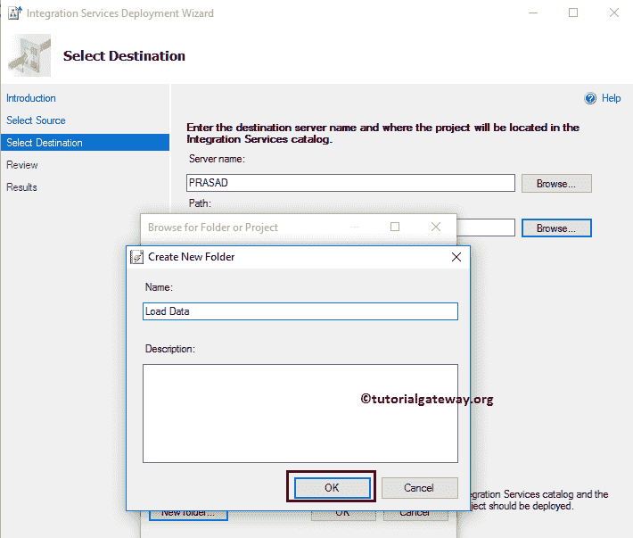

点击【下一步】按钮

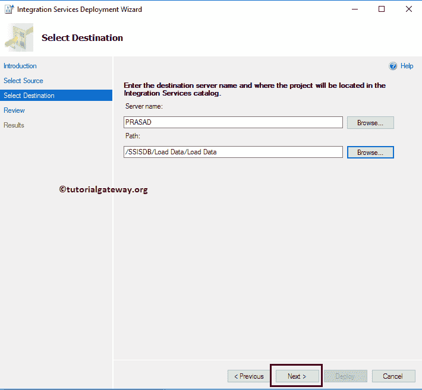

请交叉检查所有信息，如果发现任何错误，请使用“上一步”按钮返回。

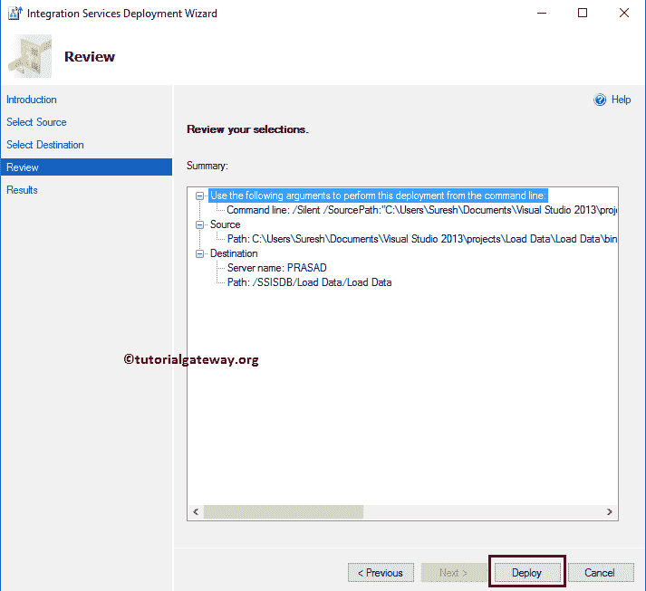

结果页面将显示结果

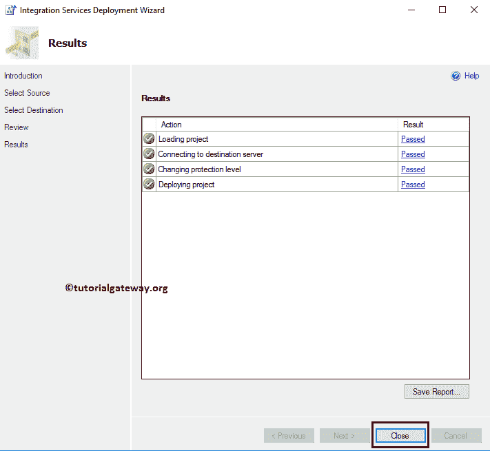

让我打开 [SQL Server 管理工作室](https://www.tutorialgateway.org/sql/)，请导航到对象浏览器下的集成服务目录- > SSISDB - >加载数据- >项目将显示新部署的项目。

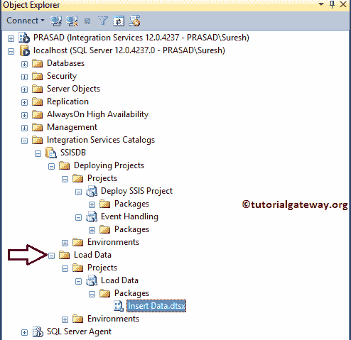