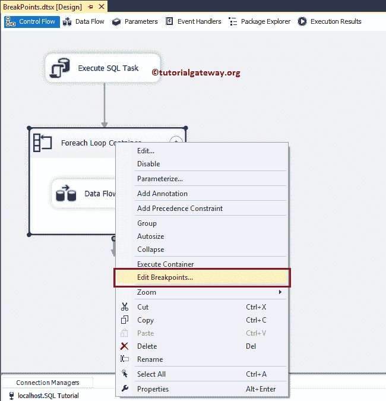
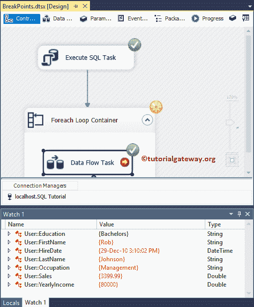

# SSIS 的断点

> 原文：<https://www.tutorialgateway.org/breakpoints-in-ssis/>

SSIS 的断点对于理解多层次的数据流非常有用。例如，您可以使用 SSIS 断点来理解执行前、执行后、每次迭代等阶段的变量值。

让我们通过一个例子来看看在 SSIS 配置断点的分步方法。对于这个 SSIS 断点演示，我们将使用下面显示的 SSIS 包。

建议大家参考[在 SSIS 全行集](https://www.tutorialgateway.org/execute-sql-task-in-ssis-full-row-set/)执行 SQL 任务，了解完整的包设置和我们使用的数据。

这个 SSIS 断点包使用的变量是:

而我们用于上面包的数据是:

## SSIS 断点示例

在本例中，我们向您展示了如何向 [Foreach 循环容器](https://www.tutorialgateway.org/ssis-foreach-loop-file-enumerator/)和数据流任务添加断点。要在容器上添加 SSIS 断点，右键单击 [SSIS](https://www.tutorialgateway.org/ssis/) Foreach 循环容器将打开上下文菜单。请选择编辑断点..从中选择。

选择编辑断点后..选项，将会打开一个名为“设置断点”的新窗口。

以下是 SSIS 断点列表和各自的描述。

| 中断条件 | 描述 |
| 当任务或容器收到 OnPreExecute 事件时 | 当任务即将执行时引发或调用此事件。在任务或容器运行之前观察它的变量是很有用的。 |
| 当任务或容器收到 OnPostExecute 事件时 | 任务完成或执行后，立即引发或调用此事件。OnPostExecute 事件对于在任务完成后观察任务或容器变量很有用。 |
| 当任务或容器收到一个错误事件时 | 当任务或容器出现错误时调用 OnError 事件 |
| 当任务或容器收到“警告”事件时 | 当任务或容器引发警告时，将调用 OnWarning 事件。 |
| 当任务或容器收到信息事件时 | 当容器或任务必须提供任何信息时，您可以在信息事件中使用它 |
| 当任务或容器收到 OnTaskFailed 事件时 | 当任务失败时，会调用此 SSIS 断点事件 |
| 当任务或容器收到 OnProgress 事件时 | 调用此事件来更新任务执行进度。 |
| 当任务或容器收到 OnQuerycancel 事件时 | 在处理任务时，您可以随时调用此事件。它有助于随时取消执行。 |
| 当任务或容器收到 OnVariableValueChanged 事件时 | 当变量值改变时，调用 OnVariableValueChanged 事件。要引发此事件，您必须将变量的 RaiseChangeEvent 设置为 TRUE。 |
| 当任务或容器收到 OnCustomEvent 事件时 | 如果要引发任何任务定义的事件，请使用 OnCustomEvent 事件。 |

在这个 SSIS 断点演示中，我们选择了预执行事件和后执行事件上的断点。

SSIS 断点允许命中计数类型有四种不同的选项，它们是:

| 命中计数类型 | 描述 |
| 总是 | 断点命中时，执行将暂停。 |
| 命中次数等于 | 当命中计数等于断点出现的次数时，执行暂停。 |
| 命中次数大于或等于 | 当命中计数大于或等于断点出现的次数时，执行暂停。 |
| 命中数倍数 | 如果将此选项设置为 4，则每四次执行就会暂停一次。 |

单击确定关闭 SSIS 断点配置。从下面的截图中，您可以看到 Foreach 循环容器上的红色圆圈。

让我们运行 SSIS 断点包，并检查本地窗口中的变量流。

我觉得局部的窗口里系统变量太多了。因此，让我选择所需的变量(用户定义的变量)，右键单击它们将打开上下文菜单。请选择添加监视选项。

现在，您可以看到“监视”窗口仅显示用户定义的变量。让我点击继续按钮

现在，您可以看到变量值被替换为最后插入的行。

让我删除 Foreach 循环容器上的断点，并在数据流任务上添加 SSIS 断点。

让我们运行 SSIS 断点包。如您所见，变量用第一行更新。

点击继续按钮，变量更新为第二行

一旦表被插入，任务就会完成。

