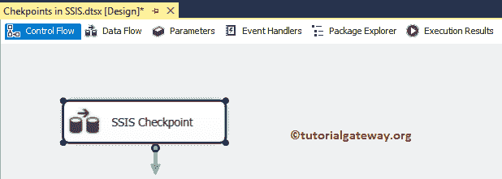
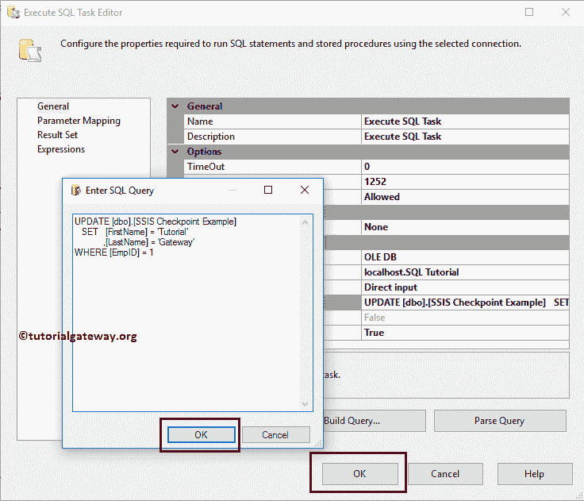

# SSIS 的检查点

> 原文：<https://www.tutorialgateway.org/checkpoints-in-ssis/>

SQL Server 集成服务包括最强大和最有用的功能，称为检查点。您可以使用此 SSIS 检查点从故障点重新启动包，而不是重新运行整个包(所有任务)。当我们加载大数据或导入或导出图像时，SSIS 检查点非常有用。

本文通过一个示例展示了在 SSIS 包中配置检查点所涉及的步骤。在这个 SSIS 检查点演示中，我们将使用下面显示的数据。


## SSIS 检查点示例

要解释 SSIS 检查点概念，请将数据流任务从工具箱拖放到控制流中，并将其重命名为 SSIS 检查点。



双击 [SSIS](https://www.tutorialgateway.org/ssis/) 数据流任务将打开数据流选项卡。将 OLE 数据库源和 OLE 数据库目标拖放到数据流区域。


双击 OLE-DB 源代码将打开源代码编辑器。从下面的截图中，您可以看到我们正在选择 SQL 教程数据库中的[员工]表。请参考 SSIS 文章中的 [OLE DB 源码。](https://www.tutorialgateway.org/ole-db-source-in-ssis/)

[](https://www.tutorialgateway.org/ole-db-source-in-ssis/)

接下来，双击 OLE 数据库目标打开以打开目标编辑器。目前，我们正在选择名为[SSIS 检查点示例]表的现有表。请参考 SSIS 文章中的 [OLE-DB 目标。](https://www.tutorialgateway.org/ssis-ole-db-destination/)

[](https://www.tutorialgateway.org/ssis-ole-db-destination/)

单击“映射”选项卡，检查源列是否准确映射到目标列。


单击确定关闭 OLE 数据库目标编辑器。接下来，从 SSIS 工具栏中拖动[执行 SQL 任务](https://www.tutorialgateway.org/execute-sql-task-in-ssis/)，并将其放入


控制流区域

现在，双击执行 SQL 任务将打开编辑器进行配置。让我选择连接类型为 [OLE DB 连接](https://www.tutorialgateway.org/ole-db-connection-manager-in-ssis/)，连接到 SQL 教程数据库。接下来，我们使用直接输入作为 [SQL](https://www.tutorialgateway.org/sql/) 语句，因此单击…按钮。


请在这里写下你的自定义 [SQL](https://www.tutorialgateway.org/sql/) 语句。从下面的截图中可以看出，我们正在编写一个[更新语句](https://www.tutorialgateway.org/sql-update-statement/)来用 5 更新 EmpId，并为 Id 为 1 的员工编写教育硕士。

```
-- SQL statement for Checkpoints in SSIS example
USE [SQL Tutorial]
GO
UPDATE [dbo].[SSIS Transactions Example]
   SET   [EmpID] = 5 
        ,[Education] = 'Masters'
WHERE [EmpID] = 1
```


让我运行 SSIS 检查点包。从下面的截图可以看到，执行 SQL 任务失败是因为我们无法更新【身份】列(即 EmpID)


但是我们成功地将这 14 条记录插入到了目标表中。


不知何故，您意识到了自己所犯的错误，并从 Update 语句中删除了 EmpID = 5。现在您可以看到，数据流任务和执行 SQL 任务都已成功执行。


在这里，您重新运行整个包，这对于这 14 条记录来说是可以的，但是对于大量数据来说，它会变得更加昂贵。在这种情况下，您可以使用 SSIS 检查点从故障点启动包(即执行 SQL 任务)。

### 在 SSIS 配置检查点

请选择要在其中设置检查点的包，并转到其属性窗口以找到 SSIS 检查点属性。

*   检查点文件名:请选择文件名。SSIS 将使用该文件保存与检查点相关的信息。通过单击..除此选项外，它将打开文件系统来选择或创建新文件。
*   检查点用法:该属性有三个选项:
    *   从不:包将不使用检查点。
    *   IfExists:包将寻找检查点信息，如果有任何信息，它将使用该信息。如果没有，它会跳过使用它。在大多数情况下，这是一个常见的选择。
    *   始终:包将始终查找检查点信息，并使用该信息。如果它没有信息，它会抛出一个错误。
*   保存检查点:选择是否要保存检查点。


我们正在 D 文件夹中创建一个名为 SSIS 检查点的新文件来保存检查点信息。


接下来，我们选择了最常见的 CheckpointUsage 属性，即 IfExists。


接下来，我们将保存检查点选项从默认的假更改为真。


在开始执行 SSIS 检查点包之前，我们必须更改控制流区域中所有任务的另一个名为 FailPackgaeOnFailure 的属性。首先，让我选择数据流任务，并将属性值从假更改为真。


接下来，选择“执行 SQL 任务”，并将属性值从“假”更改为“真”。


现在让我运行 SSIS 检查点包。


如您所见，SSIS 已经创建了一个带有检查点信息


的文件

接下来，让我在执行 SQL 任务



中更正查询

让我运行 SSIS 检查点包。从下面的截图可以看到，执行直接从【执行 SQL 任务(之前停止的位置)】


开始

让我也向您展示数据流区域。


最后，请打开 [SQL Server 管理工作室](https://www.tutorialgateway.org/sql/)查看结果。

