# SSIS 的错误处理

> 原文：<https://www.tutorialgateway.org/error-handling-in-ssis/>

SSIS 错误处理:在 SQL Server Integration Services 或 SSIS 中，当我们从源提取数据、将数据加载到目标或执行转换时，可能会出现错误。就是因为意外的数据，封装失败是不好的做法。为了处理这些情况，SSIS 引入了称为错误处理的概念。让我们通过一个例子来看看如何在 SSIS 配置错误处理。

出于 SSIS 错误处理演示的目的，我们将把 Employee.xls 中的数据导出到 SQL Server 数据库表，并在数据转换时配置错误处理。下面的截图将向您展示员工 Excel 文件

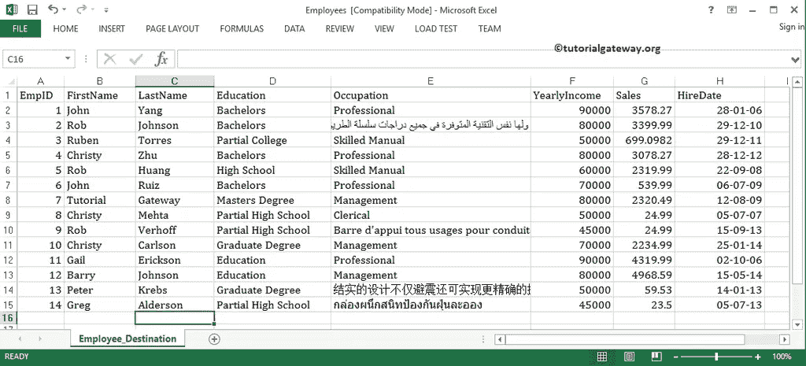

中的数据

从上面的截图可以看到 EmpId 2，13，14 的占用大于长度 255

## SSIS 示例中的错误处理

从工具箱中拖放数据流任务以控制流，并将名称更改为 SSIS 的错误处理。

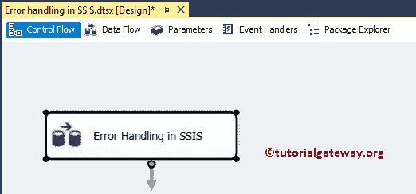

双击它将打开 [SSIS](https://www.tutorialgateway.org/ssis/) 数据流选项卡。现在，将 Excel Source、[数据转换转换](https://www.tutorialgateway.org/ssis-data-conversion/)、OLEDB Destination 从 SSIS 工具箱拖放到数据流区域

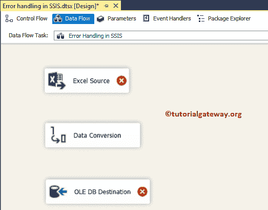

双击 Excel 源将打开连接管理器设置，并提供一个选项来选择保存源数据的表。这里，我们选择文件系统中的 Employees.xls 文件。

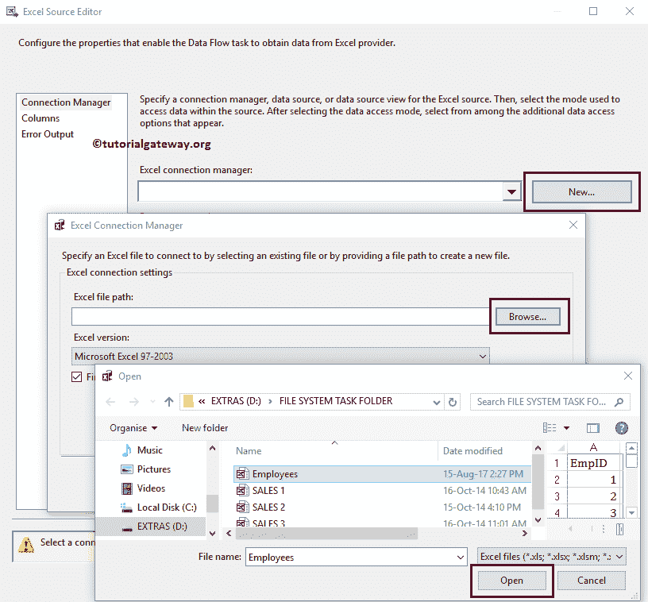

从上面的截图中，您可以看到我们正在选择 Employee.xls 文件

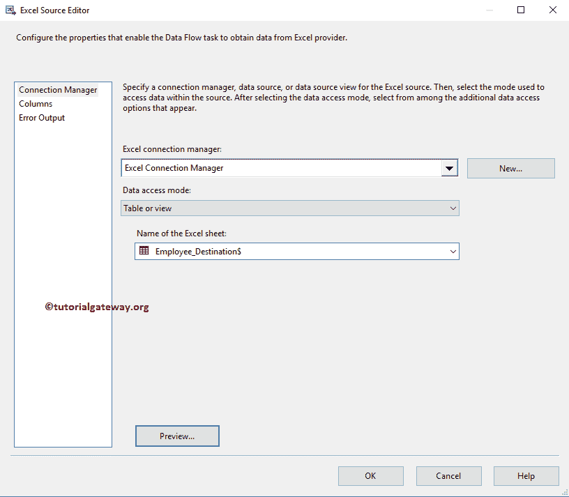

中的 Employee_Destination 表

单击确定，然后将蓝色箭头从 Excel 源拖到数据转换转换。它允许转换使用源数据。

接下来，请双击数据转换转换，编辑我们的源列数据类型，并将其转换为所需的长度数据类型。

这里我们将职业长度保留为 255，因为我们想故意使包失败。

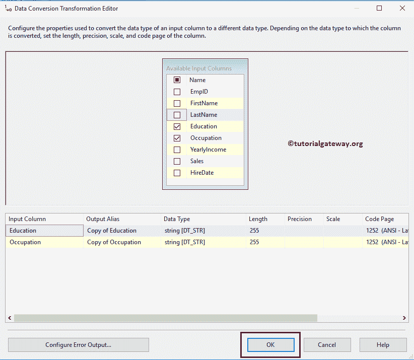

现在我们必须提供目标表的详细信息。因此，双击 OLE 数据库目标并提供所需的信息。从下面可以看到，我们选择了“重复员工错误处理程序”表。

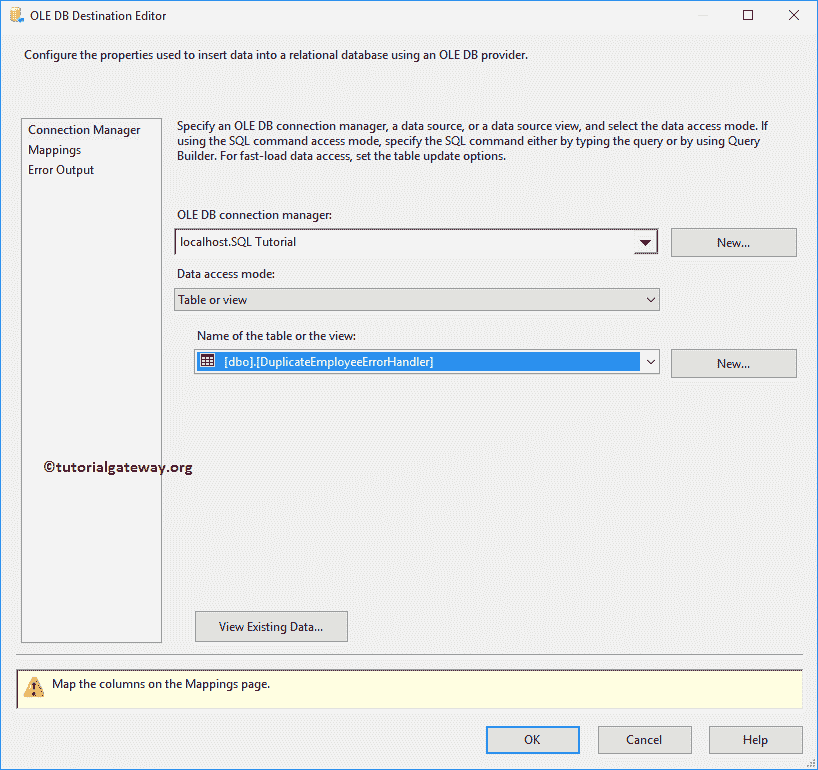

单击“映射”选项卡，检查源列是否完全映射到目标列。

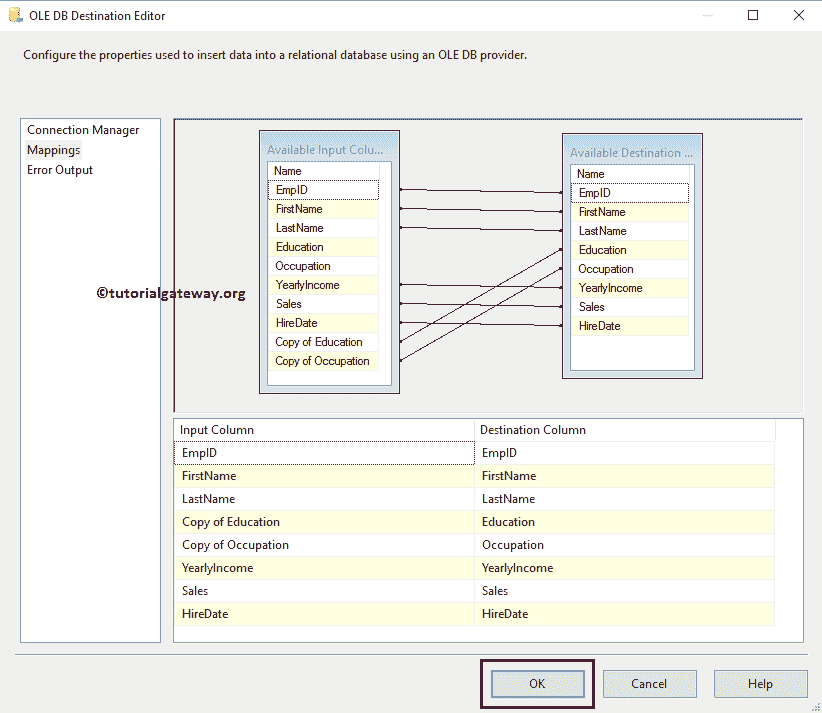

单击确定关闭上述窗口。

### 在 SSIS 配置错误处理

要在 SSIS 配置错误处理，请拖放另一个 OLE DB 目标来存储错误输出。接下来，将红线从数据转换(SSIS 错误输出)拖到 OLE DB 目标 1。

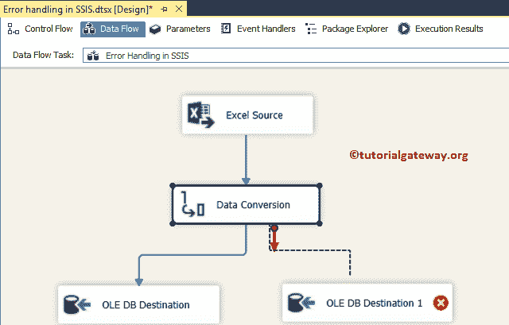

在 OLEDB 目标上拖动 SSIS 错误输出将打开以下窗口。您必须使用此窗口来配置 SSIS 的错误处理。默认情况下，所有列都指向失败组件属性

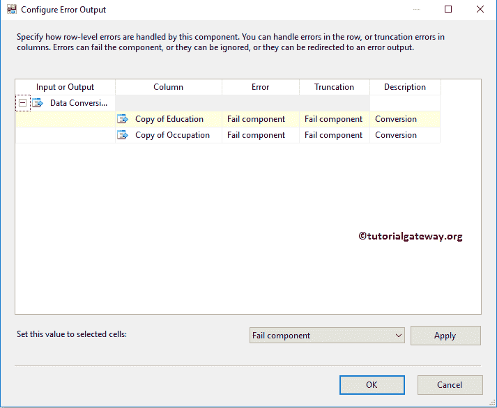

错误输出提供三个 SSIS 错误处理选项:

*   失败组件:如果有错误，那么转换、源、目标等。，就会失败。
*   忽略失败:它将忽略该行的失败。
*   重定向行:它将成功的行返回到指定的目标，将失败的行返回到失败的输出。这项任务不会失败。

请为“错误”和“截断”列更改“重定向行”选项。

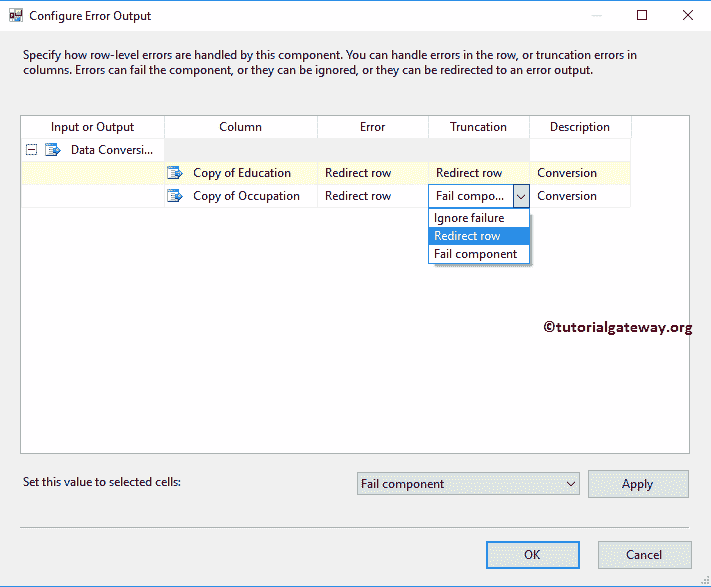

单击确定关闭配置错误输出窗口。

双击 [OLE DB 目标](https://www.tutorialgateway.org/ssis-ole-db-destination/) 1 将打开目标编辑器。目前，我们正在使用“新建”按钮创建一个新表。

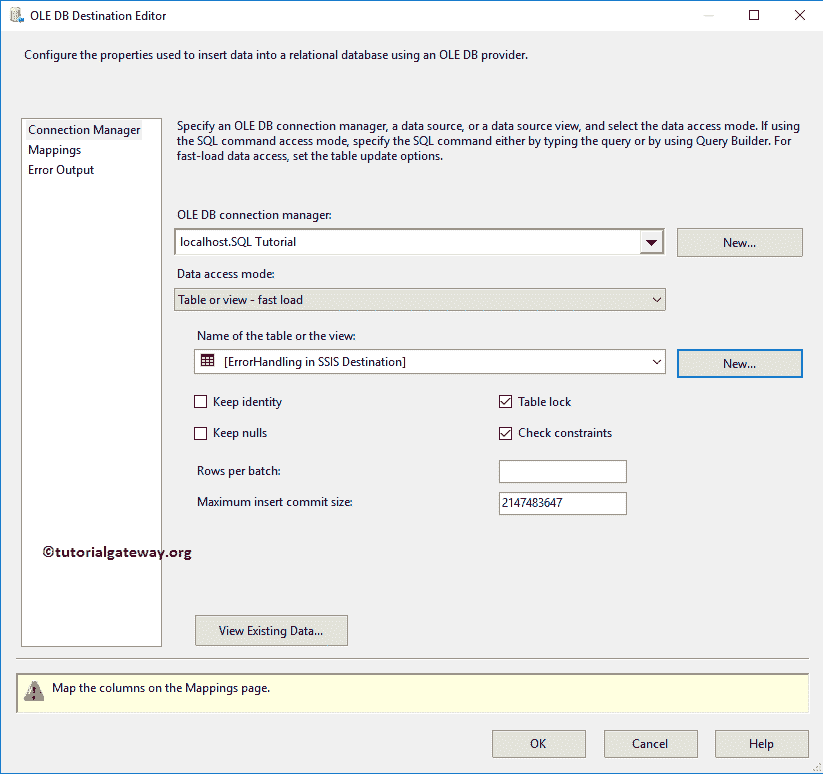

单击“映射”选项卡，验证源列是否完全映射到目标列。

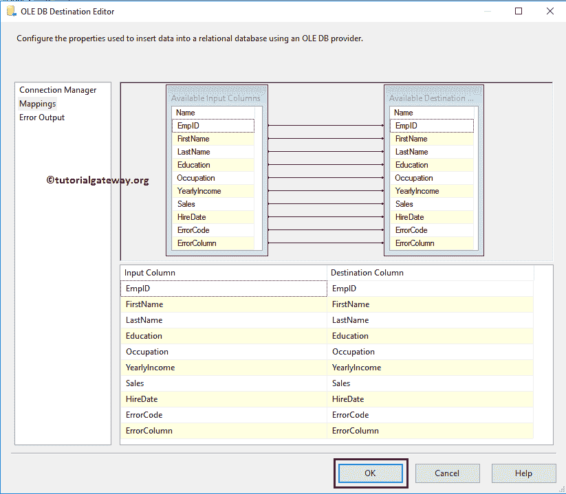

单击“确定”完成对 OLE-DB 目标的配置。下面的截图是最终的 SSIS 错误处理包。

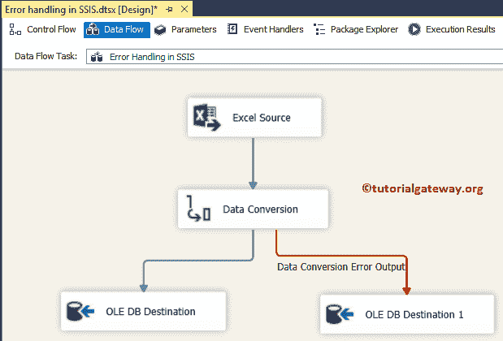

让我们运行 SSIS 错误处理包。从下面的截图中可以看到，它将 11 行(成功)重定向到 OLE DB Destination，并将 3 行重定向到错误输出。

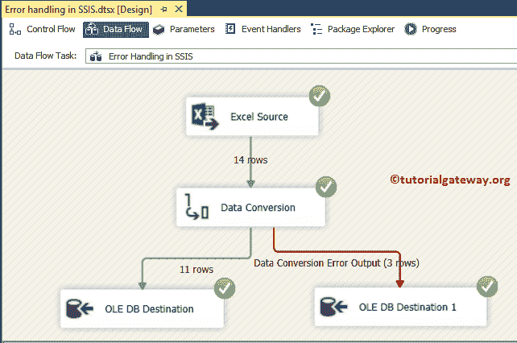

请打开 [SQL Server 管理工作室](https://www.tutorialgateway.org/sql/)查看 SSIS 错误处理包结果。

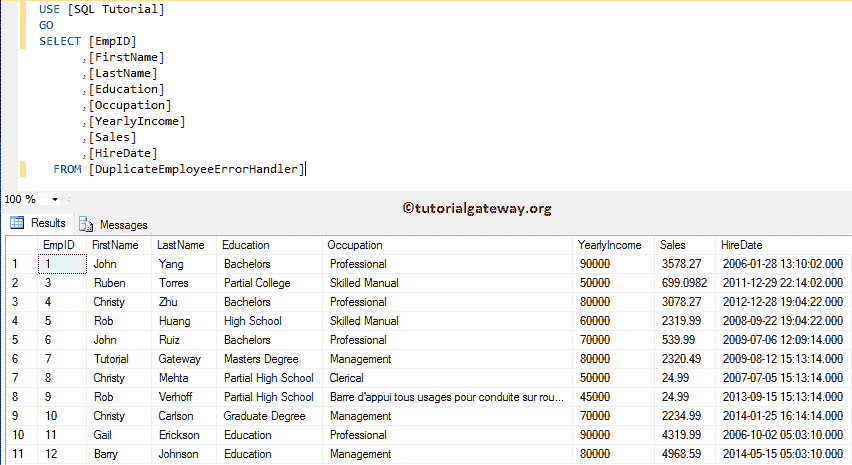

接下来，打开第二张 [SQL](https://www.tutorialgateway.org/sql/) 表，检查错误返回的记录。

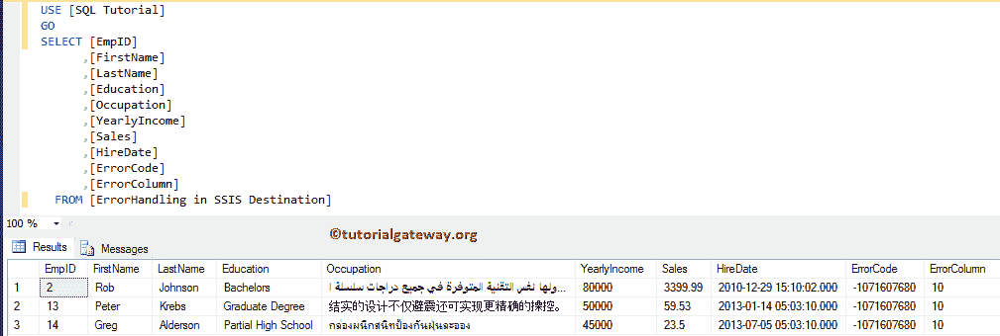