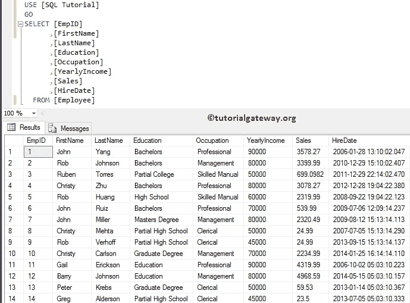
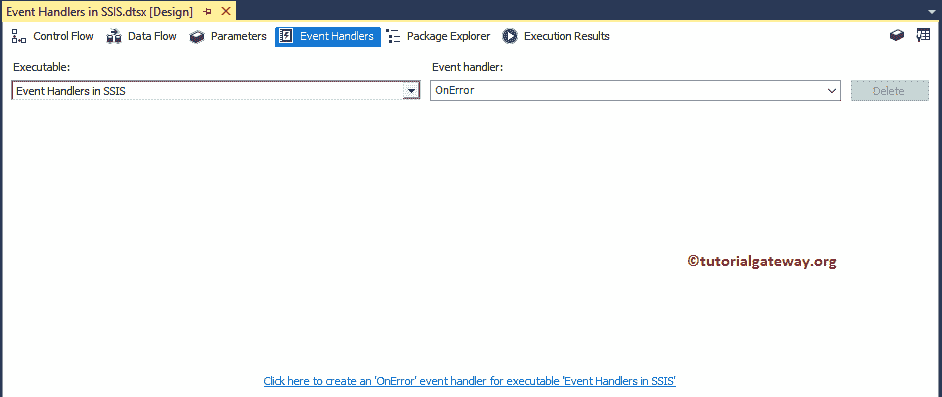
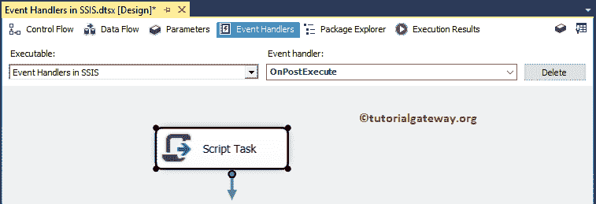

# SSIS 的事件处理器

> 原文：<https://www.tutorialgateway.org/event-handlers-in-ssis/>

事件处理器在 SSIS 是最有用、最强大的功能之一。在运行时可执行文件(如容器)中，任务会引发事件。

对于此 SSIS 事件处理器示例，在启动任务之前，在验证任务后，会引发 OnPreExecute 或 OnError 事件，或者 OnPostValidate 事件。

我们使用 SSIS 事件处理器的几个例子是:

*   在我们开始加载数据之前截断或清理表。
*   在我们将不想要的文件导出到其他位置(或 SQL)后，删除它们。
*   发生错误时发送电子邮件。
*   检索系统信息等。

在本文中，我们将通过一个例子向您展示如何在 SSIS 配置事件处理器。为此，我们将使用 SQL 教程数据库



中的雇员表

## SSIS 无事件处理器示例

将执行 SQL 任务从 [SSIS](https://www.tutorialgateway.org/ssis/) 工具栏拖放到控制流区域。


接下来，双击[执行 SQL 任务](https://www.tutorialgateway.org/execute-sql-task-in-ssis/)将打开编辑器进行配置。让我选择连接类型为 [OLE DB 连接](https://www.tutorialgateway.org/ole-db-connection-manager-in-ssis/)，连接到 SQL 教程数据库。接下来，我们使用直接输入作为 [SQL](https://www.tutorialgateway.org/sql/) 语句，因此，单击…按钮来编写定制的 SQL 命令。


请在这里写下你的自定义 [SQL](https://www.tutorialgateway.org/sql/) 语句。从下面的截图中可以看出，我们正在编写一个 [INSERT INTO 语句](https://www.tutorialgateway.org/sql-insert-into-select-statement/)，将四条记录插入到我们之前创建的表中。

```
-- SQL statement for SSIS Event Handlers example
USE [SQL Tutorial]
GO
INSERT INTO [dbo].[EmployeeDuplicates]
           ([FirstName]
           ,[LastName]
           ,[Education]
           ,[Occupation]
           ,[YearlyIncome]
           ,[Sales]
           ,[HireDate])
SELECT[FirstName]
      ,[LastName]
      ,[Education]
      ,[Occupation]
      ,[YearlyIncome]
      ,[Sales]
      ,[HireDate]
  FROM [dbo].[Employee]
```


点击【确定】关闭【执行 SQL 任务编辑器】


让我们运行 SSIS 事件处理器项目，看看我们是否成功地将记录插入到员工重复记录中。


## SSIS 事件处理器示例

为了在 SSIS 配置事件处理器，请自己导航到事件处理器选项卡，如下所示。


这里，SSIS 事件处理器有两个部分:

*   可执行文件:您可以使用此下拉列表选择要在 SSIS 应用事件处理的任务、容器。
*   事件处理器:该下拉列表包含所有事件。您可以选择要处理的事件。例如，发生发送电子邮件出错事件。



从下面的截图中，您可以看到我们选择了执行 SQL 任务作为可执行文件。


并选择 OnPreExecute 作为我们想要处理的事件。


从 SSIS 工具栏中拖动[执行 SQL 任务](https://www.tutorialgateway.org/execute-sql-task-in-ssis/)，并将其放入事件处理器区域。这意味着，在包开始执行之前，将执行这个执行 SQL 任务。


请在这里写下你的自定义 [SQL](https://www.tutorialgateway.org/sql/) 语句。从下面的截图中可以看出，我们正在编写 [TRUNCATE 语句](https://www.tutorialgateway.org/sql-truncate-table/)来删除员工重复表中的记录。

```
-- SQL statement for SSIS Event Handlers example
USE [SQL Tutorial]
GO
TRUNCATE TABLE [dbo].[EmployeeDuplicates]
```


点击【确定】关闭【执行 SQL 任务编辑器】


让我们运行 SSIS 事件处理器包。这个包将从 TRUNCATE TABLE(在事件处理器区域执行 SQL 任务)开始，然后开始将数据插入到 Employee Duplicate table(在控制流区域执行 SQL 任务)


让我们打开 [SQL Server](https://www.tutorialgateway.org/sql/) 管理工作室查询窗口预览数据。可以看出，该包插入了 14 条记录。


让我再给 SSIS 事件处理器添加一个任务。这次我们增加了一个[脚本任务](https://www.tutorialgateway.org/script-task-in-ssis/)来处理执行 SQL 任务的 OnPostExecution。



双击脚本任务将打开以下编辑器来配置脚本任务组件。请点击编辑脚本..按钮编写 C#脚本


我们在下面截图中使用的 C#代码是:

```
// C# Script for Event Handlering in SSIS
MessageBox.Show("Hey!! This is Tutorial Gateway Custom Message from Post Execute");
```


如您所见，SSIS 事件处理器项目在完成控制流区域中的执行 SQL 任务后显示消息。

