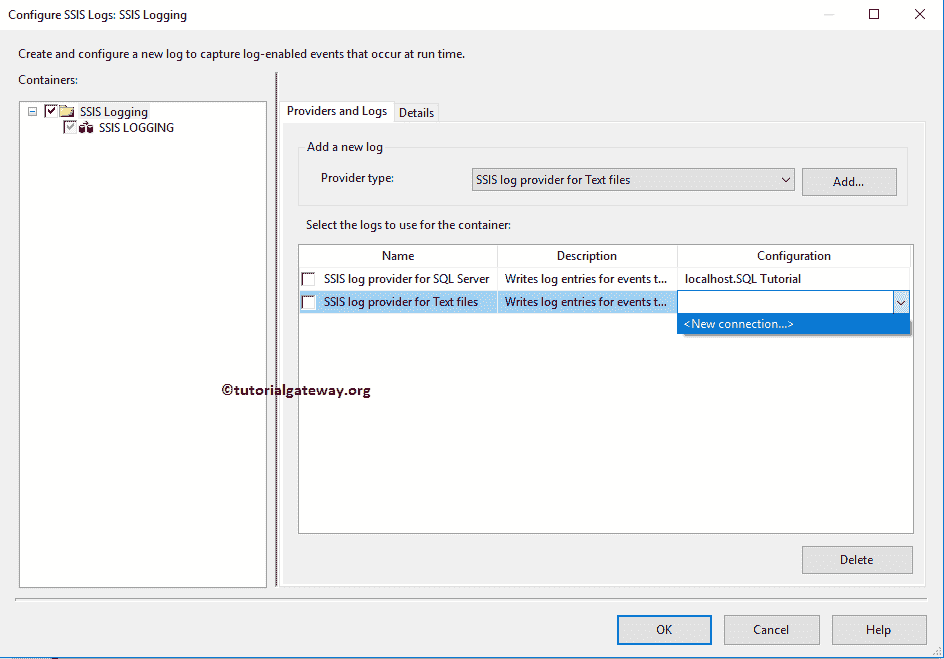

# SSIS 日志

> 原文：<https://www.tutorialgateway.org/ssis-logging/>

SQL Server 集成服务包括日志服务(日志)。因此，您可以在 SSIS 包、容器、任务等中使用它们。让我演示一下，SSIS 日志记录(保存日志信息)涉及哪些步骤。对于这个 SSIS 日志演示，我们将使用下面显示的数据。

## SSIS 日志实例

为了解释 SSIS 日志概念，首先，从工具箱中拖放数据流任务来控制流，并将其重命名为 SSIS 日志，如下所示。

双击它将打开 [SSIS](https://www.tutorialgateway.org/ssis/) 数据流选项卡。将 OLE 数据库源和 OLE 数据库目标拖放到数据流区域。

双击 OLE-DB 源代码将打开源代码编辑器。从下面的截图中，您可以看到我们正在使用 SQL Tutorial 数据库中的[员工]表。请参考[SSIS OLE DB 源码](https://www.tutorialgateway.org/ole-db-source-in-ssis/)文章，了解 OLE DB 源码编辑器中可用的选项。

双击 OLE DB 目标将打开到 OLE DB 目标编辑器来配置目标数据库。目前，我们正在选择名为[SSIS 日志示例表]的现有表。

单击“映射”选项卡，检查源列是否准确映射到目标列。

单击确定关闭 OLE 数据库目标编辑器。

### 在 SSIS 配置日志记录

要配置 SSIS 日志记录，请导航到 SSIS 菜单并选择日志记录(子菜单)，如下所示。

选择 SSIS 日志选项后，将打开一个名为“配置 SSIS 日志:SSIS 日志”的新窗口。从下面的截图可以看到，它正在显示一条警告信息

请选中该包(文件夹)以删除警告消息。

您可以在 provider type 属性中看到可用的 SSIS 日志选项列表。

*   SQL Server 事件探查器的日志提供程序:这将在 SQL 事件探查器中保存日志信息
*   XML 文件的日志提供程序:日志信息将存储到一个 XML 文件中。
*   SQL Server 提供程序:它将日志信息保存在 SQL 数据库(系统表)中的系统表中
*   Windows 事件日志的日志提供程序:它将在本地计算机中存储 SSIS 日志信息。它位于 Windows 日志的应用日志下。
*   文本文件的日志提供程序:该选项以逗号分隔值(CSV)格式保存日志信息。默认扩展名为。日志，但您可以将其更改为。txt 也是。

#### SQL 服务器日志记录配置

请选择日志提供程序类型，然后单击添加按钮。首先，我们将为 SQL 服务器

添加日志提供程序

接下来，我们必须配置连接字符串(数据库和凭据)。现在，我们选择指向 SQL 教程数据库的现有连接。

#### SSIS 配置中的文本文件记录

接下来，我们又添加了一个提供程序，即文本文件。这意味着日志信息将存储在 SQL 服务器和文本文件中。

目前，我们在包中没有任何文件连接，所以，点击<new connection..="">。</new>

一旦点击<new connection..="">选项，将打开文件连接管理器编辑器进行配置。在本例中，我们正在创建一个新文件。因此，我们从“使用类型”中选择“创建文件”选项。</new>

接下来，单击浏览按钮，并在该位置(文件系统)添加文件名。

接下来，进入详细信息选项卡，详细配置日志

#### 在日志记录中配置日志

下图将向您展示 SSIS 日志中可用事件的列表。请阅读每一个事件，以便你能理解它们的含义。因为是简单的英语，我们不解释日志事件。

出于演示目的，我们选择了 OnInformation、OnPreExecute、OnPostExecte 事件

您也可以点击高级按钮，进一步控制存储在表

中的日志信息

保存按钮:该按钮用于将我们在此配置的 SSIS 日志的配置设置保存在一个 XML 文件中。

加载按钮:使用此按钮加载现有的日志配置设置 XML 文件。

单击确定关闭 SSIS 日志设置，并运行设计的包。

让我打开文件系统中的 SSIS 日志文件。从下面的截图中，您可以看到指定文本文件中的日志信息。

请打开 [SQL Server 管理工作室](https://www.tutorialgateway.org/sql/)。在指定的数据库下(这里是 SQL 教程)，转到表文件夹- >系统表。在这里你可以找到 sysssislog 表。

