# SSIS 项目参数与 SSIS 包参数

> 原文：<https://www.tutorialgateway.org/ssis-project-parameters-vs-ssis-package-parameters/>

在本例中，我们将展示如何创建或配置 SSIS 项目参数和 SSIS 包参数。并向您展示 SSIS 项目参数和包参数之间的区别

## SSIS 项目参数与 SSIS 包参数

在 SSIS，参数有两种类型:项目参数和包参数

*   项目参数类似于全局参数。您可以从该项目中的任何包中访问它们。
*   包参数类似于局部变量。您可以从我们创建的包中访问它们。您不能从 pakage2.dtsx 访问 pakage1.dtsx 中的包参数

### SSIS 项目参数

在这里，我们将演示在 SSIS 创建项目参数所涉及的步骤。如果您查看解决方案资源管理器，我们有项目参数

右键单击项目参数，并从上下文菜单中选择视图设计器选项，以创建 [SSIS](https://www.tutorialgateway.org/ssis/) 项目参数。

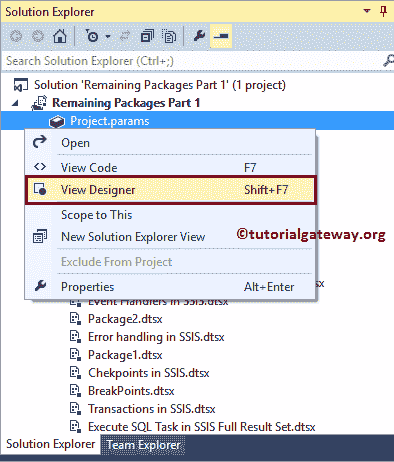

单击视图设计器选项时，将打开以下窗口。您可以使用此窗口查看现有项目参数，或创建新项目参数，或编辑现有项目参数，或删除现有项目参数。

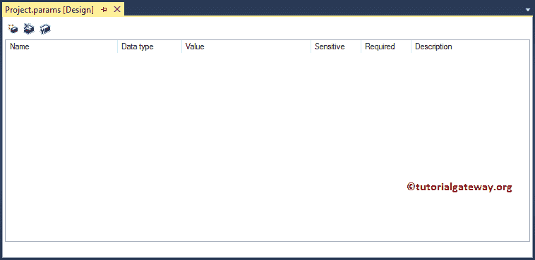

从下面的截图中，我们通过单击“新建参数”按钮来创建一个新的项目参数。

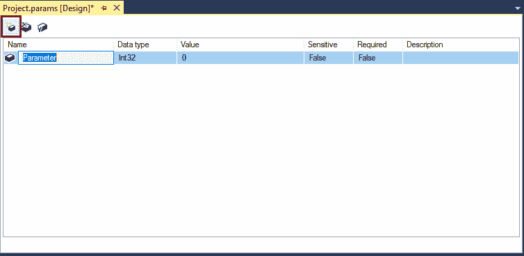

我们将名称指定为项目消息，将数据类型指定为字符串，并且值=嘿！！这是 SSIS 项目参数。

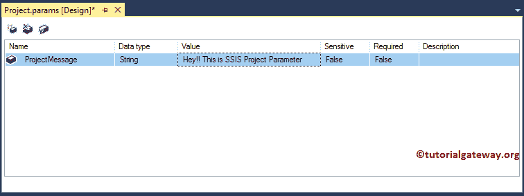

请单击保存按钮保存项目参数。

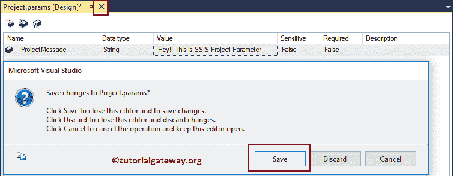

现在，您可以在 SSIS 软件包文件夹中的所有软件包中使用这个项目参数，即项目消息。

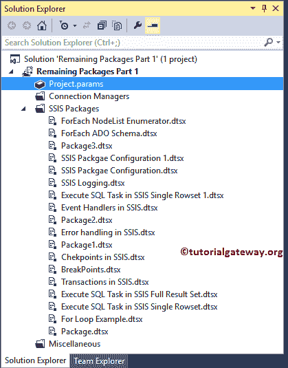

### SSIS 包参数

在本例中，我们将演示在 [SSIS](https://www.tutorialgateway.org/ssis/) 中创建包参数所涉及的步骤。为此，让我创建一个新包。

如果您观察下面的截图，对于每个新包，它都有一个参数选项卡。您可以使用此选项卡创建包级别参数。请点击此选项卡创建参数。

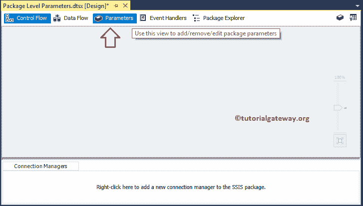

创建包级和项目级参数的界面是相同的。请单击新建参数按钮创建新的。

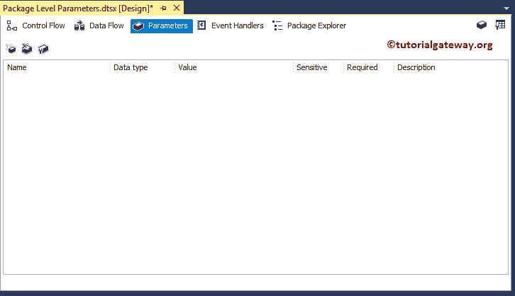

从下面的截图可以看出，我们创建了一个名为 PackageMessage 的新参数，类型为 string，其值为 Hi！！这是一个包消息。

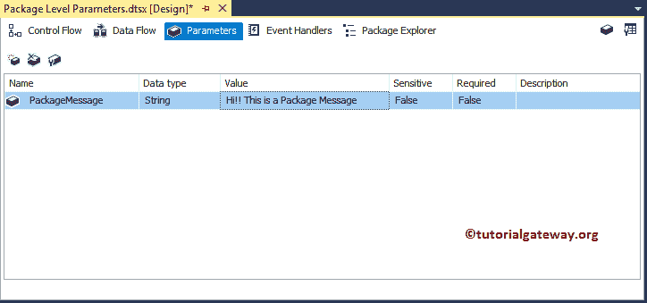

### SSIS 项目参数与 SSIS 包参数

这里，我们使用脚本任务来显示包含来自项目参数和包参数的数据的消息。为此，将 [SSIS](https://www.tutorialgateway.org/ssis/) 工具箱中的[脚本任务](https://www.tutorialgateway.org/script-task-in-ssis/)拖放到控制流区域。

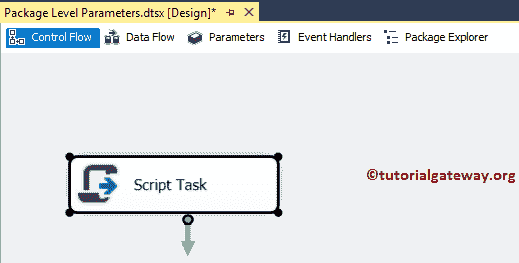

双击脚本任务将打开以下编辑器来配置脚本任务组件。我们在上一篇文章中已经解释了[脚本任务](https://www.tutorialgateway.org/script-task-in-ssis/)的配置步骤，所以请参考相同的内容。

这里我们要选择已经创建的参数。因此，请单击“仅就绪变量”属性旁边的按钮。

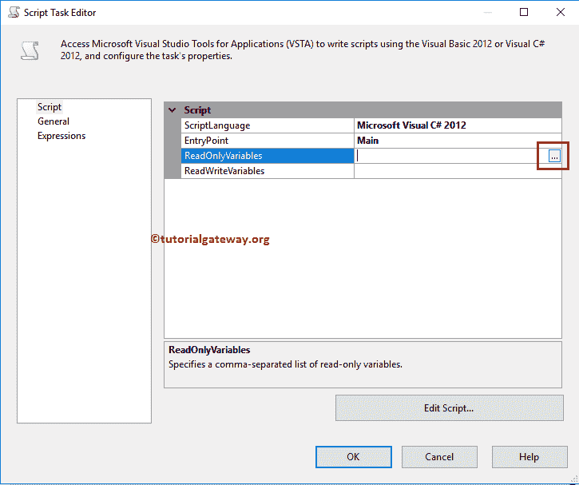

这里我们选择项目参数和包参数作为只读变量。

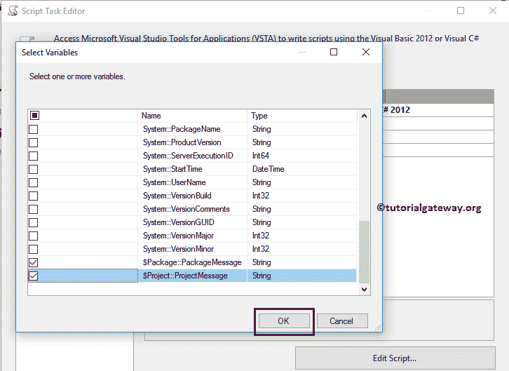

选择所需变量后，请单击编辑脚本..按钮编写实际的 C#或 VB 脚本

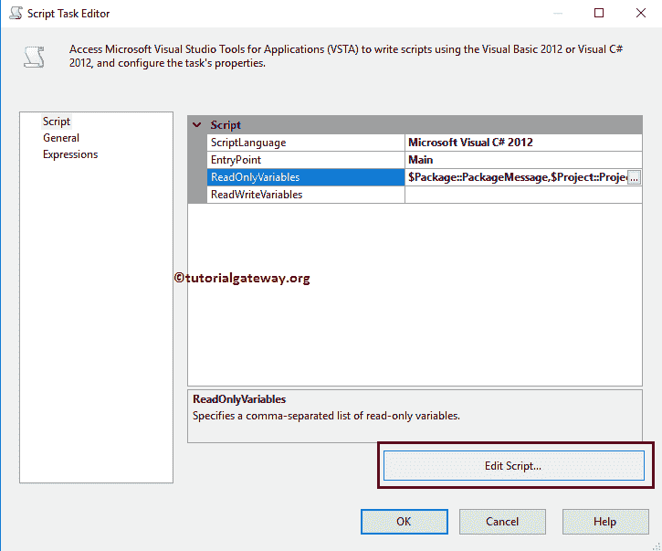

这里我们使用消息框来显示弹出消息。

我们在下面截图中使用的 C#代码是:

```
// SSIS Project Parameters Vs SSIS Package Parameters Example
string ProjectMessage = Dts.Variables["$Project::ProjectMessage"].Value.ToString();
string PackageMessage = Dts.Variables["$Package::PackageMessage"].Value.ToString();

MessageBox.Show("Message From Project Parameter is:" + 
                        ProjectMessage + Environment.NewLine +
                 Environment.NewLine +
                "Message From Package Parameter is:" + PackageMessage);
```

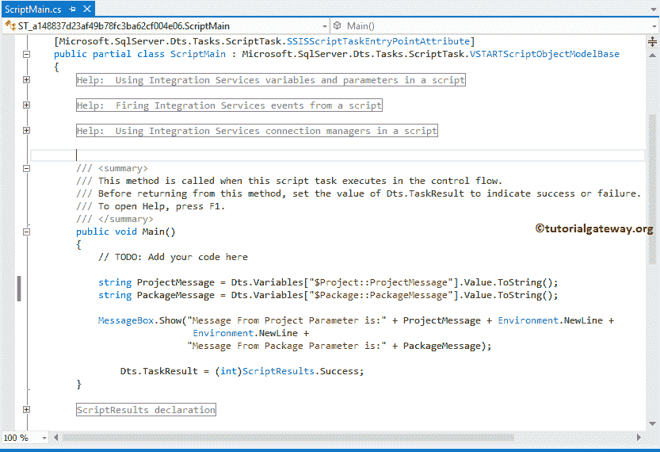

单击“确定”完成 SSIS 项目参数与 SSIS 包参数包的配置。让我们运行包

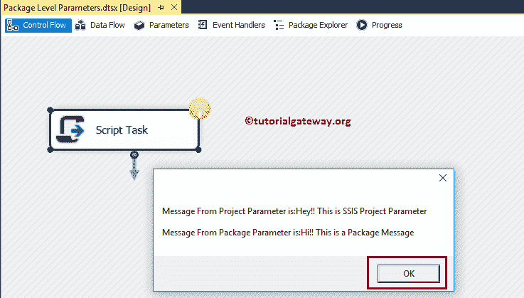

让我在这个项目中打开另一个包。从下面的截图中，可以看到这是我们在[SSIS 单行集](https://www.tutorialgateway.org/execute-sql-task-in-ssis-single-rowset/)文章中的【执行 SQL 任务】中创建的一个包。

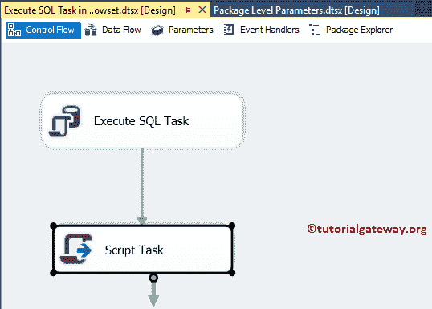

让我尝试访问我们之前从这个脚本任务中创建的参数。从下面的截图中可以看到，我们可以访问项目参数，但不能访问包参数。

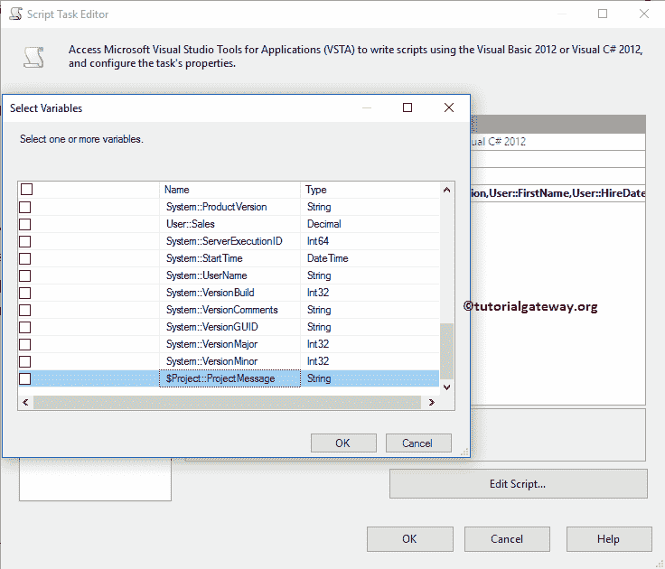