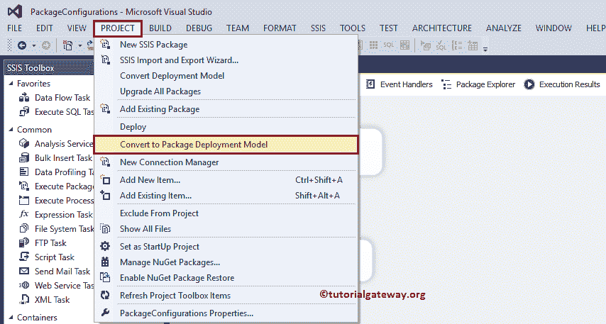
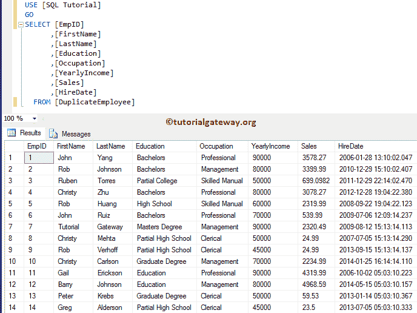

# SSIS 包配置

> 原文：<https://www.tutorialgateway.org/ssis-package-configuration/>

在将包部署到生产环境时，在 BIDS 中编辑包配置设置是一种不良做法。如果您将连接管理器的详细信息放在包中，那么您必须只使用 BIDS 来编辑它们。为了避免这些情况，我们使用了 SSIS 软件包配置设置。您可以使用它们来保存连接管理器的详细信息、变量、值等。在这里，我们向您展示了可用的 SSIS 软件包配置列表及其描述。

默认情况下，SSIS 包配置设置在包设计器中不可用。例如，如果右键单击控制流区域，它将打开上下文菜单。从列表中，您可以看到没有包配置..选项。


要获得 SSIS 包配置选项，请导航到项目菜单并选择转换为包部署模型子菜单。



选择该菜单后，将显示一个新的弹出窗口，如下所示。点击【确定】按钮


点击确定按钮后， [SSIS](https://www.tutorialgateway.org/ssis/) 会将当前包转换为部署模型。单击确定关闭转换窗口。


现在，如果您右键单击控制流区域，上下文菜单将显示包配置..选项。您可以选择此选项来添加包配置。


以下是 SQL Server 集成服务中可用的配置类型列表:

*   XML 配置文件:这种类型会将配置设置保存在一个 XML 文件中。这是部署报告时最常见的方法。请参考[使用 XML 配置文件的 SSIS 包配置](https://www.tutorialgateway.org/ssis-package-configuration-using-xml-configuration-file/)、[第 2 部分](https://www.tutorialgateway.org/ssis-package-configuration-using-xml-configuration-file-part-2/)了解 XML 配置。
*   环境变量:它允许您使用环境变量来保存配置设置或包变量值。请参考 [SSIS 包配置使用环境变量](https://www.tutorialgateway.org/ssis-package-configuration-using-environment-variable/)一文了解设置。
*   注册表项:您也可以在注册表中保存配置设置。使用注册表项访问 [SSIS 包配置，了解注册表设置。](https://www.tutorialgateway.org/ssis-package-configuration-using-registry-entry/)
*   父包变量:此类型会将配置设置保存在变量中。您可以使用此变量更新子包中的属性。访问[亲子套餐](https://www.tutorialgateway.org/ssis-parent-child-package-configuration/)
*   SQL Server:保存在 [SQL Server](https://www.tutorialgateway.org/sql/) 中的表格中的配置设置。请参见[使用 SQL Server 的 SSIS 包配置](https://www.tutorialgateway.org/ssis-package-configuration-using-sql-server/)了解 SQL 设置。


## SSIS 包配置的示例包

我们将在解释 [SSIS](https://www.tutorialgateway.org/ssis/) 中每个单独的包配置类型的系列文章中使用这个包。在我们进入 SSIS 软件包配置演示之前，让我向您展示我们将使用的表格。是 [SQL Server](https://www.tutorialgateway.org/sql/) 中的重复员工表。



从下面的截图可以看到，这是一个简单的包，包含一个[执行 SQL 任务](https://www.tutorialgateway.org/execute-sql-task-in-ssis/)和[脚本任务](https://www.tutorialgateway.org/script-task-in-ssis/)。请参考[在 SSIS 单个行集中执行 SQL 任务](https://www.tutorialgateway.org/execute-sql-task-in-ssis-single-rowset/)一文了解包配置。


让我向您展示执行 SQL 任务内部的配置设置。这里我们选择的连接类型为 [OLE DB 连接](https://www.tutorialgateway.org/ole-db-connection-manager-in-ssis/)，连接到 SQL 教程数据库。接下来，我们使用直接输入作为 [SQL](https://www.tutorialgateway.org/sql/) 语句，并编写定制的 SQL 命令。最后，我们将结果集从无(默认)更改为单行。


让我点击…按钮，显示自定义 [SQL](https://www.tutorialgateway.org/sql/) 查询。

```
-- SSIS Package Configuration Example
SELECT [FirstName]
      ,[LastName]
      ,[Education]
      ,[Occupation]
      ,[Sales]
      ,[HireDate]
      ,[YearlyIncome]
  FROM [DuplicateEmployee]
  WHERE [YearlyIncome] = ? AND
        [Education] = ?
```


在参数映射选项卡下，我们将变量分配给参数。它意味着分配给输入年收入变量的年收入旁边的第一个问号，以及分配给输入教育变量的另一个问号。


从下面的截图中可以看到，我们将之前创建的变量分配给了 [SQL](https://www.tutorialgateway.org/sql/) 语句返回的所有列。


我想我忘记显示现有的变量了。让我关闭执行 SQL 任务编辑器，并右键单击设计以选择变量..选项。从下面的截图可以看到 InputEducation=硕士学位，inputayarlincome = 90000


的默认值

脚本任务中的 C#代码如下所示。


让我们运行 SSIS 包配置包来查看结果。

