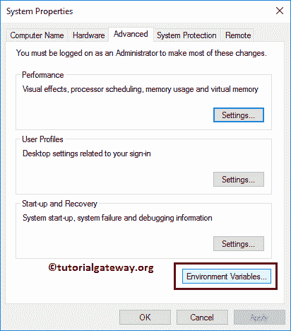
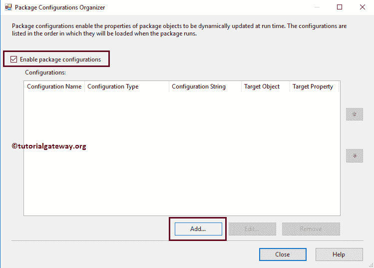

# 使用环境变量配置 SSIS 包

> 原文：<https://www.tutorialgateway.org/ssis-package-configuration-using-environment-variable/>

如何用环境变量实例应用 SSIS 包配置？。我们之前在 SSIS 软件包配置文章中描述了软件包配置列表。

在我们开始 SSIS 包配置之前，您必须创建环境变量。以便您可以在配置包时访问它们。要创建环境变量，请转到控制面板->系统和安全->系统，然后单击高级系统设置。

或者右键单击我的电脑，选择属性，然后选择高级系统设置将打开系统属性。

简单而优雅的方法是在搜索栏中键入环境变量，然后选择编辑系统环境变量选项。

通过选择编辑系统环境变量选项，系统属性窗口将会打开。要添加新的系统变量，请单击环境变量..按钮。

单击环境变量后..按钮，下面显示的窗口将会打开。在这里，您可以看到所有现有的变量及其值。请点击新建..按钮添加新变量。

如您所见，我们将变量名添加为教育详情，变量值添加为单身汉

接下来，我们再创建一个变量变量名为 IncomeVariable，变量值为 70000

点击【确定】关闭【环境变量】窗口

## 使用环境变量的 SSIS 包配置示例

在我们使用环境变量开始 [SSIS 包配置](https://www.tutorialgateway.org/ssis-package-configuration/)之前，让我执行 [SSIS](https://www.tutorialgateway.org/ssis/) 包，看看它返回了什么。

右键单击控制流区域将打开上下文菜单。请选择包配置..选项

选择软件包配置后..，一个名为“包配置管理器”的新窗口打开。

请选中启用包配置以启用配置。接下来，单击添加按钮，使用环境变量添加新的 SSIS 包配置。

单击添加按钮将打开一个向导。请勾号不要再显示此页，以免出现第一页。

选择配置类型:这是我们必须用来选择配置类型的页面。默认情况下，XML 配置文件由

选择

在这里，我们使用一个环境变量来解释 SSIS 包的配置。所以，让我选择环境变量作为配置类型。

如您所见，我们正在选择教育详细信息变量。请记住，如果您没有找到新创建的变量，请关闭项目，并重新打开 BIDS。

选择目标属性:您必须在此指定目标值。它可能是变量或连接管理器设置。

在这里，我们希望将这个环境变量赋给包变量(输入教育)值。这意味着，在运行时，输入教育的默认值，即硕士学位，将替换为学士学位。

让我将配置名称重命名为教育详细信息配置，然后单击完成按钮关闭向导。

现在，您可以看到我们新创建的保存教育值的环境变量配置。

使用相同的方法再添加一个环境变量类型的包配置。这一次，我们选择了 IncomeVariable，并将其分配给 InputYearlyIncome 变量(包变量)。

让我将配置名称指定为收入变量配置。

现在，您可以看到我们新创建的环境变量配置。点击【确定】关闭

窗口

让我们运行包来看看结果。

从上面的截图可以看到，它显示的是学历为学士，年收入为 7 万的记录。这意味着，包变量值被环境变量值替换