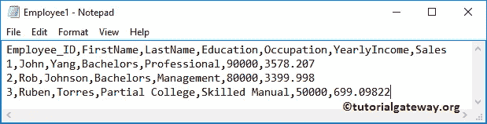
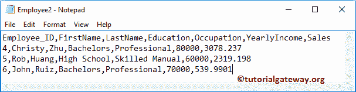
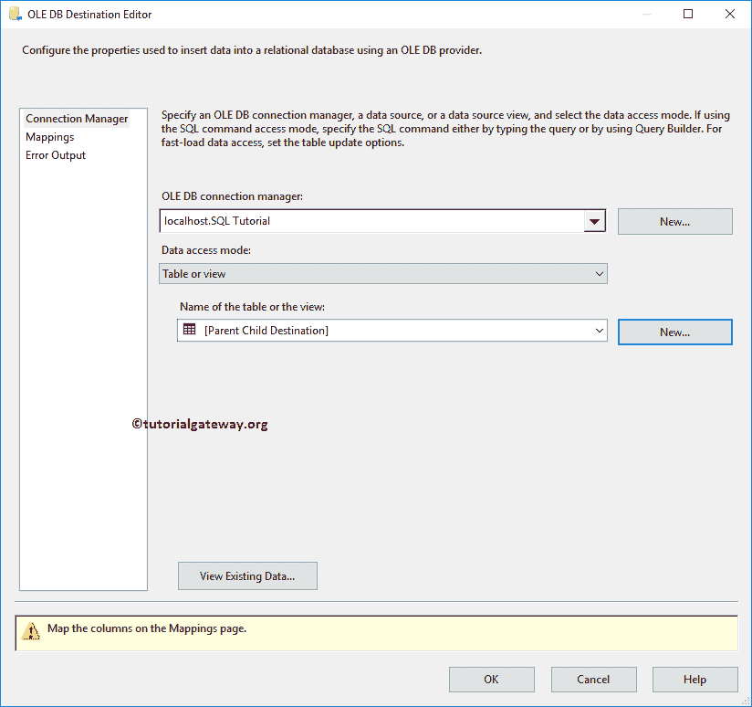
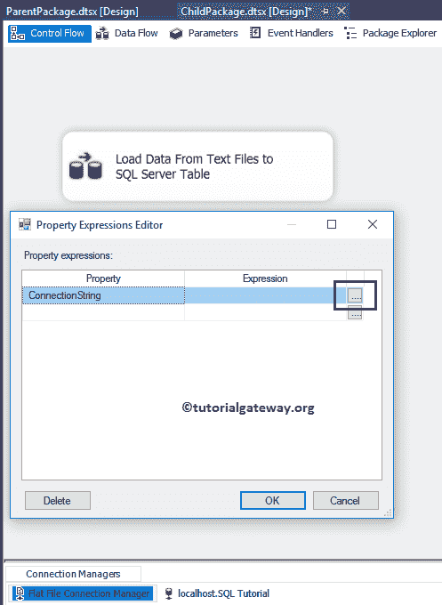

# SSIS 父子包配置

> 原文：<https://www.tutorialgateway.org/ssis-parent-child-package-configuration/>

在本文中，我们将通过示例向您展示如何创建 SSIS 父子包配置。我们已经在上一篇文章中解释了包配置列表。所以，请参考 [SSIS 套餐配置](https://www.tutorialgateway.org/ssis-package-configuration/)了解。

我们的 D 驱动器中有 [SSIS](https://www.tutorialgateway.org/ssis/) 文件系统任务文件夹，它有四个文本文件。为了演示这个 SSIS 父子包配置，我们将从文本文件加载数据到 [SQL Server](https://www.tutorialgateway.org/sql/) 表。下面的截图将向您展示 Employee1.txt 文件中的数据。

下面的截图显示了 Employee2.txt 文件中的数据。

下面的截图显示了 Employee3.txt 文件中的数据。

下面的截图显示了 Employee4.txt 文件中的数据。

## SSIS 父子包配置示例

在这个 SSIS 示例中，首先，我们将配置父包，即下一个子包。然后我们将创建一个父包变量(包配置)。我们的目标是从子包中访问父包变量(带有数据)

### 在 SSIS 配置父包

在这个包中，我们将枚举那些雇员文本文件，并将文件名保存在一个字符串变量中。为此，首先将 Foreach 循环容器拖放到控制流区域

双击它将打开 Foreach 循环编辑器进行配置。在“集合”选项卡中，请选择 [Foreach 文件枚举器](https://www.tutorialgateway.org/ssis-foreach-loop-file-enumerator/)，因为我们希望循环访问文件系统中存在的文件。接下来，单击浏览按钮从我们的文件系统中选择文件夹名称。

从下面的截图中，您可以看到，我们正在选择我们的 D 驱动器中的文件系统任务文件夹文件夹。在文件部分，我们使用通配符*。txt 因为我们要枚举文本文件

我们的目标是将文件名存储在一个变量中。为此，请转到变量映射部分，选择变量并将其分配给索引 0。完成后，单击确定完成 Foreach 循环容器的配置。

### 在 SSIS 配置子包

将数据流任务从工具箱拖放到控制流区域，并将其重命名为从文本文件加载数据到 SQL Server 表

双击它将打开数据流选项卡。接下来，将[平面文件源](https://www.tutorialgateway.org/flat-file-source-in-ssis/)和 [OLE DB 目标](https://www.tutorialgateway.org/ssis-ole-db-destination/)从工具箱拖放到数据流区域。

双击平面文件源将打开平面文件源编辑器来配置连接管理器设置。如果您已经创建了平面文件连接管理器，请选择它；否则，点击新建按钮将打开平面文件连接管理器编辑器。

从下面的截图中，您可以看到我们正在从文件系统任务文件夹中选择员工 1 文本文件。

单击确定按钮关闭平面文件源连接管理器编辑器，然后单击平面文件源编辑器列选项卡验证列。在此选项卡中，我们还可以取消选中不需要的列。

双击 [OLE DB 目标](https://www.tutorialgateway.org/ssis-ole-db-destination/)将打开 OLE DB 目标编辑器。选择 [OLE 数据库连接管理器](https://www.tutorialgateway.org/ole-db-connection-manager-in-ssis/)并选择【SSIS 教程】数据库中的【SSIS `Foreach` 循环文件分子】表以插入新记录。

单击“映射”选项卡，检查源列是否正确映射到目标列。

这里我们的子包将从文件系统中获取 Employe1 文本文件，并将其保存在 [SQL Server](https://www.tutorialgateway.org/sql/) 表中。但是我们打算将文件系统中的所有文本文件(员工 1、员工 2、员工 3 和员工 4)加载到表中。为此，请从“连接管理器”窗格中选择平面文件连接管理器，然后右键单击它，从上下文菜单中选择“属性”选项。

单击表达式属性将打开属性表达式编辑器。这里我们必须配置连接字符串设置。因此，从下拉框中选择连接管理器属性，然后单击…按钮。

单击…按钮后，它将打开表达式生成器来构建表达式。这里我们将 FileName 变量作为表达式

现在，我们必须指定变量值->位置，文件名，扩展名

### 使用父包变量的 SSIS 包配置

对于这个 SSIS 父子包配置演示，右键单击控制流区域将打开上下文菜单。请选择包配置..选项

选择软件包配置后..，将会打开一个名为“包配置管理器”的新窗口。请选中启用包配置以启用配置。接下来，单击添加按钮添加新配置。

单击添加按钮将打开一个向导。第一页是欢迎向导。请勾选“不要再显示此页面”以避免出现此页面。

选择配置类型:这是我们必须用来选择配置类型的页面。默认情况下， [SSIS](https://www.tutorialgateway.org/ssis/) 选择 XML 配置文件。在本例中，我们将解释 SSIS 父包变量配置。因此，让我选择父包变量作为配置类型，并指定父变量名。请记住，变量名应该与父包变量名相同。

选择目标属性:您必须在此指定目标值。这里我们必须将父包变量(文件名)分配给文件系统连接字符串变量(子文件名)值。这意味着运行时子文件名的默认值被父包变量(文件名)替换。

让我将 SSIS 配置名称重命名为父-子包配置，然后单击完成按钮关闭向导。

现在，您可以看到我们新创建的父包变量配置。

接下来，转到父包，将[执行打包任务](https://www.tutorialgateway.org/execute-package-task-in-ssis/)从工具箱拖放到 Foreach 容器中。

双击执行打包任务来配置包。转到包选项卡以设置包位置和连接字符串。在这个例子中，我们正在执行文件系统中的包。因此，请将引用类型更改为外部引用，并选择文件系统作为包源。

接下来，单击新建连接打开文件连接管理器编辑器，选择文件系统中的文件。

提示:请参考【文件系统】文章中的[执行包，了解从文件系统执行包所涉及的步骤。接下来，参见](https://www.tutorialgateway.org/execute-packages-in-file-system-using-ssis-execute-package-task/) [SSIS 执行打包任务项目引用](https://www.tutorialgateway.org/ssis-execute-package-task-project-reference/)一文调用同一个项目内的包，以及[使用 SSIS 执行包 Tas](https://www.tutorialgateway.org/execute-packages-in-sql-server-using-ssis-execute-package-task/) k 调用 SQL Server 中的包。

从下面的截图可以看到，我们正在从 [SSIS](https://www.tutorialgateway.org/ssis/) 套餐列表中选择子套餐。

单击确定选择文件。如果包用密码保护(通常是)，请提供适当的密码。

单击“确定”完成父包的配置。让我们运行 SSIS 父子包配置包

从上面，您可以观察到我们的执行打包任务正在调用子包。

让我们打开 [SQL Server 管理工作室](https://www.tutorialgateway.org/sql/)查看结果。

让我告诉你，如果我们删除父包变量配置会发生什么。

现在可以看到任务已经失败

