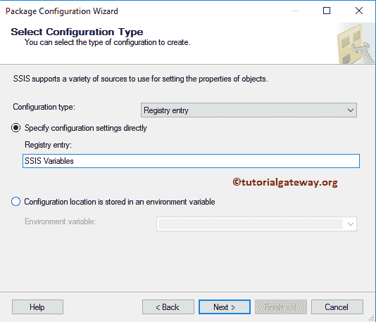
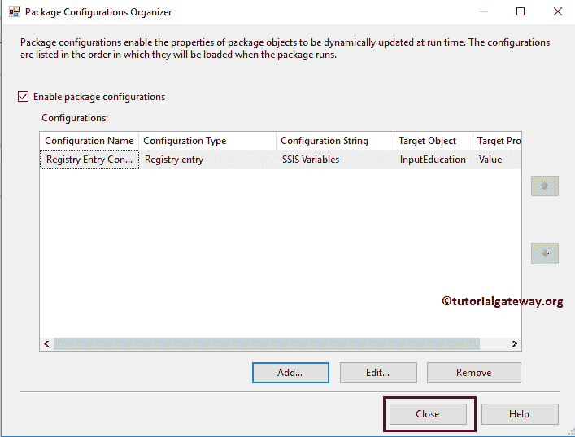

# 使用注册表项配置 SSIS 包

> 原文：<https://www.tutorialgateway.org/ssis-package-configuration-using-registry-entry/>

在本文中，我们将通过示例向您展示如何使用注册表项应用 SSIS 包配置。我们已经在上一篇文章中解释了包配置列表。所以，请参考 [SSIS 套餐配置](https://www.tutorialgateway.org/ssis-package-configuration/)了解。

在我们使用注册表项开始 SSIS 包配置之前，您必须向注册表添加一个新项。以便您可以在配置包时访问它。要打开系统注册表，请转到搜索栏并键入运行。请记住，编辑注册表项是危险的。因此，我建议您在开始之前备份注册表文件。

键入注册表编辑(注册表编辑的简称)，然后单击确定

右键单击 HKEY 当前用户将打开上下文菜单。请选择新建，然后按键

根据您的要求分配密钥名称。这里我们指定 SSIS 变量作为键名。

右键单击 SSIS 变量键->新建->字符串值以向键

添加值

将值指定为新字符串值的名称

双击该值将打开一个新的弹出窗口。将数据指定为单身汉。

## 使用注册表项的 SSIS 包配置

在我们使用注册表项开始 SSIS 包配置之前，让我执行这个包，看看它返回了什么。

要配置包，右键单击控制流区域将打开上下文菜单。请选择包配置..选项

选择软件包配置后..，将打开一个名为“包配置管理器”的新窗口。请选中启用包配置以启用配置。接下来，单击添加按钮，使用 SSIS 的注册表项添加新的软件包配置。

单击添加按钮将打开包配置向导。第一页是欢迎向导，请勾选“不要再显示此页”以避免出现此页。

选择配置类型:这是我们必须用来选择配置类型的页面。默认情况下， [SSIS](https://www.tutorialgateway.org/ssis/) 选择一个 XML 配置文件。在本例中，我们将使用注册表项来解释 SSIS 包的配置。因此，让我选择注册表项作为配置类型。

接下来，我们将指定之前创建的注册表项。

选择目标属性:您必须在此指定目标值。在这里，我们希望将这个注册表值分配给包变量(输入教育)值。这意味着输入教育的默认值，即硕士学位，将在运行时替换为学士学位。

让我将 SSIS 包配置名称重命名为注册表项配置。并单击“完成”按钮关闭向导。

现在，您可以看到我们新创建的保存教育值的环境变量配置。

让我们运行包来看看结果。

从上面的截图可以看到，它显示的是学历为学士，年收入为 9 万的记录。这意味着，包变量值(InputEducation)被注册表键值替换。