# 使用 SQL Server 的 SSIS 包配置

> 原文：<https://www.tutorialgateway.org/ssis-package-configuration-using-sql-server/>

在本文中，我们将通过示例向您展示如何使用 SQL Server 应用 SSIS 包配置。我们已经在 [SSIS 套装配置](https://www.tutorialgateway.org/ssis-package-configuration/)一文中解释了套装配置列表。

## 使用 SQL Server 的 SSIS 包配置示例

在我们使用 [SQL Server](https://www.tutorialgateway.org/sql/) 开始 [SSIS](https://www.tutorialgateway.org/ssis/) 包配置之前，让我执行这个包，看看它返回了什么。

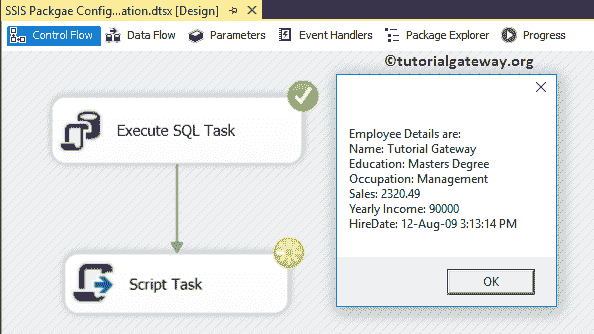

要添加 SQL SSIS 包配置，右键单击控制流区域将打开上下文菜单。请选择包配置..选项

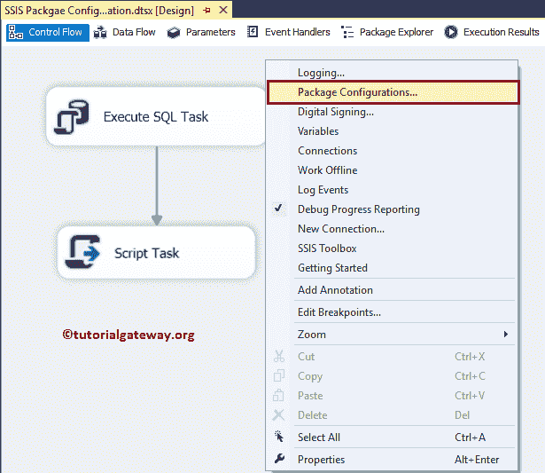

选择软件包配置后..，将打开一个名为“包配置管理器”的新窗口。请选中启用包配置以允许配置。接下来，单击添加按钮，使用 SQL Server 添加新的 SSIS 包配置。

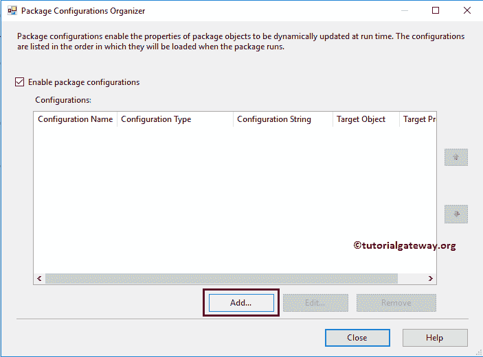

单击添加按钮将打开一个向导。第一页是欢迎向导。勾号不要再次显示此页面以避免出现此页面。

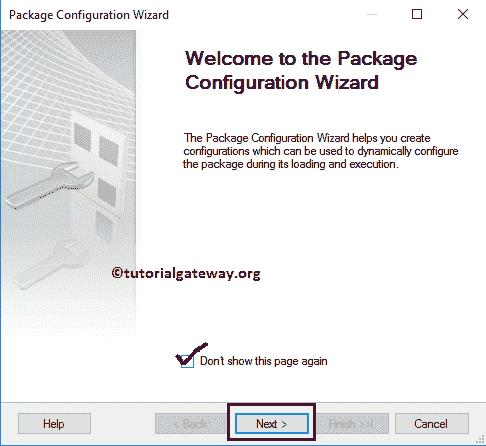

选择配置类型:这里我们要选择配置类型。默认情况下， [SSIS](https://www.tutorialgateway.org/ssis/) 选择 [XML 配置文件](https://www.tutorialgateway.org/ssis-package-configuration-using-xml-configuration-file/)。

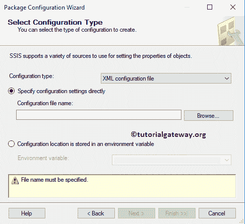

在这里，我们将解释使用 SQL Server 的 SSIS 包配置。因此，让我选择 SQL Server 作为配置类型。

*   连接:指定连接到 SQL Server 的 OLE 数据库连接。
*   配置表:创建或选择存储配置设置的配置表。

目前，我们正在选择现有的连接。如果您没有任何连接，请单击“新建”按钮创建一个连接。

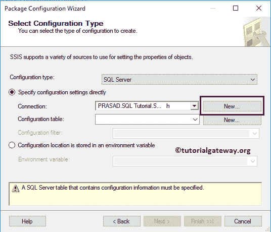

单击新建按钮将打开配置 OLE 数据库连接管理器。请访问 [OLE DB 连接管理器](https://www.tutorialgateway.org/ole-db-connection-manager-in-ssis/)文章

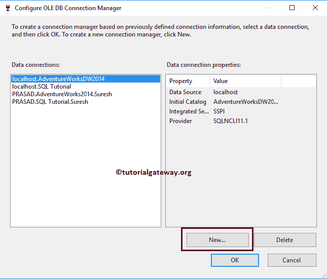

我们还没有创建任何配置表。所以，点击

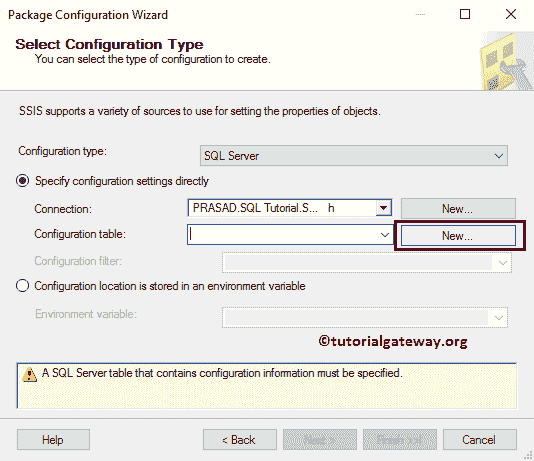

新建按钮

它会自动为您生成一个[创建表](https://www.tutorialgateway.org/sql-create-table/)脚本。其生成的 [SQL](https://www.tutorialgateway.org/sql/) 脚本为:

```
CREATE TABLE [dbo].[SSIS Configurations]
(
	ConfigurationFilter NVARCHAR(255) NOT NULL,
	ConfiguredValue NVARCHAR(255) NULL,
	PackagePath NVARCHAR(255) NOT NULL,
	ConfiguredValueType NVARCHAR(20) NOT NULL
)
```

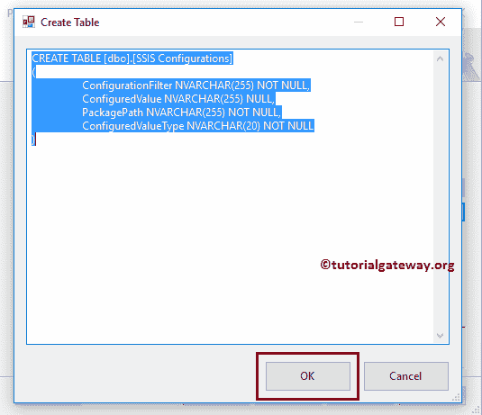

请为配置过滤器分配唯一的名称。

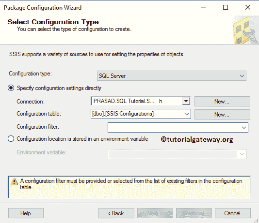

点击【下一步】按钮

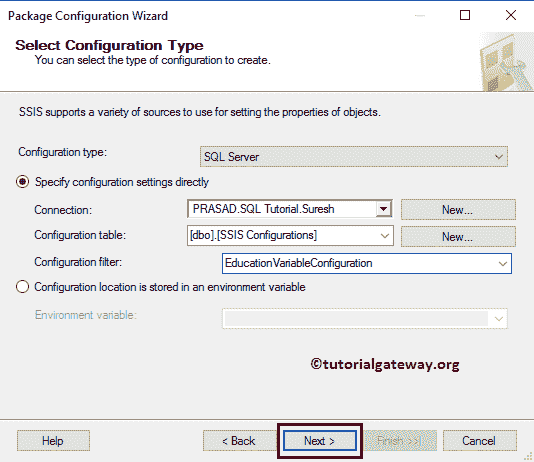

选择要导出的属性:指定目标值。在这里，我们想要分配包变量 InputEducation 和 InputYearlyIncome 值。这意味着在运行时，输入教育(即硕士学位)的默认值，输入一个新值(即 90000)将替换为 SSIS 配置表的值。

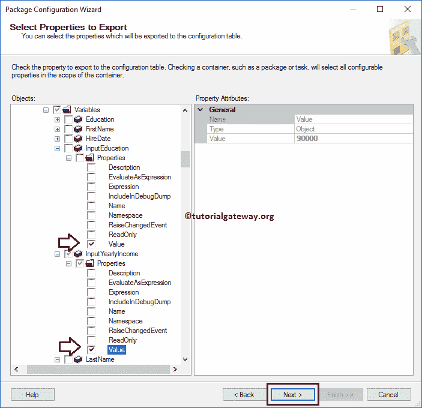

让我使用 SQL Server 名称作为输入教育配置来重命名这个 SSIS 包配置。并单击“完成”按钮关闭向导。

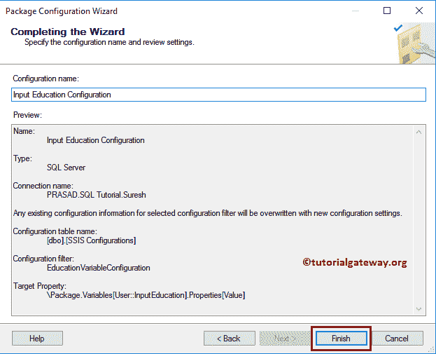

现在，您可以看到我们新创建的配置，它保存了 SQL 表中的变量值信息。

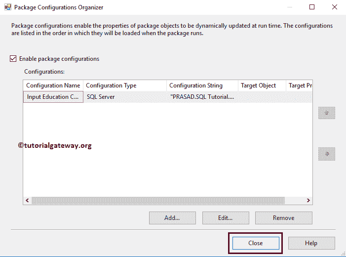

让我打开 [SQL Server 管理工作室](https://www.tutorialgateway.org/sql/)，查看详情


接下来，我们使用 [UPDATE 语句](https://www.tutorialgateway.org/sql-update-statement/)将配置值更新为:InputYearlyIncome = 70000，InputEducation =单身汉

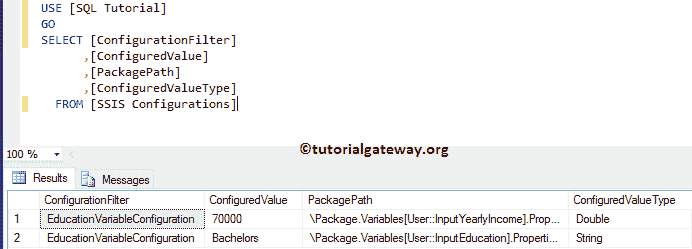

让我们运行包

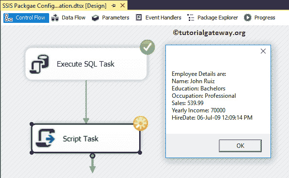

从上面的截图看，显示的是学历为学士，年收入为 7 万的记录。意思是，包变量值被 [SSIS](https://www.tutorialgateway.org/ssis/) 配置表值