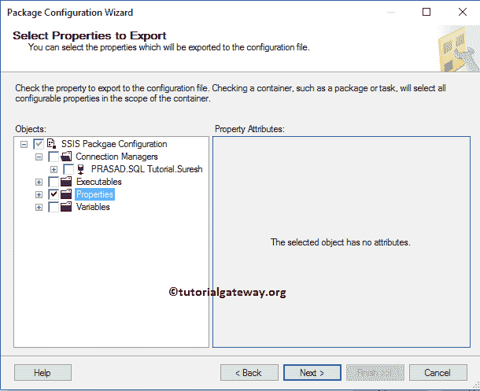
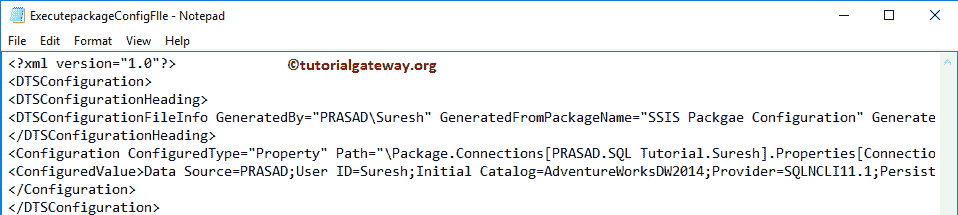

# 使用 XML 配置文件配置 SSIS 包

> 原文：<https://www.tutorialgateway.org/ssis-package-configuration-using-xml-configuration-file/>

如何用 XML 配置文件结合实例应用 SSIS 包配置？。我们已经在上一篇文章中解释了包配置列表。所以，请参考 [SSIS 套餐配置](https://www.tutorialgateway.org/ssis-package-configuration/)了解。

## 使用 XML 配置文件的 SSIS 包配置示例

在我们开始使用 XML 配置文件配置 SSIS 包之前，让我执行这个包，看看它返回了什么。

要添加 XML 包配置，右键单击控制流区域将打开上下文菜单。请选择包配置..上下文菜单中的选项

选择软件包配置后..，一个新的包配置管理器窗口打开。请选中启用包配置以启用配置。接下来，单击添加按钮，使用 XML 配置文件添加新的 SSIS 包配置。

单击添加按钮将打开一个向导。第一页是欢迎向导页。勾号“不再显示此页面”选项可避免显示此页面。

选择配置类型:这里我们要选择默认的配置类型， [SSIS](https://www.tutorialgateway.org/ssis/) 选择的 XML 配置文件。

*   直接指定配置设置:通过选择此选项，您必须直接指定配置设置。这意味着您必须选择包含配置设置(连接管理器或变量值等)的文件。).在这个例子中，我们将解释这个属性。因此，单击“浏览”按钮选择现有的配置文件，或者创建一个配置文件。
*   配置位置存储在环境变量中:这是一种间接方法。请参考使用 XML 配置文件的 SSIS 包配置第 2 部分来了解此选项。

从下面的截图中可以看出，我们正在项目中创建 dtsConfig 类型的 ExecutepackageConfigFile。

点击【下一步】按钮

选择要导出的属性:您必须在此指定目标值。它可能是一个变量值或连接管理器设置。

这里我们想用 XML 配置文件替换包中的连接管理器设置。因此，让我选择 ConnectionString 属性。这意味着，包中的默认连接字符串在运行时被这个配置文件替换。

让我将配置名称重命名为连接字符串配置，然后单击完成按钮关闭向导。

现在您可以看到我们新创建的连接字符串配置，它保存了. dtsConfigfile.

中的连接字符串信息

让我打开我的文件系统，显示

该文件中的 XML 数据是:

您也可以使用记事本

编辑配置文件

这里我们将数据库名称从 SQL 教程改为冒险作品 DW 2014

运行包时失败，因为 Adventure Works DW 2014 没有复制员工表。

让我把它改成 SQL 教程。接下来，使用 XML 配置文件包

运行 SSIS 包配置