# 使用 XML 配置文件配置 SSIS 包——第 2 部分

> 原文：<https://www.tutorialgateway.org/ssis-package-configuration-using-xml-configuration-file-part-2/>

本文通过一个例子展示了如何使用存储在环境变量中的 XML 配置文件来应用 SSIS 包配置。我们已经在上一篇文章中解释了包配置列表。

在我们部署项目时，这是一个非常有用的方法。因为，您可以将配置文件保存在客户端位置，并创建一个指向该文件的环境变量。这就是你要做的。

在我们开始[包配置](https://www.tutorialgateway.org/ssis-package-configuration/)之前，您必须创建一个环境变量。在前面的文章中，我们已经解释了创建环境变量的分步方法。请参考[使用环境变量的 SSIS 包配置](https://www.tutorialgateway.org/ssis-package-configuration-using-environment-variable/)了解相同内容。

要添加新的环境变量，请单击环境变量..按钮。

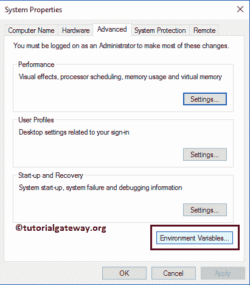

单击环境变量后..按钮，下面显示的窗口将被打开。在这里，您可以看到所有现有的变量及其值。请单击新建…按钮添加新变量。

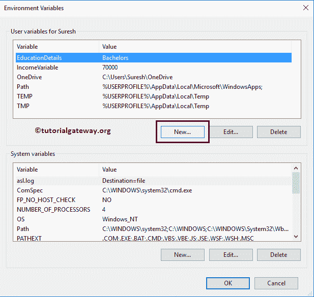

如您所见，我们正在添加变量名作为配置路径，变量值= C:\ user \ Suresh \ Documents \ Visual Studio 2013 \ project \ package configurations \ package configurations \ execute packageconfigfile . dtsconfig

这意味着我们正在创建一个包含 XML 配置文件路径的环境变量。而我们使用的配置文件是在 [SSIS 包配置中使用 XML 配置文件](https://www.tutorialgateway.org/ssis-package-configuration-using-xml-configuration-file/)创建的

文章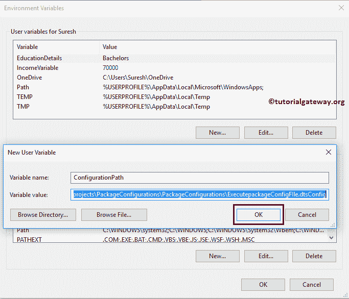T4】

点击【确定】关闭【环境变量】窗口

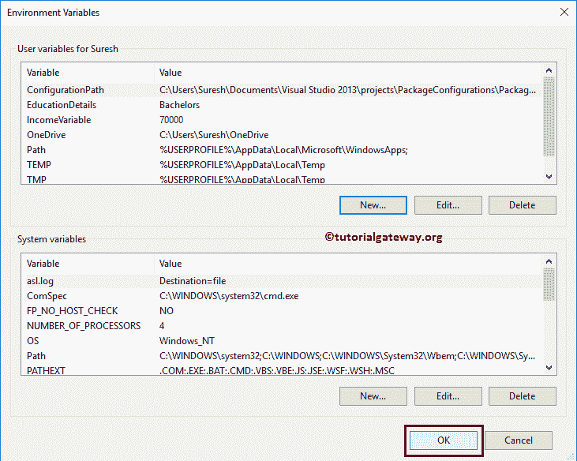

## 使用 XML 配置文件的 SSIS 包配置第 2 部分

要添加存储在环境变量中的 XML 包配置，右键单击控制流区域将打开上下文菜单。请选择包配置..选项

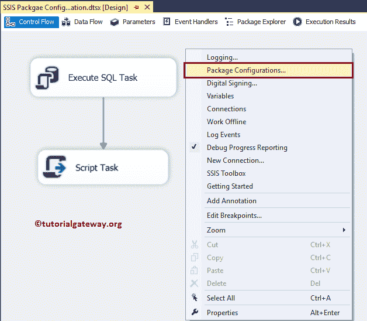

选择软件包配置后..，将打开一个名为“包配置管理器”的新窗口，如下所示。请选中启用包配置以启用配置。接下来，单击添加按钮添加新配置。

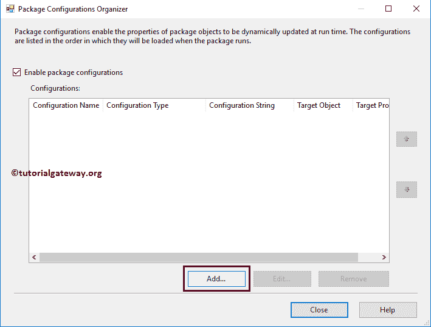

单击添加按钮将打开一个向导。

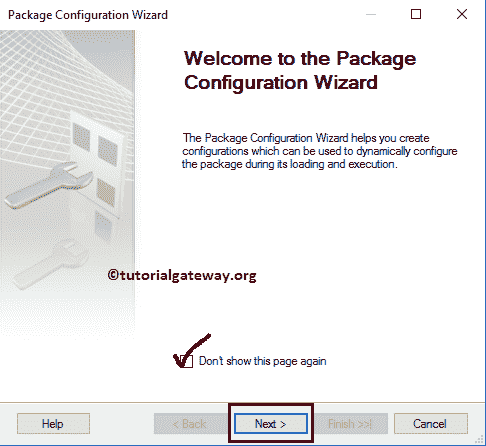

选择配置类型:这里我们要选择配置类型。默认情况下， [SSIS](https://www.tutorialgateway.org/ssis/) 选择 XML 配置文件，所以您不必做任何事情。

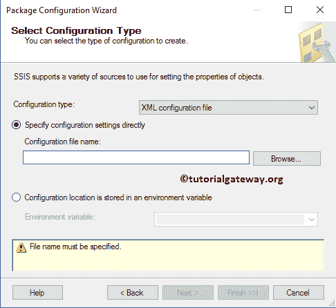

我们已经直接解释了指定配置设置，所以请参考 [SSIS 包配置使用 XML 配置文件](https://www.tutorialgateway.org/ssis-package-configuration-using-xml-configuration-file/)一文来理解。在本例中，我们解释了配置位置存储在环境变量中。&所以，请选择相同的

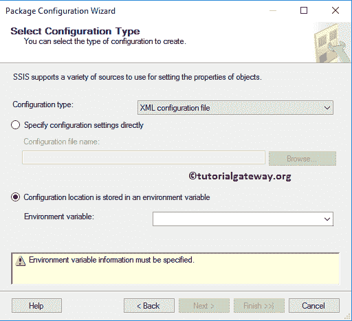

如您所见，我们正在选择配置路径变量。请记住，如果您没有找到新创建的变量，请关闭项目，并重新打开 BIDS。

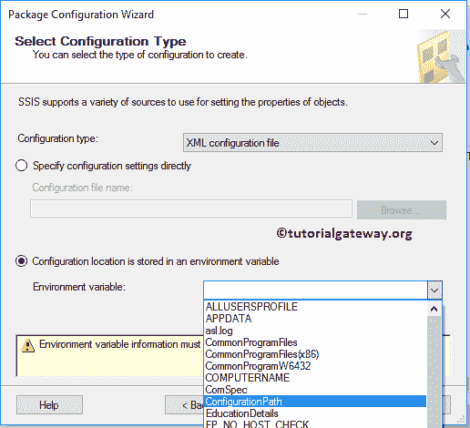

点击【下一步】按钮

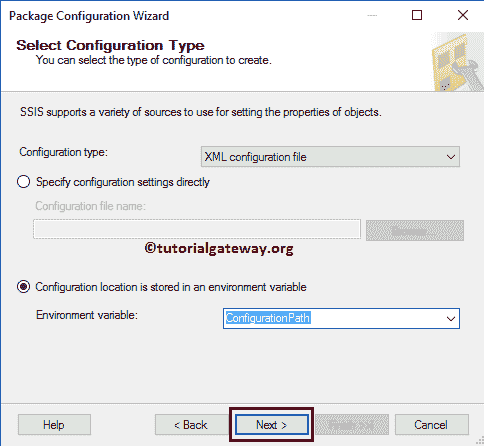

让我将配置名称重命名为连接字符串配置，然后单击完成按钮关闭向导。

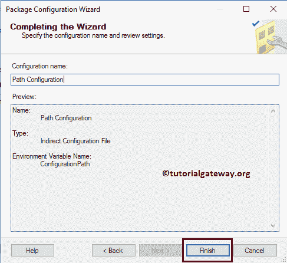

现在，您可以看到我们新创建的路径配置，它保存了环境变量中的连接字符串信息。

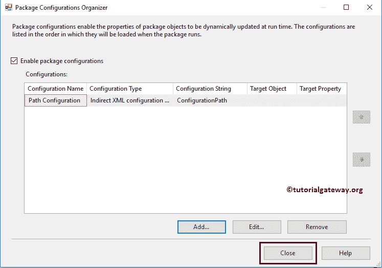

让我运行包

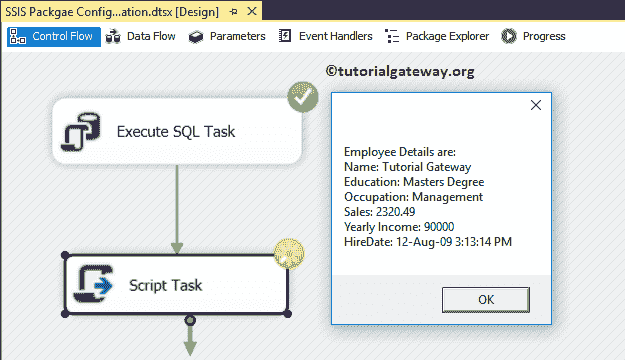