# SSIS 包保护等级

> 原文：<https://www.tutorialgateway.org/ssis-package-protection-level/>

在本文中，我们将向您展示可用的 SSIS 软件包保护级别列表，以及如何通过示例应用这些设置。对于此 SSIS 软件包保护级别演示，我们使用以下集成服务软件包。

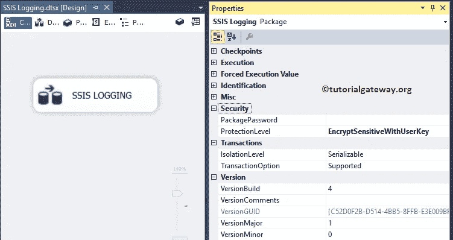

您可以在包属性下找到 SSIS 保护级别列表。请转到包属性，然后在“安全性”选项卡下，您可以找到“保护级别”属性。这是您将用来保护您的包的属性。以下是 SSIS 软件包保护级别列表:

*   不敏感:该选项不会在包中保存任何敏感信息。因此，如果不同的用户打开包，机密信息(密码)将被替换为空白。
*   加密敏感用户密钥:此选项使用当前用户设置加密敏感信息。当前用户是指运行 BIDS 的窗口用户。
*   加密敏感密码:它将使用密码加密敏感信息，并将加密的信息保存在包中。使用 PackagePassword 属性提供的机密数据的密码
*   加密带密码:这个 SSIS 包保护级别选项使用密码加密整个包。您必须使用 PackagePassword 属性来分配密码。当您在设计器中打开包时，或者要使用此选项运行包，则必须提供密码。
*   EncryptAllWithUserKey:此选项使用当前用户设置来加密整个包。例如，如果教程网关是创建或导出包 1 的用户，那么他只能打开或运行该包。

请参考 [SSIS 日志](https://www.tutorialgateway.org/ssis-logging/)了解包配置。

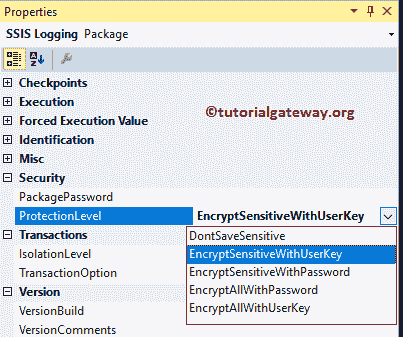

## SSIS 包保护级别示例

为了演示 SSIS 包中的保护级别，我们将在更改保护级别后创建一个 [OLE DB 连接管理器](https://www.tutorialgateway.org/ole-db-connection-manager-in-ssis/)。首先，让我试试唐萨维斯敏。要创建连接，右键单击控制流区域将打开上下文菜单。请选择新连接..从中选择。

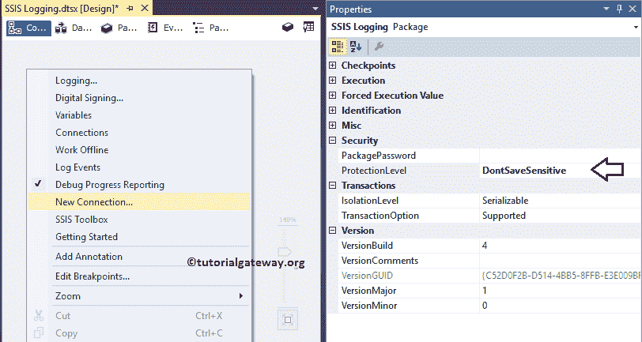

当您选择“新连接”时..选项，将打开添加 SSIS 连接管理器窗口表单。在这里，我们选择了 OLE 数据库连接管理器，并选择了新的连接。

单击新按钮将打开连接管理器窗口。从下面的截图中，您可以观察到我们使用 PRASAD 作为实例，并提供了用于 SQL 身份验证的用户名和密码。我们选择了[AdventureWorks2014]作为数据库名称。

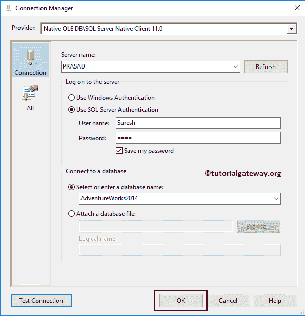

单击确定关闭配置设置

现在，让我双击新创建的 OLE DB 连接管理器。如你所见，它没有显示密码，尽管我们勾选了【保存我的密码】选项

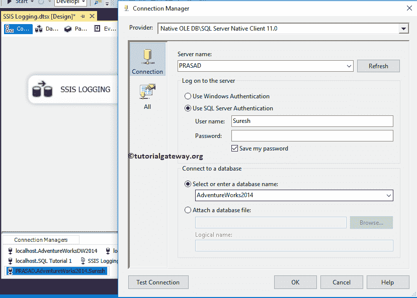

您可以在 XML 文件中检查相同的内容。

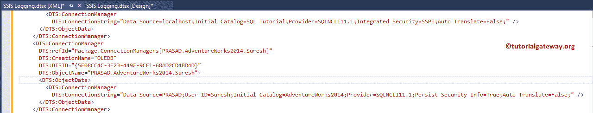

让我将 SSIS 软件包保护级别更改为加密敏感密码。如果选择此选项，您必须提供密码来加密敏感数据。要分配密码，请单击包密码旁边的…按钮。

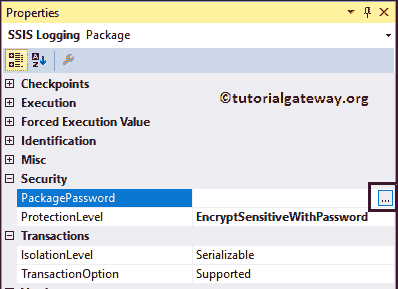

一旦你点击…会弹出一个新窗口，要求你提供密码。如你所见，我们给出了一个随机密码

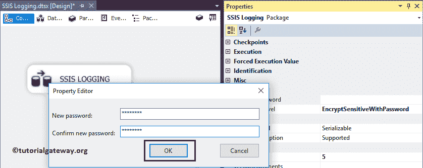

现在，您可以看到 XML 文件中的加密信息。

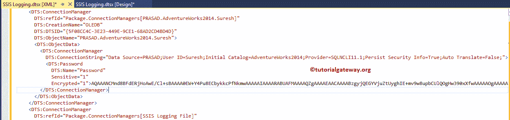

如果您将 SSIS 包保护级别更改为加密带密码并提供了密码，则 XML 文件看起来如下图所示。它不会向用户显示任何信息。一切都加密了。

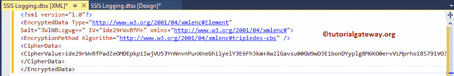

当您打开具有保护级别 EncryptAllWithPassword 或 EncryptAllWithPassword 的包时，将打开以下弹出窗口。你必须提供运行该包的密码

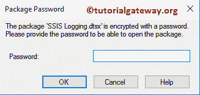