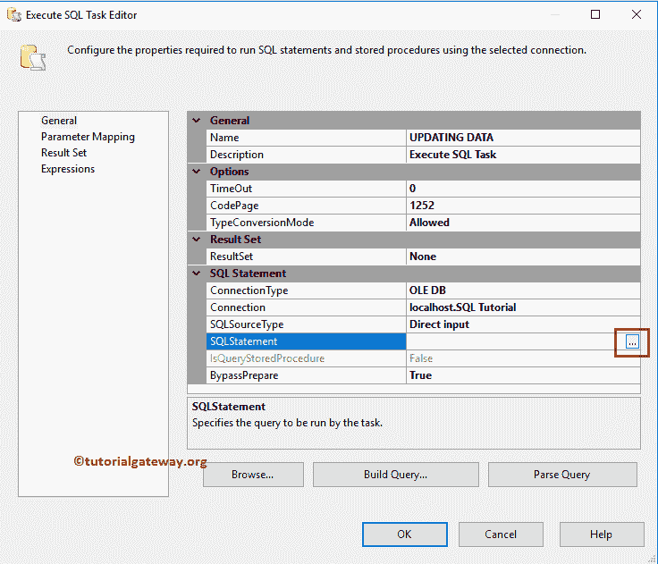
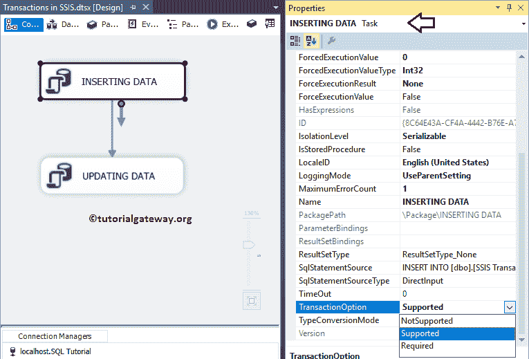

# SSIS 的交易

> 原文：<https://www.tutorialgateway.org/transactions-in-ssis/>

与 SQL Server 类似，SQL Server 集成服务或 SSIS 也包括维护数据完整性的事务选项。在 SSIS 有三种类型的交易选项，你可以在容器、任务等中使用它们。

以下是 SSIS 的可用交易列表

*   不支持:它不会启动新事务，或者不会加入现有事务(父事务)。例如，如果您在父级别(包级别)指定事务为必需的，而在子级别(任务或容器)不支持该事务。SSIS 交易不适用于子级别。
*   支持:它不会启动新事务，但会加入现有事务(如果有)。
*   必需:如果它们是现有的事务，那么它将加入。否则，它将在 SSIS 套餐中开始新的交易。

让我们用一个实际的例子来看看在 SSIS 配置事务所涉及的步骤。在我们开始解释 SSIS 事务之前，让我[在](https://www.tutorialgateway.org/sql-create-table/) [SQL Server](https://www.tutorialgateway.org/sql/)


中创建一个表

## SSIS 交易示例

在本节中，我们将通过示例向您展示在 SSIS 配置事务所涉及的步骤。为此，从[【SSIS】](https://www.tutorialgateway.org/ssis/)工具栏拖动两个[执行 SQL 任务](https://www.tutorialgateway.org/execute-sql-task-in-ssis/)并将其放入控制流区域


将第一个任务重命名为插入数据，将第二个 SQL 任务重命名为更新数据


现在，双击第一个执行 SQL 任务将打开编辑器进行配置。让我选择连接为 [OLE DB 连接](https://www.tutorialgateway.org/ole-db-connection-manager-in-ssis/)，连接到 SQL 教程数据库。接下来，我们使用直接输入作为 [SQL](https://www.tutorialgateway.org/sql/) 语句，因此，单击…按钮来编写定制的 SQL 命令。


请在这里写 [SQL](https://www.tutorialgateway.org/sql/) 语句。从下面的截图中可以看出，我们正在编写一个 [INSERT 语句](https://www.tutorialgateway.org/sql-insert-statement/)，将四条记录插入到我们之前创建的表中。

```
-- SQL statement for SSIS Transaction example
USE [SQL Tutorial]
GO
INSERT INTO [dbo].[SSIS Transactions Example] (
       [FirstName], [LastName], [Education], [Occupation], [YearlyIncome], [Sales])
VALUES   ('Tutorial', 'Gateway', 'Education', 'Admin', 10000, 200)
	,('Imran', 'Khan', 'Degree', 'Skilled Professional', 15900, 100)
	,('Doe', 'Lara', 'Masters','Management', 15000, 60)
	,('Ramesh', 'Kumar', 'High School', 'Professional', 65000, 630)
```


接下来，双击第二个执行 SQL 任务。这里我们也选择连接类型为 [OLE DB 连接](https://www.tutorialgateway.org/ole-db-connection-manager-in-ssis/)，连接到 SQL 教程数据库。接下来，我们使用直接输入作为 [SQL](https://www.tutorialgateway.org/sql/) 语句。所以，点击…按钮。



在这里写自定义 [SQL](https://www.tutorialgateway.org/sql/) 语句。从下面的截图中可以看到，我们正在编写 [UPDATE 语句](https://www.tutorialgateway.org/sql-update-statement/)来更新 ID 为 1 的员工的教育硕士。

```
-- SQL statement for SSIS Transaction example
USE [SQL Tutorial]
GO
UPDATE [dbo].[SSIS Transactions Example]
   SET [Education] = 'Masters'
WHERE [EmpID] = 1
```


单击确定完成配置执行 SQL 任务。让我们运行 SSIS 交易包


让我们打开 [SQL Server](https://www.tutorialgateway.org/sql/) 管理工作室查询窗口预览数据。可以看出，包中插入了四条记录，并用 Masters 更新了第一条记录。


### 在 SSIS 配置交易

SQL Server 集成服务允许我们在包级别(主级别)、任务级别或容器级别应用事务。目前，我们将在包级别使用 SSIS 交易。为此，请转到包属性并查找事务选项属性。

默认情况下，支持被选为事务选项。让我只保留默认选项


让我在任务级别向您展示 SSIS 事务选项。为此，请选择执行 SQL 任务，转到其属性，并查找事务选项属性。



让我在第二个执行 SQL 任务中更改 Update 语句，故意使任务失败

```
-- SQL statement for SSIS Transaction example
USE [SQL Tutorial]
GO
UPDATE [dbo].[SSIS Transactions Example]
   SET   [EmpID] = 5 
        ,[Education] = 'Masters'
WHERE [EmpID] = 1
```


让我运行 SSIS 交易包


可以看出，包插入了四条记录，但是第一条记录没有用 Masters 的值更新。


如果我们想在任务失败时回滚整个操作呢？。我的意思是，如果 Update 语句失败，如何从表中删除插入的行？。

为此，我们必须在包级别将事务选项从支持更改为必需。这意味着“插入数据”任务和“更新数据”任务都将位于“必需的事务”选项下。


让我运行 SSIS 交易包


现在，让我给你看看这张桌子。可以看出，包没有插入任何记录。连第一个任务都成功了。


让我向您展示，如果我将首次执行 SQL 任务的 SSIS 事务选项从支持更改为不支持，会发生什么？


它将插入四条记录。尽管在包级别(父级别)需要一个事务，但在子级别的“不支持”选项将删除该事务。


在处理 SSIS 事务时，有些人可能会遇到以下错误

错误:由于错误 0x8004D01B“事务管理器不可用”，SSIS 运行时无法启动分布式事务。故障诊断码事务无法启动。这可能是因为 MSDTC 服务没有运行。

如果是这种情况，请转到服务并启动分布式事务协调器服务。如果没有找到该服务，请前往微软下载页面，下载微软分布式事务协调器(MSDTC)管理包

