# 使用导入和导出向导将数据从 SQL Server 导出到平面文件

> 原文：<https://www.tutorialgateway.org/export-data-from-sql-to-flat-file-using-import-and-export-wizard/>

我们在 SQL 中有 SQL 导入和导出向导，它可以帮助使用向导将各种来源的数据导入或导出到不同的目的地。在本例中，我们将使用 SQL 导入和导出数据向导，将 Adventure Works DW 2014 SQL 数据库中的 DimGeography 表数据导出到本地硬盘中的 Geography 文本文件。

## 使用导入和导出将数据从 SQL Server 导出到平面文件

要使用导入和导出向导将数据从 SQL Server 导出到平面文件，请双击 SQL Server 导入和导出向导工具(您可以在开始->所有程序-> Microsoft SQL Server 2014 -> SQL 导入和导出数据向导中找到)。它将打开 SQL Server 导入和导出数据向导。第一页是欢迎页面

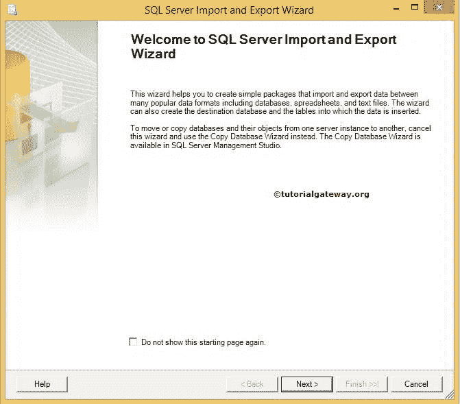

如果您不想再次看到此页面，请勾选“不再显示此起始页”复选框现在，单击下一步

选择数据源页:此页用于配置源信息。我们的源是 [SQL](https://www.tutorialgateway.org/sql/) 数据库，所以我们选择 SQL Server 原生客户端作为我们的源，我使用我的 localhost 实例作为服务器名。

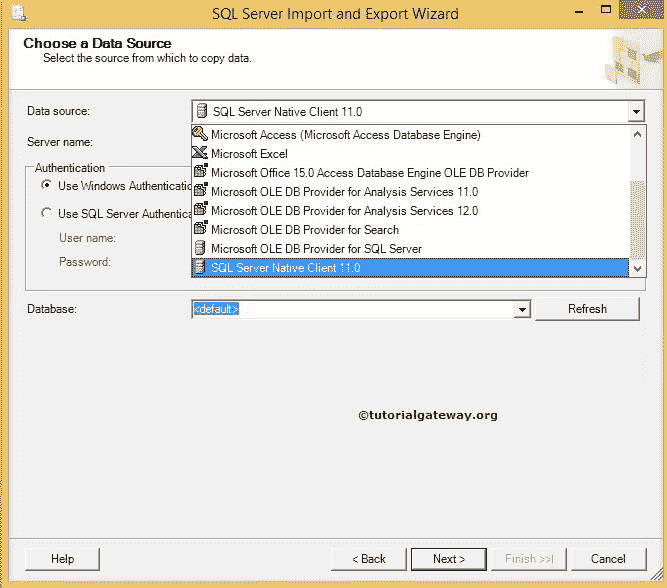

从列表中选择源数据库。让我们在这里选择冒险作品 2014。

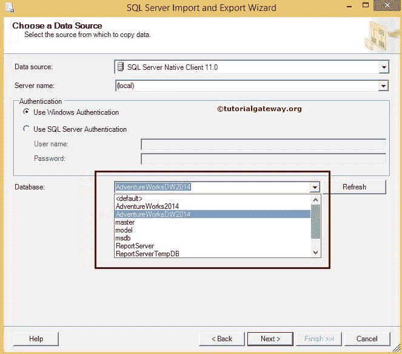

身份验证:这里，我们使用的是 windows 身份验证。但是在实时情况下，您的组织或公司将提供访问数据库的身份验证凭据。在这种情况下，您必须将单选按钮更改为 SQL 身份验证，并提供用户名和密码。

选择目的地:此页面用于配置目的地信息。我们的目标是将数据保存为文本文件，因此我们选择平面文件目标作为我们的目标

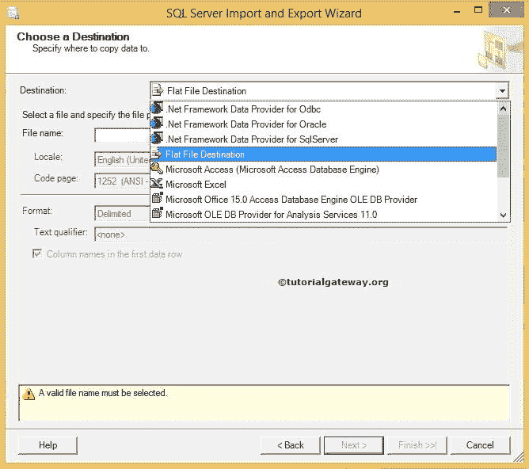

然后我们要从我们的本地驱动器

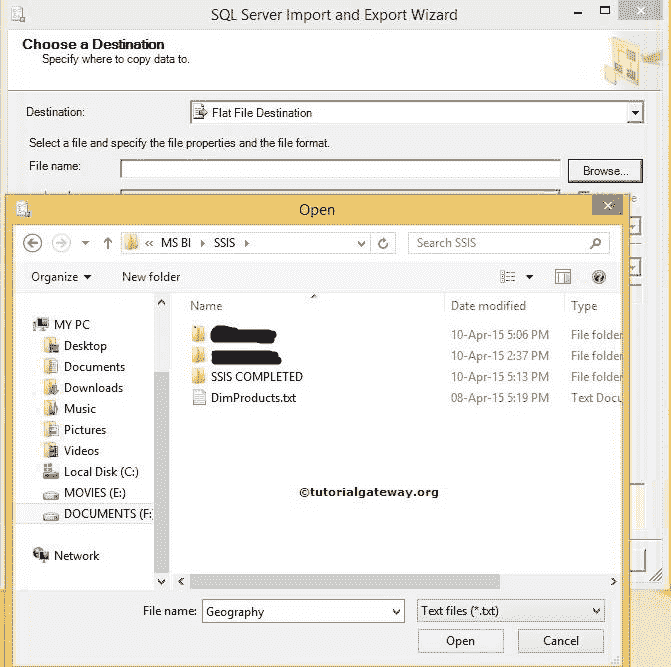

中选择文本文件

从上面，您可以看到我们正在创建地理文本文件。接下来，请选择我们要使用的格式

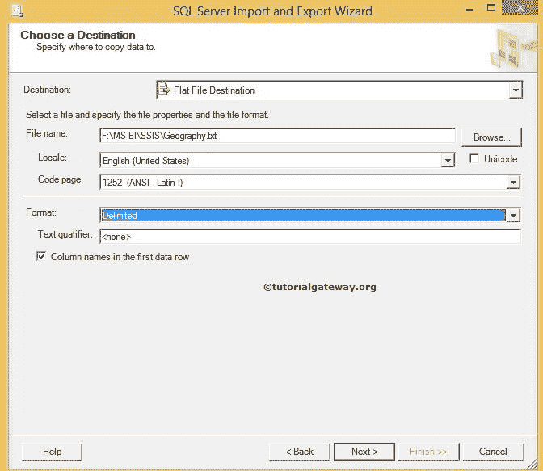

如果希望文本文件在第一行中包含列名，请勾选复选框“第一个数据行中的列名”。如果没有，取消选中它。

单击下一步按钮

指定表复制或查询:这里有两个选项

1.  从一个或多个表或视图复制数据:使用此选项从现有表或视图(所有列数据)中进行选择
2.  编写查询来指定要传输的文件数据选项:这是经常使用的选项，因为每个表中都会有不必要的列。所以最好避开它们或者选择有条件的数据。

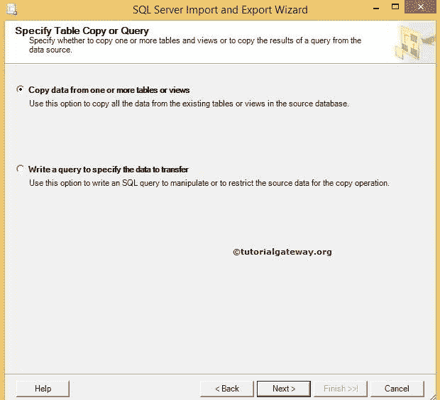

目前，我们正在选择每一行。所以我们选择了第一种方案。单击下一步按钮

此页用于从要用作源的 SQL 数据库中选择源表。这里我们选择了 DimGeography 表。点击预览按钮查看传入数据流

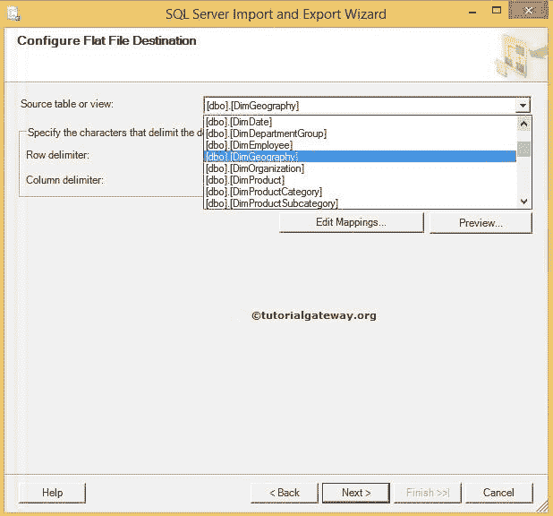

指定您想要的行分隔符和列分隔符。单击编辑映射按钮更改类型和大小。

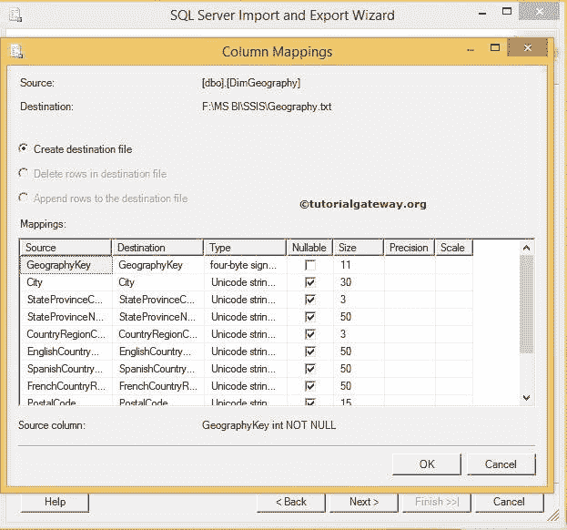

保存并运行包:此页面为我们提供了在 SQL 服务器或文件系统中保存包的选项。暂时，我选择的是文件系统

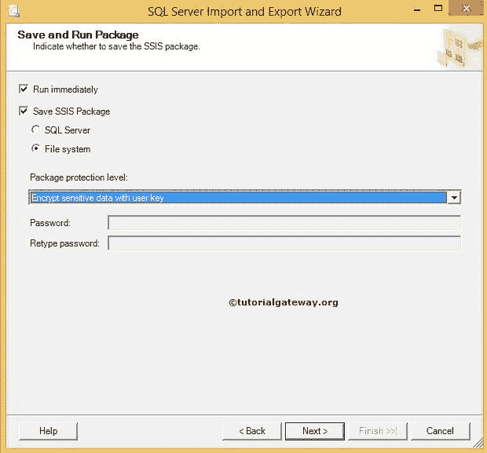

保存 SSIS 套餐:提供地址保存 [SSIS](https://www.tutorialgateway.org/ssis/) 套餐

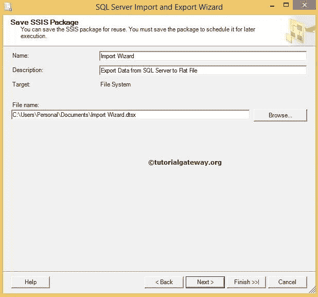T4】

*   名称:根据需要更改软件包名称
*   描述:写下你的描述
*   文件名:通过单击“浏览”按钮选择文件名，并导航到适当的位置。

点击下一步

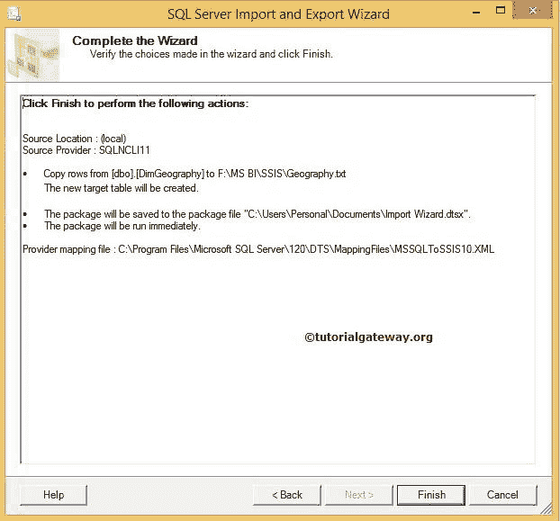

点击完成按钮，完成 [SSIS](https://www.tutorialgateway.org/ssis/) 向导。观察状态:成功和消息。

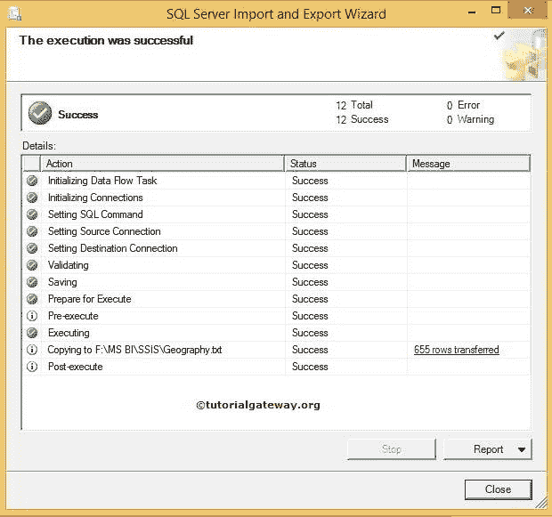

让我们导航到我们提供的文件系统地址，并检查文件名“地理”。双击文本文档检查结果。我们已经使用导入和导出成功地将数据从 SQL Server 导出到平面文件。

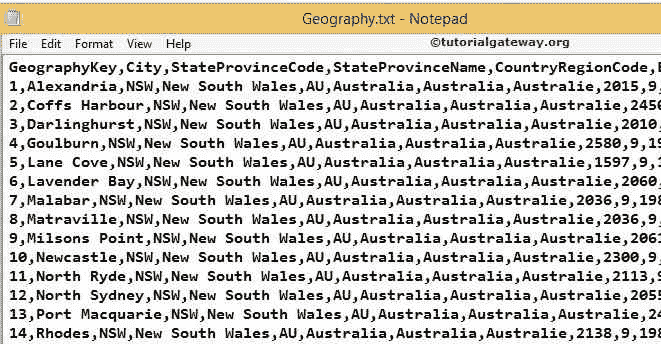