# 使用导入和导出数据向导将数据从平面文件导入到 SQL Server

> 原文：<https://www.tutorialgateway.org/import-data-from-flat-file-to-sql-table-using-import-and-export-data-wizard/>

在 SSIS，我们有 SQL Server 导入和导出数据向导，该向导用于使用向导将各种来源的数据导入或导出到不同的目标。在本例中，我们有一个 DimGeo 文本文档，我们将使用导入和导出数据向导将文本文件中的数据导入到 SQL 数据库表中。

下面的截图将显示 DimGeo 文本文件中的数据。

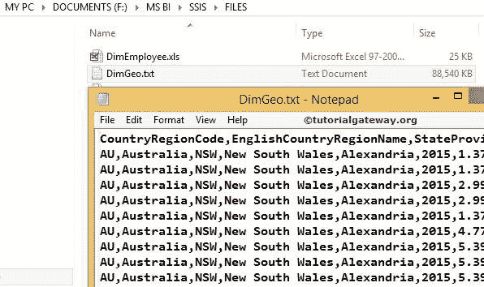

## 如何使用导入和导出数据向导将数据从平面文件导入到 SQL Server

如果您运行的是 Windows 7，那么您可以在开始->所有程序->微软 SQL Server 2014 ->导入和导出数据向导中找到)。

如果你在 Windows 8 上运行，那么你可以在 app

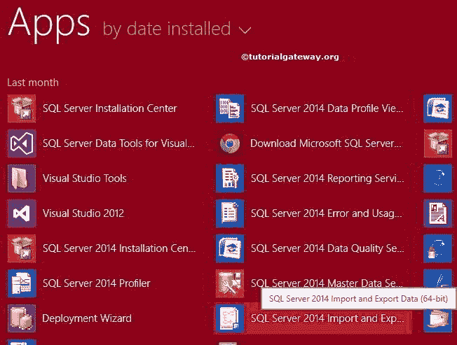

中找到

双击 SQL Server 导入和导出数据工具。它将打开 SQL Server 导入和导出向导。第一页是欢迎页面。

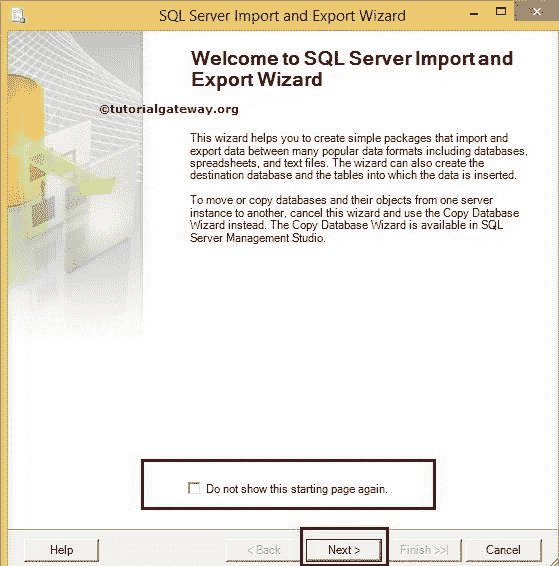

如果您不想再次看到此页面，请勾选“不再显示此起始页”复选框。现在，单击下一步

选择数据源页:此页用于配置源信息。我们的来源是一个文本文件。所以我们选择平面文件源作为我们的数据源

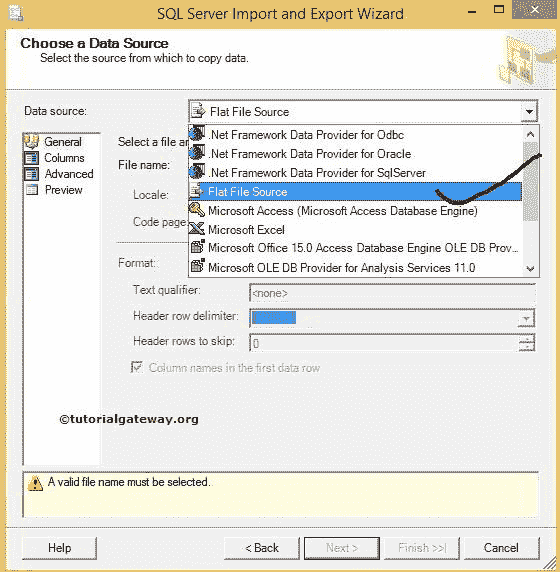

然后我们要从我们的本地驱动器

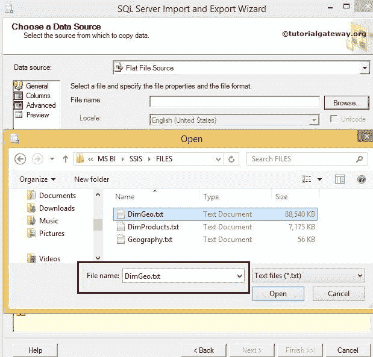

中选择文本文件

从上面可以看到，我们选择了 DimGeo 文本文件。

如果您的文本文件在第一行中包含列名，则勾选“第一个数据行中的列名”复选框。如果没有，取消选中它。

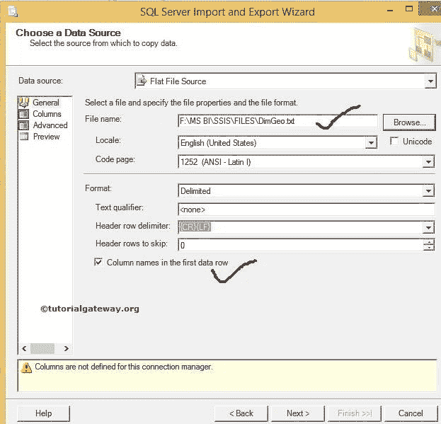

单击列选项卡，配置行和列分隔符以及行分隔符(指定如何分隔列数据和行数据)。大多数情况下，分隔符是自动选择的。不过，自己验证一下总是好的做法。我们也可以看到数据。

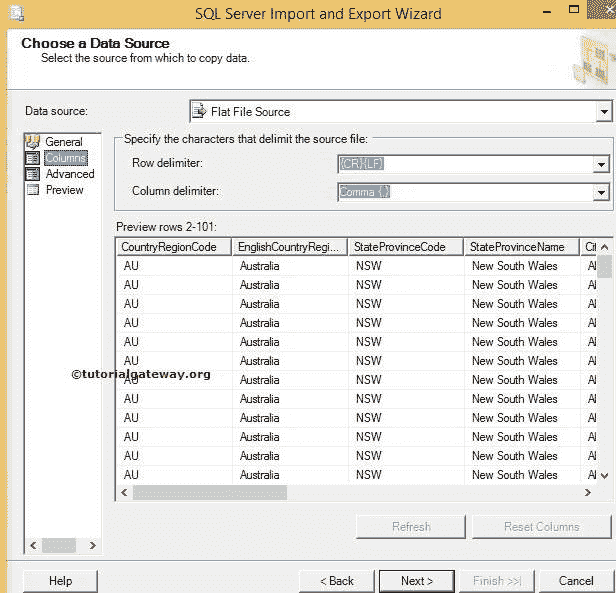

点击高级选项卡查看/修改源列

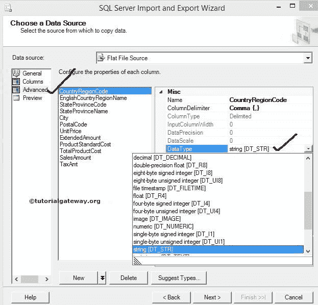

的数据类型

选择目标页:此页用于配置目标信息。我们的目标是 [SQL](https://www.tutorialgateway.org/sql/) 数据库，因此我们选择了 SQL Server 本机客户端作为我们的目标。这里，我们使用我的 localhost 实例作为服务器名。

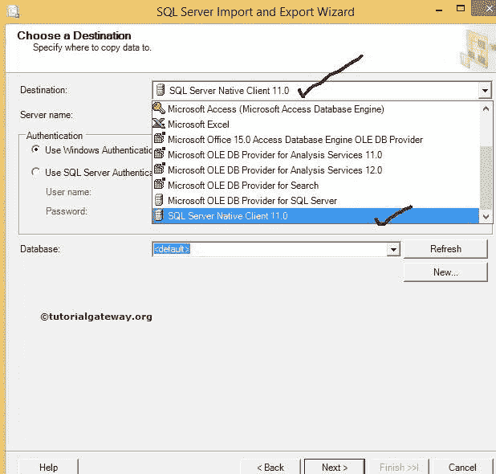

请从列表中选择目标数据库。让我们在这里选择 SSIS 教程。

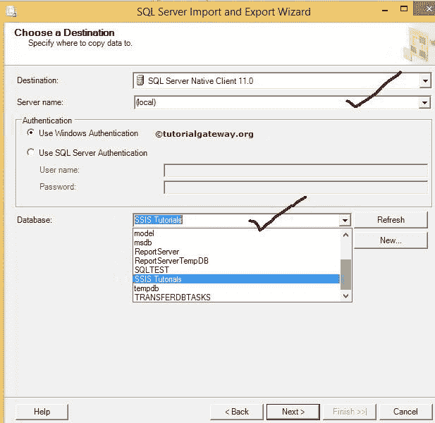

身份验证:这里，我们使用的是 windows 身份验证。但是在实时情况下，您的组织或公司将提供访问数据库的身份验证凭据。在这种情况下，您必须将单选按钮更改为 SQL 身份验证，并提供用户名和密码。

选择源表和视图:此页用于从 SQL 数据库中选择目标表(如果您已经创建了该表)。如果没有点击编辑映射按钮将打开如下窗口创建一个表，也可以点击编辑 SQL 按钮自定义

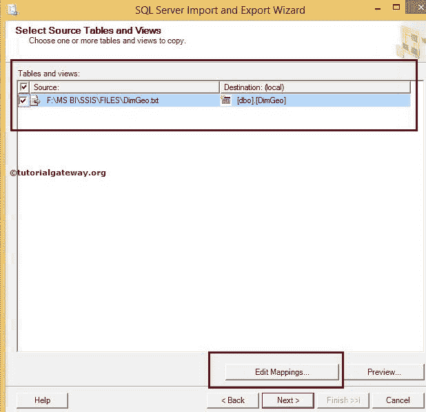

点击【编辑映射】按钮

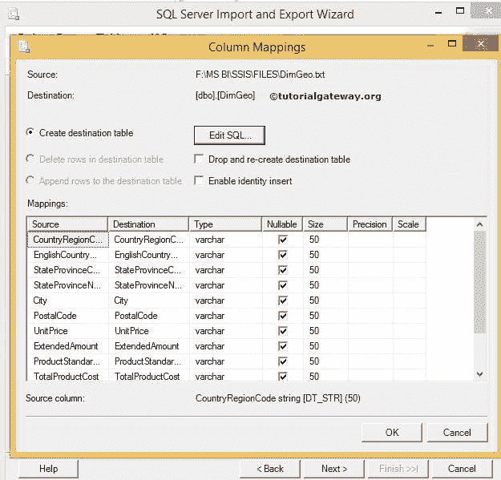

单击确定

从上面的截图可以观察到，

*   在这里，我们可以创建一个新表。或者，我们可以通过单击“编辑 SQL”按钮来自定义一个已经存在的表。
*   我们可以删除现有的表，并通过选择删除并重新创建目标表来重新创建它
*   启用标识插入选项将帮助您将值插入标识列

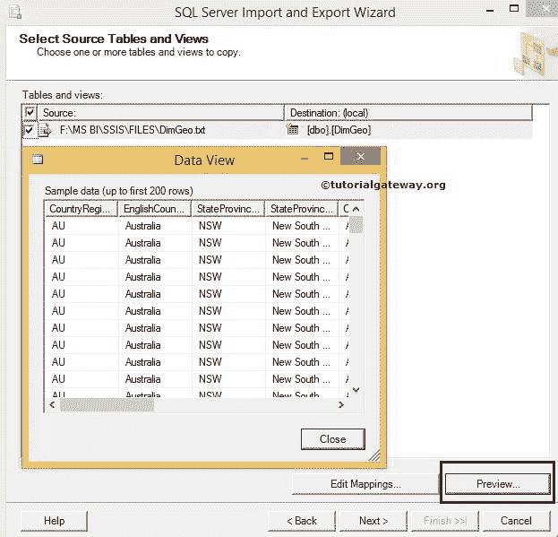

预览按钮用于查看列数据。

保存并运行包:此页面为我们提供了在 SQL 服务器或文件系统中保存包的选项。目前，我们正在选择一个文件系统

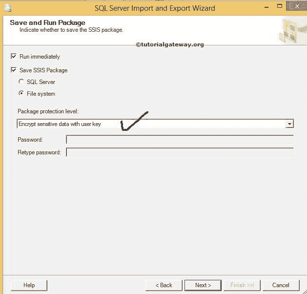

点击【下一步】按钮

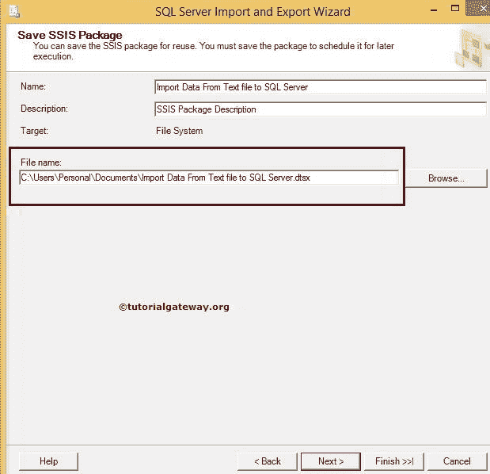

*   名称:根据需要更改软件包名称
*   描述:写你自己的描述
*   文件名:通过单击“浏览”按钮选择文件名和文件位置，并导航到适当的位置。(这是包要保存的地方)。

点击下一步

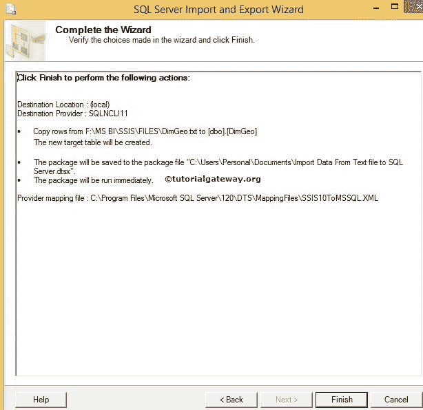

点击完成按钮完成向导

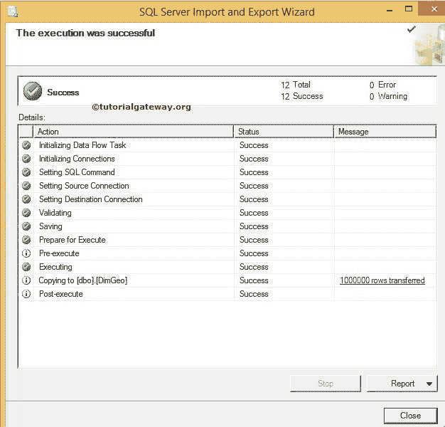

从上面可以观察到 1000000 行传输的状态:成功和消息。

让我们打开 SSMS，查看 [SSIS](https://www.tutorialgateway.org/ssis/) 输出数据

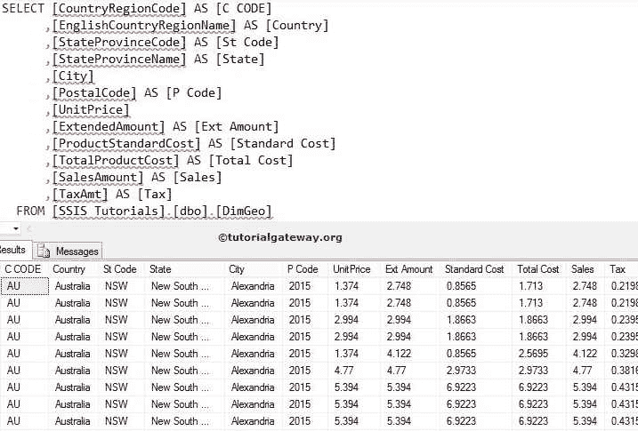T4】