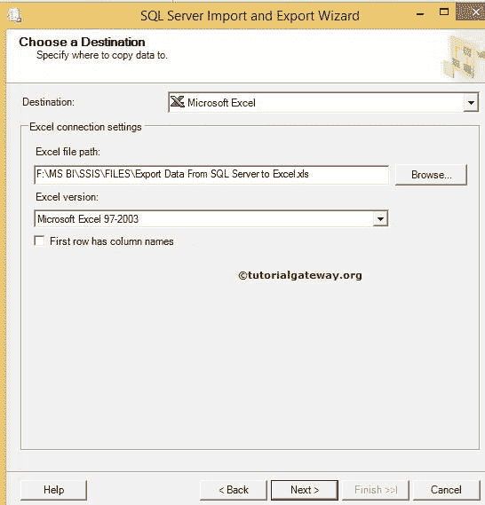
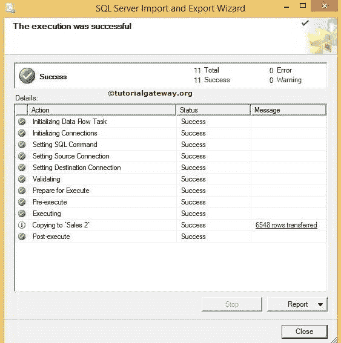

# 使用 SSIS 导入和导出向导将数据从 SQL Server 导出到 Excel

> 原文：<https://www.tutorialgateway.org/export-data-from-sql-server-to-excel-using-ssis-import-and-export-wizard/>

在 SQL Server 中，我们有 SSIS 导入和导出向导，它可以帮助使用向导将数据从 SQL Server 导出到 Excel 目标。在这个 SSIS 示例中，我们将使用 Sql 导入和导出数据向导，将[销售 2]表数据从 Sql Server 数据库[SSIS 教程]导出到本地硬盘中的 Excel 文件。

下面的截图显示了【销售 2】表

中的数据

## 使用 SSIS 导入和导出向导将数据从 SQL Server 导出到 Excel

要使用 [SSIS](https://www.tutorialgateway.org/ssis/) 导入和导出向导将数据从 SQL Server 导出到 Excel，请双击 SQL Server 导入和导出向导工具。可以在 start - >所有程序- >微软[SQL Server](https://www.tutorialgateway.org/sql/)2014->SQL 2014 导入导出数据向导中找到。它将打开 SQL Server 导入和导出数据向导。第一页是

欢迎页面

选择数据源页:此页用于设置源信息。我们的来源是 SQL 数据库。因此，我们选择 SQL Server 本机客户端作为我们的源，我们的实例作为服务器名称。

从列表中选择源数据库。让我们在这里选择[SSIS 教程]。

身份验证:在这里，我们使用的是 windows 身份验证，但是实时地，您的组织提供了访问数据库的凭据。在这种情况下，将单选按钮切换到 SQL 身份验证，并生成用户名和密码。

选择目标:此页用于设置目标信息。我们 SSIS 的工作是将 SQL Server 数据保存到一个 Excel 文件中。所以我们选择微软 Excel 作为我们的目标

然后我们必须从本地驱动器

中选择现有的 Excel 文件

从上面的截图中，可以观察到我们选择的是将数据从 SQL Server 导出到 Excel 文件。点击打开按钮选择

如果您的 Excel 文件包括第一行中的列名，请选中复选框“第一个数据行中的列名”。如果没有，取消选中它。

单击下一步按钮

指定表复制或查询:这里有两个选项

*   从一个或多个表或视图复制数据:使用此选项从现有表或视图(所有列数据)中进行选择
*   编写一个查询来指定要传输的文件数据选项:这是我们通常使用的选项，因为每个表中都会有不必要的列。所以最好绕过它们或者选择有条件的数据。

目前，我们正在选择每一行，所以我们选择了第一个选项。单击下一步按钮

此页面用于从 SQL 数据库中选择源表。这里我们选择[销售 2]表。如果您的 Excel 文件已经包含保存输出的表。然后从目标列表中选择适当的 Excel 表。否则，SQL Server 导入和导出向导将生成表名。点击预览按钮查看传入数据流

单击编辑映射按钮更改每列的数据类型和大小。您也可以使用【编辑 SQL】按钮

编辑表创建

从上面的截图中，可以看到英文的“产品名称”、“颜色”和“销售订单编号”列的类型为“龙腾”，这与 SQL Server 中的源数据不兼容。所以，让我们改变数据类型。

我们将上面提到的列更改为 VarChar，并分配了所需的大小。如果忘记更改列的大小，数据将被截断。因此，请更改每个列的大小以匹配源列。

保存并运行包:此页面为我们提供了在 SQL 服务器或文件系统中保存包的选项。就目前而言，我们不是在拯救包裹

点击完成按钮完成向导

从上面可以看到状态:成功和消息。

让我们导航到我们提供的文件系统地址，并检查文件名从 SQL Server 导出数据到 Excel。双击 Excel 文件查看结果

